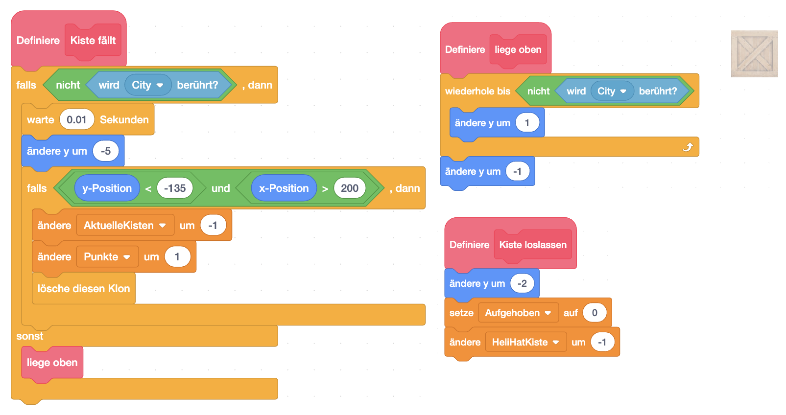

## Spielbeschreibung

Steuere deinen Helikopter mit den Cursortasten zu den Kisten, heb sie auf und lass sie dann ganz rechts am Bildschirm mit der &lt;Space&gt;-Taste wieder fallen. Wenn du alle Kisten eingesammelt hast, kommst du ins nächste Level.

### Figuren

Leider bietet uns Scratch in der Standardbibliothek keinen Helikopter und auch keine Kisten. Du kannst aber hier die entsprechenden Figuren herunterladen:

1. [den Helikopter](assets/helicopter.sprite3)
1. [die Kiste (Engl. Crate)](assets/Crate.sprite3)
1. [die Hindernisse/Gebäude der Stadt (City)](assets/City.sprite3)

Bitte importiere die Figuren in dein Scratch-Projekt.

### Hintergrund


Als Hintergrund eignet sich hier eine City-Skyline sehr gut. Die Scratch-Bibliothek bietet hier einiges. 

Damit wir auch das Ende des Spiels korrekt darstellen, duplizieren wir einfach das Bühnenbild und schreiben groß "Game Over" darüber.


### Globale Variablen


Neben den beiden Spiel-relevanten Informationen, die auch sichtbar sind:

1. **Punke**
1. **Zeit**

benötigen wir noch 2 Variablen, die für den Spielablauf wichtig sind:

1. **Aktuelle Kisten** - wie viele Kisten sind noch am Spielfeld
1. **HeliHatKiste** - zeigt uns, ob der Helikopter gerade eine Kiste trägt


### Steuerung des Helikopters
    

Die Steuerung des Helikopters ist relativ einfach. Wir verwenden die Cursortasten, um den Helikopter zu bewegen. Dabei achten wir darauf, dass er nicht aus dem Bildschirm fliegen kann.

Die Steuerung beschleunigt den Heli in die Richtung, die wir auf den Pfeiltasten drücken, indem wir in 2 neuen Variablen:

1. **X-Geschwindigkeit** und
1. **Y-Geschwindigkeit**

speichern. Später verändern wir dann die Position des Helikopters um diese Werte und überprüfen, ob wir eine Kiste (Crate) erwischt haben, oder evtl. gegen ein Gebäude geflogen sind. (Block "**dagegen geflogen**")

Die Nachrichten **&lt;&lt;Heli bewegt sich&gt;&gt;** und **&lt;&lt;kiste berührt&gt;&gt;** schicken wir ab, damit evtl. die Kisten mitbekommen, dass sie sich auch bewegen müssen, um mitzukommen. Aus Gleichzeitigkeitsgründen müssen wir leider warten bis die Nachrichten abgearbeitet sind.

Danach prüfen wir noch, ob wir uns noch im Bildschirmbereich befinden und korrigieren die Position, falls wir uns aus dem Bildschirm bewegt haben. (Block "**Prüfe Flugbereich**")

Als Letztes lassen wir den Heli noch in der Luft bremsen, sodass er von alleine langsamer wird und langsam auf den Boden sinken kann. (Block "**Bremsen**")

**Hier noch die Blöcke im Detail** (Alle Blöcke "Ohne Bildschirmaktualisierung"):



#### Sonstiges zum Helikopter

Der Helikopter sollte während des Fluges natürlich die Rotorblätter drehen. Eine einfache Animation lässt es so aussehen.



Das Ereignis **&lt;&lt;neue kisten&gt;&gt;** wird gesendet, wenn ein neues Level beginnt. Dazu setzen wir den Helikopter auf seine Startposition am rechten Rand.

**&lt;&lt;gefangen&gt;&gt;** wird gesendet, wenn eine Kiste bemerkt, dass Sie vom Helikopter berührt wird und damit aufgehoben wird. Damit der Heli sie nicht gleich wieder fallen lässt, lassen wir den Helikopter ein bisschen nach oben gehen, sodass die Kiste nicht gleich wieder auf dem Boden aufsitzt.


### Kisten

Wir brauchen für das Spiel mehrere Kisten. Also werden wir die eigentliche Figur unsichtbar machen und Klone erzeugen, die wir für das Spiel verwenden.

Das Ereignis **&lt;&lt;neue kisten&gt;&gt;** zeigt, dass ein neues Level gestartet wird. Also wird es Zeit, neue Kisten auf dem Bildschirm zu verteilen. Jede Kiste braucht über sich selbst folgende Information, die in Variablen **nur für diese Figur** gespeichert werden:

- **Aufgehoben** zeigt uns, dass die aktuelle Kiste gerade am Helikopter hängt

Überdies setzen wir die globalen Variablen:

- **HeliHatKiste** auf 0 um zu zeigen, dass der Helikopter gerade keine Kiste trägt und
- **AktuelleKisten** auf 0, da wir diese ja erst erzeugen müssen.

In einer Schleife erzeugen wir dann 3x einen Klon der Kiste an einer zufälligen Stelle und zählen die Anzahl der aktuellen Kisten hoch.



Wie vorhin bereits erwähnt machen wir die Klone sichtbar, sodass wir sie als Spielfiguren verwenden können. Solange der Klon existiert, überprüfen wir, ob er gerade aufgehoben ist. Wenn nein, dann lassen wir ihn einfach fallen. Wenn ja, dann überprüfen wir ständig

- **ob die Leertaste gedrückt wurde** und lassen ihn dann fallen, oder
- **ob die Kiste an einem Gebäude angestoßen ist** und lassen sie dann auch fallen.

Des Weiteren benötigen wir noch die Blöcke. Erwähnenswert ist hier, dass der Block **Kiste fällt** auch überprüft, ob die Kiste zu weit nach unten gefallen ist. Dort hat die Stadt keinen Boden und wir können damit die Kiste als Punkt zählen und die verfügbaren Kisten um 1 verringern.



#### Ereignisse der Kisten

Die Kisten müssen eigentlich nur auf 2 Ereignisse reagieren:

1. **Kiste berührt** zeigt an, dass der Heli eine Kiste berührt hat. Jede Kiste muss jetzt überprüfen, ob sie betroffen ist, und ob sie die einzige ist. Wenn ja, sieht sich die Kiste selbst als **Aufgehoben**.
1. **Heli bewegt sich** informiert die Kiste, dass der Heli sich bewegt. Sollte die Kiste **Aufgehoben** sein, fliegt sie mit.





### Gebäude (City)

Diese Figur zeigt uns die Gebäude der Stadt. Jedes Kostüm ist ein Level des Spiels. 
Zuerst wird bei einem neuen Level gewartet, bis Kisten im Spielfeld sind. Danach warten wir, bis alle eingesammelt wurden. Anschließend schalten wir zum nächsten Level um.

**Anmerkung**: Du kannst die Level sehr einfach erweitern, indem du ein weiteres Kostüm hinzufügst, und deine Gebäude hineinmalst. Du musst nur darauf achten, dass es einen Bereich (am besten ganz rechts) gibt, wo die Kisten bis zum unteren Rand fallen können.


### Spielsteuerung (Bühne)

Dieser Block steuert das Spiel, indem es die Zeit herunterzählt und darauf achtet, ob die Zeit abgelaufen ist. Falls die Zeit um ist, wird das Spiel beendet und "Game Over" angezeigt.


## Herunterladen

Du kannst das fertige Projekt unter [heli-drop auf scratch.mit.edu](https://scratch.mit.edu/projects/883155247/) ausprobieren.
