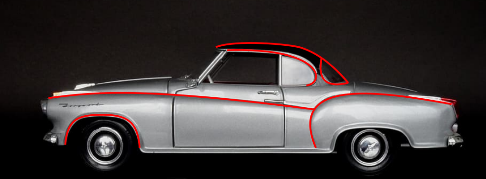

# Spaß mit Bezier-Kuven

## Einleitung

Kaum jemand von euch wird schon einmal etwas von Bezier-Kurven gehört haben. Unsere Welt ist aber voll davon. Sie werden beim Design von physischen Dingen wie Autos genauso eingesetzt wie bei Computerspielen. Im folgenden Bild siehst du ein Beispiel. Wenn man sich die Form des Autos ansieht, entdeckt man eine Menge Kurven. Diese Kurven sind Bezier-Kurven. 



Im Bild sind bei weitem nicht alle Bezier-Kurven hervorgehoben. Findest du noch weitere?

## Bezier-Kurven in Inkscape zeichnen

### Inkscape

Am leichtesten versteht man Bezier-Kurven, wenn man mit ihnen experimentiert. Zu diesem Zweck installiere bitte das Open-Source Zeichenprogramm [Inkscape](https://inkscape.org/de/). Dieses Zeichenprogramm ist sehr beliebt bei Menschen, die im Bereich Grafikdesign und Softwareentwicklung arbeiten.

### Eine Linie in Inkscape zeichnen

*  Starte Inkscape und wähle das *Pen/Bezier*-Werkzeug aus. Klicke jetzt im Zeichenbereich an die Stelle, an der die Linie beginnen soll. Bewege die Maus zu der Stelle, wo die Linie enden soll.
 
  Mach für unsere Übung eine möglichst waagrechte Linie. Klicke doppelt auf die Stelle des Linienende, um die Linie zu erstellen.


*  So sollte dein Ergebnis in etwa aussehen.


### Aus der Linie eine Bezier-Kurve machen

Die Linie ist nett, aber was ist, wenn wir eigentlich einen Hügel zeichnen möchten? Hier kommt die Bezier-Kurve ins Spiel:

*  Schalte auf das *Pfad verändern*-Werkzeug um.


*  Klicke und Ziehe die Linie in der Mitte nach oben. Siehst du, wie aus der Linie eine Kurve wird? Das ist eine Bezier-Kurve!


*  Das Besondere an einer Bezier-Kurve sind ihre *Kontrollpunkte*. Markiere mit dem *Pfad verändern*-Werkzeug einen Endpunkt deiner Kurve, dann werden die Kontrollpunkte sichtbar. Verändere sie und beobachte, wie sich die Kurve verändert. Die *Kontrollpunkte* "ziehen" an der ursprünglichen Linie und verzerren sie so, dass das Ergebnis eine Kurve wird.

Unsere Bezier-Kurve besteht aus vier Punkten: Startpunkt, Endpunkt und zwei Kontrollpunkte. Man bezeichnet eine solche Bezier-Kurve als *kubische Bezier-Kurve* (in Englisch *Cubic Bezier Curve*).


### Was Inkscape noch alles kann.

Inkscape kann noch viel mehr wenn es um Linien, Linienzüge und Kurven geht. In dieser Übung wollen wir aber jetzt zum Programmieren übergehen und daher Inkscape verlassen. Wer mehr über Zeichnen in Inkscape lernen möchte, dem empfehle ich, nach kostenlosen Anleitungen auf YouTube zu suchen. Wenn ihr zum Beispiel nach *Inkscape Bezier Tool* sucht, werdet ihr viele Videos mit nützlichen Tipps finden.

## Was sind Bezier-Kurven?

Bezier-Kurven lassen sich mathematisch beschreiben und geometrisch veranschaulichen. Keine Angst, wir tauchen hier nicht tief in die Mathematik von Bezier-Kurven ein. Wer das möchte und schon gut Englisch spricht, dem empfehle ich das wunderschöne Video [*The Beauty of Bézier Curves*](https://youtu.be/aVwxzDHniEw).

 Wenn ihr noch jünger seid und euch noch Grundlagen im Bereich Mathematik und Englisch fehlen, um das Video zu verstehen, dann könnt ihr euch einmal die Webseite [https://www.geogebra.org/m/ek7RHvuc](https://www.geogebra.org/m/ek7RHvuc) ansehen.

Verschiebt das in der Grafik markierte Dreieck. Seht ihr, wie sich die Bezier-Kurve durch die Bewegung von Kontrollpunkten verändert? Sieht spannend aus, nicht wahr?


## Bezier-Kurven in HTML und SVG

 In HTML und SVG ist Unterstützung für Bezier-Kurven eingebaut. Das möchten wir jetzt ausprobieren.

Öffne [https://stackblitz.com/edit/svg-bezier-starter](https://stackblitz.com/edit/svg-bezier-starter) im Browser. Der HTML-Code ist unvollständig. Unten siehst du den fertigen Code und in der Grafik siehst du, wie das Endergebnis aussehen soll.

Achte im Code auf die `<path ...>`-Elemente. Dort findest du die Befehle `H` für *horizontale Linie*, `Q` für *quadratische Bezier-Kurve* und `C` für *kubische Bezier-Kurve*. Experimente mit den Koordinaten und versuche zu verstehen, wo die Start-, End- und Kontrollpunkte im Code zu finden sind.

```html
<html>
  <head>
    <meta charset="UTF-8">
    <link rel="stylesheet" type="text/css" href="styles.css">
  </head>
  <body>
    <h1>Bezier Curves in HTML and SVG</h1>

    <h2>Line</h2>
    <p>
      A line has two points.
    </p>
    <svg width="510" height="10">
      <path d="M5 5 H505" />
      <circle cx="5" cy="5" r="4" />
      <circle cx="505" cy="5" r="4" />
    </svg>

    <h2>Quadratic Bezier</h2>
    <p>
      A quadratic Bezier curve has three points.
    </p>
    <svg width="510" height="210">
      <path d="M5 205 Q 255 0, 505 205" />
      <circle cx="5" cy="205" r="4" />
      <circle cx="505" cy="205" r="4" />
      <circle cx="255" cy="5" r="4" />
      <line x1="5" y1="205" x2="255" y2="5" />
      <line x1="505" y1="205" x2="255" y2="5" />
    </svg>

    <h2>Cubic Bezier</h2>
    <p>
      A cubic Bezier curve has four points.
    </p>
    <svg width="510" height="415">
      <path d="M5 205 C 255 0, 255 410, 505 205" />
      <circle cx="5" cy="205" r="4" />
      <circle cx="505" cy="205" r="4" />
      <circle cx="255" cy="5" r="4" />
      <circle cx="255" cy="410" r="4" />
      <line x1="5" y1="205" x2="255" y2="5" />
      <line x1="505" y1="205" x2="255" y2="410" />
    </svg>
  </body>
</html>
```


Du kannst dir die fertige Lösung unter [https://stackblitz.com/edit/svg-bezier](https://stackblitz.com/edit/svg-bezier) ansehen.

Suchst du eine Herausforderung? Versuche ein Herz mit Bezier-Kurven mit SVG zu zeichnen.

Falls du schon etwas älter bist, Interesse an Mathematik hast und schon gut Englisch verstehst, schau dir die Webseite [https://www.drububu.com/animation/beziercurves/index.html](https://www.drububu.com/animation/beziercurves/index.html) an. Dort wird erklärt, wie man Bezier-Kurven selbst berechnen und mit SVG zeichnen kann.

## Bezier-Kurven in p5js

 Auch die Spieleplattform [p5js](https://p5js.org/) beherrscht Bezier-Kurven. Das möchten wir in der folgenden Übung probieren.

Öffne [https://stackblitz.com/edit/p5-bezier-starter](https://stackblitz.com/edit/p5-bezier-starter) im Browser. Der TypeScript-Code ist unvollständig. Unten siehst du den fertigen Code und in der Grafik siehst du, wie das Endergebnis aussehen soll. Die Bezier-Kurve ändert sich je nach Mausposition.

```typescript
// Import stylesheets
import './style.css';
import p5 = require('p5');

function setup(p: p5) {
  p.createCanvas(510, 500);
}

function draw(p: p5) {
  p.background('white');

  p.noFill();

  // Bezier-Kurve zeichnen
  p.stroke('red');
  p.strokeWeight(5);
  p.bezier(
    // Startpunkt
    5, 205,
    // Kontrollpunkt 1
    p.mouseX, 205 - Math.abs(p.mouseY - 205),
    // Kontrollpunkt 2
    p.mouseX, 205 + Math.abs(p.mouseY - 205),
    // Endpunkt
    505, 205);

  // Kontrollpunkte anzeigen, um genauer zu verstehen,
  // wie die Bezier-Kurve entsteht.
  p.stroke('blue');
  p.circle(5, 205, 4);
  p.circle(505, 205, 4);
  p.circle(p.mouseX, 205 - Math.abs(p.mouseY - 205), 4);
  p.circle(p.mouseX, 205 + Math.abs(p.mouseY - 205), 4);

  p.strokeWeight(1);
  p.line(5, 205, p.mouseX, 205 - Math.abs(p.mouseY - 205))
  p.line(505, 205, p.mouseX, 205 + Math.abs(p.mouseY - 205))
}

const p = new p5((p: p5) => {
  p.setup = () => setup(p);
  p.draw = () => draw(p);
  return p;
});
```


Du kannst dir die fertige Lösung unter [https://stackblitz.com/edit/p5-bezier](https://stackblitz.com/edit/p5-bezier) ansehen.

Verstehst du Englisch schon recht gut und möchtest du mehr über Bezier-Kurven in p5js lernen? Ein super Video zu dem Thema findest du unter [https://youtu.be/enNfb6p3j_g](https://youtu.be/enNfb6p3j_g).
