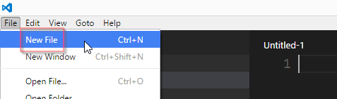
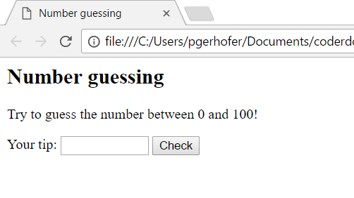

# Number guessing

## Goal

In this exercise you'll code a simple *Number Guessing* game and learn, how to handle inputs and outputs with JavaScript.

The game should do the following: The computer chooses a number between 0 and 100 and the player has to guess this number with the least amount of guesses.
The player can enter a guess to which the computer responds with *higher* or *lower* respectively. The player guesses until he chooses the correct number. 

In case you have no experience at all with HTML, ask a CoderDojo mentor for help. They will explain the HTML basics to you or point you to another exercise for the basics.

## programming environment

JavaScript as well as HTML can be written in any text editor. 
We recommend an editor that is specialized for software engineering, for example Visual Studio Code. 

## download an HTML side

So that you don't have to start from scratch, you are provided with a skeletal structure. 

1. Open your text editor.

2. Create a new text file. In *Visual Studio Code* you should do the following:  

3. Enter the following lines of code in your editor:

        <!DOCTYPE html>
        <html>
        	<head>
        		<meta charset="utf-8">
        		<title>Number guessing</title>
        	</head>
        	<body>
        		<h2>Number guessing</h2>
        		
        		
Try to guess the number between 0 and 100!

        		
        		

        			<label>Your tip:</label>
        			<input type="number" id="inputGuess" style="width:100px"/>
        			<button>Check</button>
        			
        			

        			

        		

        	</body>
        	
        	
        </html>

4. Save the file as `number-guessing.html`. Afterwards open it in a browser by double clicking on the file. You should see the following: 

## The game

When you enter a number now and click *Check* nothing will happen yet. We'll change that now. 

1. Go back to the text file in your editor. 
The file consists of two areas: one for the HTML code (red) and one for the JavaScript code (blue).  

2. We want to react to the click on the *Check* button. To do so extend the *button* tag in the HTML with the following. 
Whenever a person clicks the button, the function `checkNumber` should be called. The function doesn't exist yet but we will write it soon. 

        <button onclick="checkNumber()">Check</button>

3. To add the function add the following code to the JavaScript area after the row `number = ...`. First we will declare a new *variable* named `count` and set its value to 0.
Moreover we create the previously mentioned function `checkNumber`. For now the only thing this function does, is increment the `count` variable and show the current value on the website.

        count = 0;
    
        function checkNumber() {
    		count = count + 1;
    		outputCount.innerHTML = "You have guessed " + count + " times.";
        }

4. Take a good look and try to find out what the variable `outputCount` is used for. 
Can you see how the dedicated `p` tag is looked up with the JavaScript function [`getElementById`](http://www.w3schools.com/jsref/met_doc_getelementbyid.asp)?
In case you have any questions feel free to ask one of the mentors. 

5. Save your changes and reload the page in the browser (e.g. via pressing F5). Everytime you click *Check* now the count will be incremented and shown on the page.
	
Of course the most important part of the guessing game is still missing: the check if the number is correct or not and the hint whether the guess was too high or too low.
In order for this to work we need some more JavaScript code.

## Lower or higher?

Now we will compare the number entered by the user with the number from the computer. 

1. Go back to the HTML file in the editor. 

2. Add the following code to the beginning of the `checkNumber` function, right before the line `count = count + 1;`. 
Pay attention that the *equals* operator in the third check is done by using two equal signs.en!

        var guess = parseInt(inputGuess.value);			
        if (guess < number)
            outputResult.innerHTML  = "Your guess was too low.";
        else if (guess > number)
            outputResult.innerHTML  = "Your guess was too high.";
        else if (guess == number)
            outputResult.innerHTML  = "Correct!";		

5. Save your changes and reload the page in the browser (e.g. via pressing F5). Now you can already try the game and play it until the end. 
How many guesses does it take you to get the correct number? Can you manage it with less than 10 tries?
 
## restart the game

Right now you have to reload the hole page in order to restart the game. As a last step lets make that a little bit easier for the user

1. Go back to the HTML file in the editor. 

2. In the HTML code we add a new button for restarting the game. To do so add the following line to the file:

        <button onclick="newGame()">Restart</button>

3. If you save and reload now you can see the new button, but nothing happens when you click it. In order for it to work we have to add and implement the function `newGame`
that is called when the button is clicked. To do so add the following lines of code to the JavaScript area.

        function newGame() {
            number = Math.floor(Math.random() * 100);
            count = 0;
    	
            inputGuess.value = "";
            outputResult.innerHTML = "";
            outputCount.innerHTML = "";
        }
	
4. Take a close look at those lines. Can you see the functions starting with `Math.`? Those are mathematical function from JavaScript. 
[Here](http://www.w3schools.com/jsref/jsref_obj_math.asp) you can find a description of all those functions. 
Look for the descriptions of `Math.floor` and `Math.random` and try to find out what functionality those functions have.

5. Save your changes and reload the page in the browser (e.g. via pressing F5). Now you can restart the game anytime with a button click.

You can download the finished game [here](javascript-number-guessing/zahlen-raten-final.html).

## some ideas

In case you want to extend the game, here are some more ideas:

1. After the first guess the text is not really nice: "You guessed 1 times." It would be better to have "You guessed 1 time." (singular)

2. Improve the computers tips: "Your tip was way too high" oder "Close! Your tip was a little too low."

3. Choose (randomly) between messages with the same meaning: "Your guess was too high.", "No, too high.", "Try lower."

4. When you've collected some experience with JavaScript, you can try the [JavaScript quiz on w3schools](http://www.w3schools.com/js/js_quiz.asp). 
How many questions can you answer? You can read in the documentation to increase your HTML and JavaScript knowledge. 