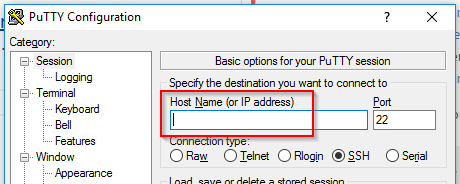

# Erste Schritte mit Assembler-Programmierung

## Ziel der Übung

Normalerweise programmieren wir im CoderDojo mit sogenannten [höheren Programmiersprachen](https://de.wikipedia.org/wiki/H%C3%B6here_Programmiersprache) wie C#, Java, Python oder JavaScript. Auf unterster Ebene versteht ein Computer diese Sprachen aber nicht. Er kann nur mit [Maschinensprache](https://de.wikipedia.org/wiki/Maschinensprache) umgehen. Diese Befehle kann der Prozessor deines Computers direkt ausführen.

In dieser Übung probieren wir, ein Programm direkt in Maschinensprache zu programmieren. Dazu verwenden wir eine [Assemblersprache](https://de.wikipedia.org/wiki/Assemblersprache). Auch wenn du später selten Assembler programmieren wirst, hilft dir diese Übung, besser zu verstehen, was im Hintergrund passiert.


## Systemvoraussetzungen

### Systemabhängigkeit

In Assembler schreibt man Programme für einen bestimmten Prozessor und ein bestimmtes Betriebssystem. Ein Assemblerprogramm, das man z.B. für einen Windows-Computer mit [Intel](https://de.wikipedia.org/wiki/Intel)-Prozessor schreibt, kann man nicht ohne weiteres unter Linux auf einem [ARM](https://de.wikipedia.org/wiki/ARM-Architektur)-Prozessor ausführen.

**Diese Übung setzt einen Intel-Prozessor und Linux (z.B. [Ubuntu](http://www.ubuntu.com/)) voraus.**

### Entwicklungsumgebung im CoderDojo

Im CoderDojo wird dir ein Mentor einen Zugang zu einer fertigen Linux-Maschine geben. Zum Zugriff brauchst du [PuTTY](http://www.chiark.greenend.org.uk/~sgtatham/putty/download.html). Lade die Software herunter, installiere sie und frage deinen CoderDojo-Mentor um die Zugangsdaten.

### Eigene Entwicklungsumgebung

**Wenn du von einem Mentor die Zugangsdaten zu einer fertigen Entwicklungsumgebung bekommen hast, kannst du dieses Kapitel überspringen.***

Möchtest du die Entwicklungsumgebung auf deinem Computer haben? Das ist natürlich möglich. Die gesamte, verwendete Software ist Open Source und kostenlos.

Damit Linux bei dir läuft, hast du folgende Möglichkeiten (falls du nicht sicher bist, frag einen CoderDojo Mentor um Hilfe):

* Du hast einen Computer, der sowieso **[Ubuntu](http://www.ubuntu.com/)** verwendet? Dann kannst du sofort loslegen.
* Du hast einen **Windows-Computer**, auf dem **Hyper-V** installiert ist bzw. installiert werden kann?
  * Lade [Ubuntu Server](http://www.ubuntu.com/download/server) aus dem Internet herunter. Du bekommst eine *.iso*-Datei
  * Installiere eine neue, virtuelle Maschine in *Hyper-V* mit *Ubuntu Server*. Falls du dabei Hilfe brauchst, frag einen CoderDojo Mentor ([Schritt-für-Schritt-Anleitung](http://www.ubuntu.com/download/desktop/install-ubuntu-desktop))
* Du hast einen **Windows- oder Mac-Computer**, auf dem *Hyper-V* **nicht** funktioniert?
  * Installiere [VirtualBox](https://www.virtualbox.org/) auf deinem Computer.
  * Lade [Ubuntu Server](http://www.ubuntu.com/download/server) aus dem Internet herunter. Du bekommst eine *.iso*-Datei
  * Installiere eine neue, virtuelle Maschine in *Hyper-V* mit *Ubuntu Server*. Falls du dabei Hilfe brauchst, frag einen CoderDojo Mentor ([Schritt-für-Schritt-Anleitung](http://www.ubuntu.com/download/desktop/install-ubuntu-desktop))
* Du kannst oder möchtest *Ubuntu* Linux nicht auf deinem Computer installieren? Du kannst eine virtuelle Maschine in der **Azure Cloud** verwenden ([Schritt-for-Schritt-Anleitung](https://azure.microsoft.com/de-de/documentation/articles/virtual-machines-linux-quick-create-portal/)).
  * **Achtung!** Virtuelle Maschinen in der Cloud sind **kostenpflichtig**. Du brauchst die Hilfe deiner Eltern, um mit einer Kreditkarte den Zugang freizuschalten.

Wenn du deinen *Ubuntu* Linux Server installiert hast, musst du die für die Übung notwendige Software einrichten. Folgendes müssen wir installeren:

* [NASM - The Netwide Assembler](http://www.nasm.us/index.php)
  * [Installationsanleitung](http://www.nasm.us/xdoc/2.12.02/html/nasmdoc1.html#section-1.3)
  * [Download](http://www.nasm.us/pub/nasm/releasebuilds/?C=M;O=D)
  * [Dokumentation](http://www.nasm.us/xdoc/2.12.02/html/nasmdoc0.html)
* [GCC - The GNU Compiler Collection](https://gcc.gnu.org/)
  * GCC wird unter Ubuntu Linux im Paket [build-essentials](https://packages.debian.org/de/sid/build-essential) installiert. Starte daher `sudo apt-get install build-essential`
  * [Dokumentation](http://www.delorie.com/gnu/docs/gcc/gcc_toc.html)
* [GDB - The GNU Project Debugger](https://www.gnu.org/software/gdb/)
  * GDB wird unter Ubuntu Linux im Paket `gdb` installiert. Start daher `sudo apt-get install gdb`
  * [Dokumentation](http://www.delorie.com/gnu/docs/gdb/gdb_toc.html)

Hier das gesamte Installationsscript:

```
sudo apt-get update
sudo apt-get install -qqy build-essential gdb
curl --output nasm-2.12.02.tar.gz http://www.nasm.us/pub/nasm/releasebuilds/2.12.02/nasm-2.12.02.tar.gz
sudo tar -xzf nasm-2.12.02.tar.gz --directory /usr/local/src
cd /usr/local/src/nasm-2.12.02/
sudo ./configure
sudo make
sudo make install
sudo cp nasm.1 /usr/local/man/man1
sudo cp ndisasm.1 /usr/local/man/man1
cd ~
```

*Ein Hinweis für das Mentorenteam:* Im Ordner [create-ubuntu-scripts](create-ubuntu-scripts) findet ihr ein *ARM-Template* mit zugehörigem PowerShell-Script zum automatischen Anlegen von vorkonfigurierten VMs in Azure.


## Zum Unbuntu Linux Server verbinden

1. Starte [PuTTY](http://www.chiark.greenend.org.uk/~sgtatham/putty/download.html)

1. Im Feld *Host Name (or IP address)* gibst du die IP-Adresse deines Ubuntu Linux Servers ein (im CoderDojo bekommst du die IP-Adresse vom Mentorenteam).<br/>


1. Melde dich mit Benutzer und Passwort an (im CoderDojo bekommst du Benutzer und Passwort vom Mentorenteam)

1. Probiere, ob du den Assembler starten kannst, indem du das Kommando `nasm -v` ausführst. Du müsstest die Version von NASM angezeigt bekommen.

Klappt alles? Dann können wir anfangen zu hacken.


## Erste Übung: *Hello World*

Als erstes möchten wir das typische Kennenlernprogramm schreiben, das man in jeder Programmiersprache programmiert: *Hello World*.

1. Starte den Editor *vim* mit dem Kommando `vim`. *vim* ist ein grundlegender Editor, der bei Bedarf auf jeden System installiert werden kann.

1. Mache dich gemeinsam mit dem Mentorenteam vom CoderDojo mit *vim* vertraut.
   * Bei Bedarf findest du eine gute [Einführung in *vim*](https://wiki.ubuntuusers.de/VIM/) im Internet
   * Nützlich ist auch ein [Cheat Sheet](http://vim.rtorr.com/)

1. Erstelle mit *vim* die Datei `hello.asm`, indem du das Kommando `vim hello.asm` eingibst.

1. Gib das folgende Assemblerprogramm ein:

```
        SECTION .data       ; Hier speichern wir Daten
msg:    db "Hello World",10 ; Diesen Text wollen wir ausgeben
                            ; Die 10 am Ende bedeutet "naechste Zeile"
len:    equ $-msg           ; Wir berechnen die Laenge des Text, indem
                            ; wir die Speicheradresse von msg von der
                            ; aktuelle Speicheradresse ("$") subtrahieren

        SECTION .text       ; Hier kommt der Code
        global main         ; Das Programm startet bei "main"
main:
        mov edx,len         ; In edx tragen wir die Laenge ein
        mov ecx,msg         ; In ecx die Adresse des Textes
        mov ebx,1           ; 1 steht fuer "stdout" = Bildschirm
        mov eax,4           ; 4 steht fuer "Ausgabe"
        int 0x80            ; Mit Interrupt 80 hex rufen wir den 
                            ; Linux Kernel auf

        mov ebx,0           ; 0 steht fuer "normal beendet"
        mov eax,1           ; 1 steht fuer "programm beenden" 
        int 0x80
```

1. Kompiliere das Programm mit `nasm -f elf hello.asm`. Als Ergebnis bekommst du eine Datei `hello.o`.

1. Linke das Programm mit `gcc -m32 -o hello hello.o`. Als Ergebnis bekommst du die ausführbare Datei `hello`. Faszinierend, wie klein die Datei ist, oder?

1. Führe dein Programm mit `./hello` aus. Wenn *Hello World" ausgegeben wird, hast du dein erstes Assembler-Programm geschrieben :-)

Hier in paar wichtige Links, die dir helfen, das Programm besser zu verstehen:

* [Seite mit Links zu Lernmaterial](http://asm.sourceforge.net/)
* [Linux System Calls](http://www.lxhp.in-berlin.de/lhpsyscal.html)
* [Linux File Descriptors](https://en.wikipedia.org/wiki/File_descriptor)

Während des CoderDojos kannst du das Programm mit dem Mentorenteam diskutieren.


## Challenge: Was macht dieses Programm?

Im folgenden Programm sind bewusst keine Kommentare enthalten. Finde heraus was es macht. Gib den Code anschließend ein und probieren ihn aus.

```
        section .bss
buffer: resb 64

        section .text
        global main
main:
        mov edx, 64
        mov ecx, buffer
        mov eax, 3
        mov ebx, 0
        int 0x80

        mov edx,eax
        mov eax, 4
        mov ebx, 1
        int 0x80

        mov eax, 1
        int 0x80
```

