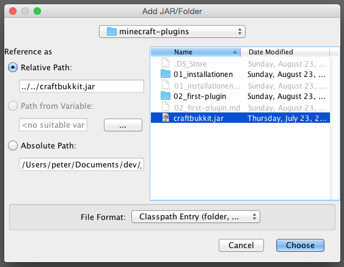
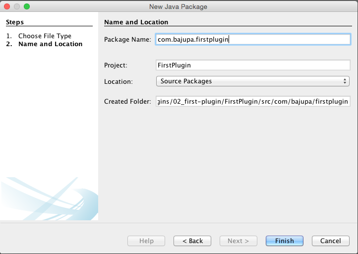
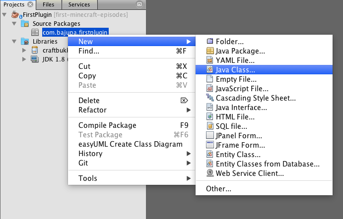
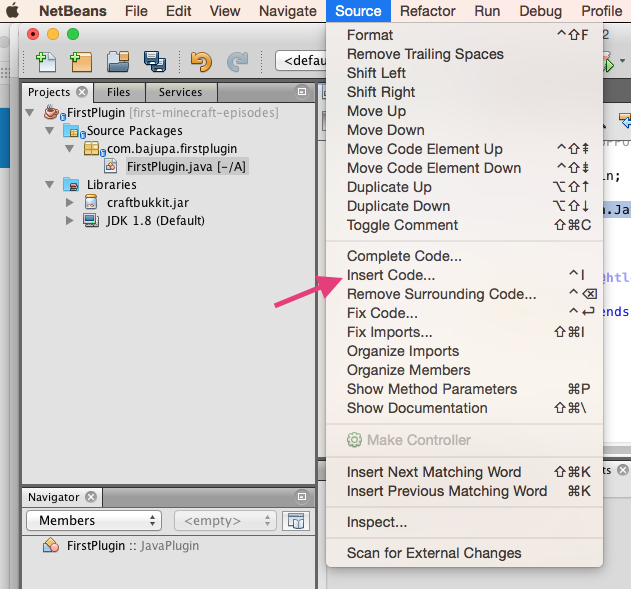
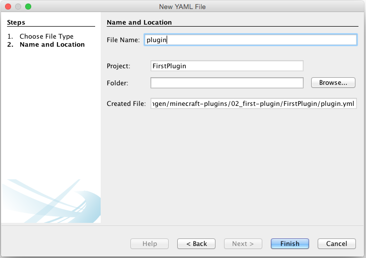
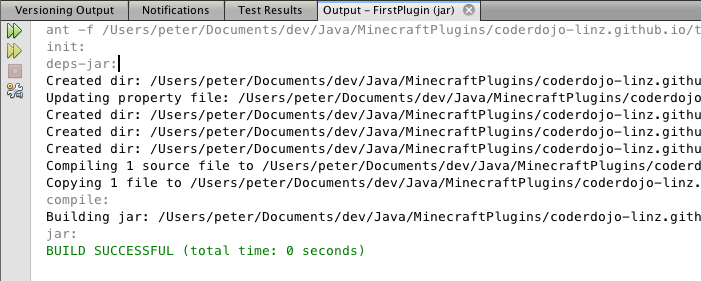

# Dein erstes Plugin
Nach den Vorbereitungsarbeiten können wir nun endlich unser erstes Plugin entwickeln. Wenn wir mit dieser Episode fertig sind, wirst du in Minecraft den Befehl ``/sayhello`` eingeben können und du wirst die Antwort ``Hello *dein-Minecraft-Name*`` erhalten (*dein-Minecraft-Name* wird natürlich durch deinen wirklichen Minecraft-Namen ersetzt werden). Dieses wird vielleicht noch nicht das absolute Killer-Plugin auf *Curse* sein aber eine Reise beginnt immer mit ihrem ersten Schritt. Also, los gehts:

## Ein neues NetBeans-Projekt anlegen
Als erstes starten wir natürlich NetBeans. Die StartPage brauchen wir nicht und du kannst sie gleich wegklicken. Jetzt gehst du ins Menü **File** und findest als ersten Menüpunkt **New Project …** Wenn du den auswählst, siehst du folgendes Fenster:

Du wählst die Kategorie **Java** und von den Projekten **Java Class Library**, anschließend klickst du auf **Next >**. Damit siehst du sofort ein weiteres Fenster, das folgendermaßen aussieht:

Hier vergibst du einen sinnvollen Projektnamen. Da es unser erstes Plugin ist, tut es auch ein etwas einfallsloses **FirstPlugin**, besser verständlich ist natürlich ein Name wie **GreetMe**. Für die Project Location suchst du dir einen Platz auf deiner Festplatte, wo du das Plugin auch wiederfindest. Project Folder lässt sich nicht ändern. Dieses Feld zeigt dir nur, wo dein Projekt und alle seine Files gespeichert werden. Damit bist du fertig und kannst auf den Button **Finish** drücken. Damit verschwindet das Fenster und du hast einen ersten Blick auf dein gesamtes Projekt.

So nun wollen wir uns mal ein wenig orientieren.

Der Arbeitsbereich in NetBeans gliedert sich grundsätzlich in 5 Teile. Wir gehen diese nummernweise durch:

1. Im *Project Explorer* hast du einen Überblick über dein Projekt. Alle Dateien, die du dazu brauchst sind hier aufgelistet und können relative schnell gefunden werden. Die wichtigsten Files wirst du unter **Source Packages** finden.
2. Im *Navigator* wirst du, nachdem wir das erste File editieren, einen Überblick über das geöffnete File haben. Wenn das File ein wenig größer wird, wirst du sehen, dass es sehr bequem ist, wenn man schnell zu bestimmten Punkten im File springe kann.
3. Im *Information Panel* bekommst du Informationen, die beim Arbeiten wichtig sind. Beispielsweise kannst du hier sehen, ob du dein Projekt erfolgreich "baut", das heißt für den Einsatz in Minecraft übersetzt werden kann.
4. Das ist der Editor. Hier werden wir dann Java-Code reinschreiben
5. Das ist die Toolbar. Manche Befehle (z. B. um das Projekt zu bauen) können wir hier schnell erreichen.

Bevor wir jetzt endlich mit dem Programmieren beginnen müssen wir noch die Datei ``craftbukkit.jar`` zu unserem Projekt hinzufügen. Ja du liest richtig, es ist genau dieselbe Datei, die wir bereits verwendet haben, um unseren Server zu starten. Am besten legst du dir eine Kopie an und legst sie im Ordner neben deinem FirstPlugin ab. Nun klickst du im **Project Explorer** mit der rechten Maustaste auf den Ordner **Libraries** und wählst den Punkt **Add JAR/Folder…** aus:

Nun siehst du folgendes Fenster in welchem du zum File ``craftbukkit.jar`` navigieren kannst. Wähle es aus und klicke auf **Choose**.

Jetzt siehst du im **Project Explorer** im Ordner **Libraries** die Datei ``craftbukkit.jar``. So jetzt können wir mit dem Programmieren beginnen.

### Großeltern-Imponier-Wissen
* Java-Programme müssen, bevor sie ausgeführt werden können, *gebaut* werden. Das heißt, dass man den Java-Code (also, das, was du schreibst) in einen Maschinen-Code umwandeln muss. Manchmal sagt man auch, dass das Programm *compiliert* werden muss.
* Wenn du ein Minecraft-Plugin schreibst, brauchst du Informationen vom Server (z. B. den Namen des Spielers) oder willst auch das Verhalten des Servers teilweise verändern (z. B. soll er auf das Kommando ``/sayhello`` reagieren, was er ja sonst mal so nicht täte). Damit das möglich ist, gibt es das sogenannte *API* (Application Programmer Interface), das sind alle "Funktionen", die der Server für dich zum Programmieren zur Verfügung stellt. Damit wir das API zur Verfügung haben, fügen wir die Datei ``craftbukkit.jar`` zu unserem Projekt dazu.

## Ein Package und die Plugin-Klasse anlegen
Du speicherst Java-Dateien in *Packages* ab. Wenn du im **Project Explorer** den Ordner **Source Packages** öffnest, siehst du das Package **\<default package\>**. Damit Package-Namen aber sicherlich eindeutig sind, legst du aber besser ein neues Package an, mit ``io.coderdojo-linz.<dein-name>.firstplugin`` (dabei ersetzt du ``<dein-name>`` durch deinen Namen). Wenn du eine eigene Domain über die du im Netz erreichbar bist hast, dann kannst du auch die verwenden.

Also klickst du mit der rechten Maustaste auf **Source Packages** und wählst aus dem Kontextmenü **New** und dann **Java Package ...** aus. 

Im nun folgenden Fenster gibst du den Namen deines Packages, wie wir oben beschrieben haben, ein und klickst auf den Button **Finish**.

Jetzt ist das Package **\<default package\>** verschwunden. Das macht nichts, weil wir es derzeit echt nicht brauchen. Und nun musst du noch die Klasse anlegen, in der wir dieses Plugin programmieren. Dazu (Überraschung!!) klickst du mit der rechten Maustaste auf das neu erstellte Package und wählst dann **New** und **Java Class...** aus

Im darauffolgenden Fenster gibst du der neuen Klasse einen Namen und klickst auf **Finish**.

Jetzt solltest du in NetBeans ziemlich genau dieses Bild vor dir haben:

## Die Klasse programmieren
Nun müssen wir dieser Klasse als erstes mal mitteilen, dass sie ein Plugin werden soll. Das machen wir indem wir in der Zeile mit ``public class FirstPlugin {`` folgendes dazuschreibst:

Du siehst nun, dass das Wort **JavaPlugin** rot unterstrichen ist und am Beginn der Zeile einen Hinweis bekommen hast. Das bedeutet, dass der Compiler einen Fehler gefunden hat (rot unterstrichen) und aber einen oder mehrere Lösungsvorschläge für dich hat (gelbe Glühbirne am Beginn der Zeile). Wenn du auf die Glübirne klickst, bekommst du die Option angeboten, **Add import org.bukkit.plugin.java.JavaPlugin** und genau das wählst du aus. Damit sollte die Fehlermeldung verschwunden sein und ein paar Zeilen über der Zeile, die du gerade geschrieben hast, die Codezeile ``import org.bukkit.plugin.java.JavaPlugin;`` stehen.

Somit hätten wir ein fast lauffähiges Plugin, das genau gar nix macht. Da das genau niemand braucht, werden wir dem Ding mal sagen, dass es bei Aufruf ``Hello stranger`` ausgeben soll. Dazu müssen wir eine *Methode* anlegen und das geht so: Als erstes klickst du in die Klasse ``FirstPlugin``, das heißt, du platzierst den Cursor in die Zeile zwischen der geschwungenen Klammer auf und wieder zu. 

    public class FirstPlugin extends JavaPlugin {
       // your cursor must be here
    }

Also du klickst genau in die leere Zeile. Dann gehst du auf das Menü **Source** und wählst **Insert Code...** aus.

Damit bekommst du ein kleines Fensterchen, in welchem du **Override Method...** auswählst.

Und weils grad so lustig ist, kommt gleich noch ein Fenster, in welchem wir die Zeile mit **onCommand(...** auswählen.

Wenn du dann auf **Generate** klickst, siehst du in deiner Klasse eine erste Methode. Hier legen wir fest, was das Plugin machen soll. Dazu löschen wir als erstes die Zeile mit ``return super.onCommand(sender, command, label, args)`` und schreiben folgendes rein:

    @Override
    public boolean onCommand(CommandSender sender, Command command, String label, String[] args) {
        sender.sendMessage("Hello stranger");
        return true;
    }

Am Ende sollte deine Klasse genau so aussehen:

Ok, damit sind wir beinah durch. Was uns noch fehlt ist, dass wir für Minecraft erkenntlich machen, wie das Plugin heißt und auf welches Kommando es reagiert. Das machen wir im ``plugin.yml``.

## Das ``plugin.yml`` anlegen, das Projekt bauen und testen
Im ``plugin.yml`` schreiben wir alles das rein, das Minecraft braucht, um unser Plugin zu erkennen und im richtigen Moment auch aufrufen zu können. Dazu legen wir das File zuerst einmal an. Überraschenderweise klickst du wieder mit der rechten Maustaste auf das **Source Package** und wählst **New** und **YAML File...** aus. Falls du diesen Eintrag nicht findest, wählst du im Menü ganz unten **Other...** aus und wählst aus der Kategorie **Other** den Punkt **YAML File** aus.

Inzwischen kennst du den zweiten Schritt wahrscheinlich auch schon: Wir müssen das File benennen. Achte darauf, dass,

1. das File wirklich ``plugin`` heißt und
2. wie beim Java-File auch, du nicht die Dateierweiterung ``.yml`` dazuschreibst. Es reicht der Name ``plugin``, im Feld **Created File** siehst du, dass das ``yml`` automatisch angehängt wird:

Und wenn du jetzt in den Project Explorer schaust, dann entdeckst du, dass unser geliebtes ``<default package>`` wiederauferstanden ist. Das ist auch richtig so, da Minecraft das ``plugin.yml`` genau an dieser Stelle sucht.

Jetzt haben wir wieder ein leeres File und dürfen hier die notwendigen Informationen eintragen:

Bevor du beginnst, das abzuschreiben, lies dir die folgenden Punkte bitte durch: Als erstes achte bitte darauf, dass nach den Doppelpunkten immer unbedingt ein Leerzeichen kommen muss.

1. name ist eben der Name und kann beliebig gewählt werden. Sinnvollerweise nennen wir unser Plugin so, wie wir auch das Projekt genannt haben.
2. **Aufpassen!** In dieser Zeile legen wir fest, in welcher Klasse das Plugin implementiert ist. Und zwar müssen wir das inklusive dem Package-Namen angeben. Vergleiche die Zeile mit ``main`` mit der Darstellung des Packages und der Klasse im Bild darüber. Die siehst, dass das übereinstimmt (bis auf ``.java``.)
3. version ist eben die Verion. Das darfst du dir aussuchen.
4. authors ist eine Liste der Authoren, die untereinander stehen und mit einem Minus (-) anfangen. Hier musst du darauf achten, dass die Zeilen mit den Listeneinträgen ein paar Leerzeichen (**Achtung: keine Tabs**) eingerückt sind.
5. description beschreibt das Plugin. Hier kannst du deiner Fantasie wieder freien Lauf lassen.
6. commands listet alle Kommandos, auf die das Plugin reagiert auf und gibt eine kurze Beschreibung und einen Benutzungshinweis an. Wir wollen, dass unser Plugin auf das Kommando ``/sayhello`` reagiert. Daher haben wir genau dieses Kommando angegeben. Auch hier achte wieder auf die Einrückungen. Diesmal sind es sogar zwei bei description und usage.

Damit bist du jetzt wirklich fertig und kannst das gesamte Projekt bauen. Dazu klickst du auf den Hammer in der **Toolbar**:

Daraufhin sollte im **Information Panel** im Tab **Output** ca. folgende Information stehen:

Der wichtigste Punkt ist die letzte Zeile, in der auf jeden Fall ``BUILD SUCCESSFULL`` stehen muss. Damit ist nämlich klar, dass dein Projekt korrekt ist und übersetzt werden kann.

Um dein Plugin auszurprobieren musst du im File-Explorer (Windows) oder Finder (Mac) in dein NetBeans Projekt-Directory reinsehen. Dort sollte sich nun ein weiteres Directory ``dist`` befinden, in dem sich wiederum ein File ``FirstPlugin.jar`` befinden sollte. Dieses nimmst du nun und bewegst es in das Directory ``plugins`` des Server-Directories, das du noch aus unserer ersten Episode kennst.

Nun kannst du den Server starten. Als erstes überprüfen wir, ob das Plugin korrekt geladen wurde. Das sehen wir im Log des Servers, wenn er hochstaret.

Abschließend kannst du testen, indem du das Kommando ``sayhello`` in der Konsole eingibst. Der Server sollte mit ``Hello stranger`` antworten. Auch kannst du noch ins Spiel gehen und dort den Befehl mit Slash ``/sayhello`` eingeben. Auch ier sollte der Server mit einem freundlichen ``Hello stranger`` antworten.

## Eine erste Erweiterung
Nur im Spiel und nicht in der Konsole

## Eine zweite Erweiterung
Name des Spielers statt stranger.

## Zusammenfassung für Profis
1. Neues Projekt anlegen
2. ``craftbukkit.jar`` zu den Libraries dazufügen
3. Package anlegen
4. Klasse anlegen
5. ``extends JavaPlugin`` dazuschreiben
6. Methode ``onCommand`` zur Klasse geben
7. ``plugin.yml`` zum Projekt hinzufügen
8. Bauen
9. Fertiges jar File aus ``dist`` in das Plugins-Verzeichnis kopieren