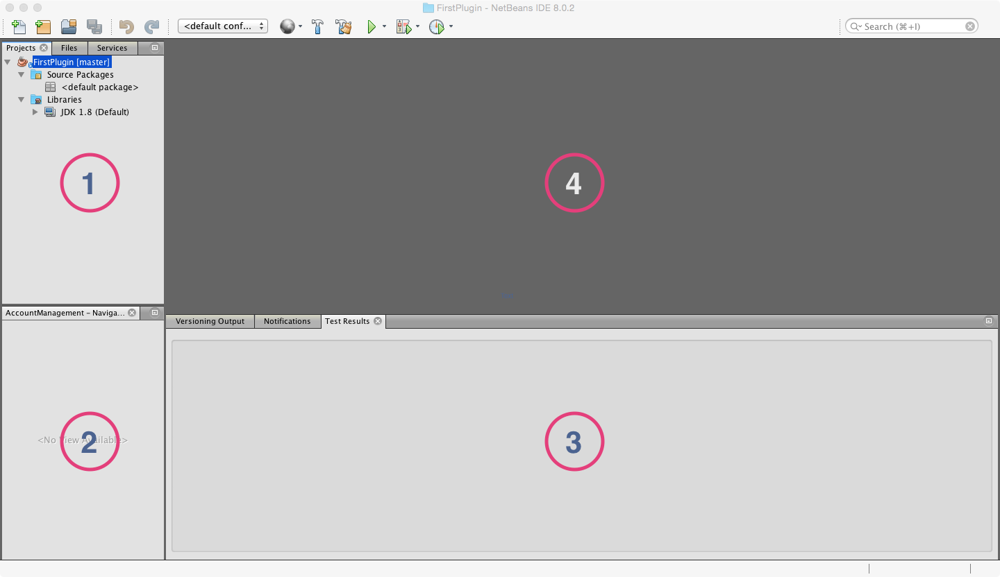

# Dein erstes Plugin
Nach den Vorbereitungsarbeiten können wir nun endlich unser erstes Plugin entwickeln. Wenn wir mit dieser Episode fertig sind, wirst du in Minecraft den Befehl ``/sayhello`` eingeben können und du wirst die Antwort ``Hello *dein-Minecraft-Name*`` erhalten (*dein-Minecraft-Name* wird natürlich durch deinen wirklichen Minecraft-Namen ersetzt werden). Dieses wird vielleicht noch nicht das absolute Killer-Plugin auf *Curse* sein aber eine Reise beginnt immer mit ihrem ersten Schritt. Also, los gehts:

## Ein neues NetBeans-Projekt anlegen
Als erstes starten wir natürlich NetBeans. Die StartPage brauchen wir nicht und du kannst sie gleich wegklicken. Jetzt gehst du ins Menü **File** und findest als ersten Menüpunkt **New Project …** Wenn du den auswählst, siehst du folgendes Fenster:

Du wählst die Kategorie **Java** und von den Projekten **Java Class Library**, anschließend klickst du auf **Next >**. Damit siehst du sofort ein weiteres Fenster, das folgendermaßen aussieht:

Hier vergibst du einen sinnvollen Projektnamen. Da es unser erstes Plugin ist, tut es auch ein etwas einfallsloses **FirstPlugin**, besser verständlich ist natürlich ein Name wie **GreetMe**. Für die Project Location suchst du dir einen Platz auf deiner Festplatte, wo du das Plugin auch wiederfindest. Project Folder lässt sich nicht ändern. Dieses Feld zeigt dir nur, wo dein Projekt und alle seine Files gespeichert werden. Damit bist du fertig und kannst auf den Button **Finish** drücken. Damit verschwindet das Fenster und du hast einen ersten Blick auf dein gesamtes Projekt.

So nun wollen wir uns mal ein wenig orientieren.

Der Arbeitsbereich in NetBeans gliedert sich grundsätzlich in 5 Teile. Wir gehen diese nummernweise durch:

1. Hier hast du einen Überblick über dein Projekt. Alle Dateien, die du dazu brauchst sind hier aufgelistet und können relative schnell gefunden werden. Die wichtigsten Files wirst du unter **Source Packages** finden.
2. Hier wirst du, nachdem wir das erste File editieren, einen Überblick über das geöffnete File haben. Wenn das File ein wenig größer wird, wirst du sehen, dass es sehr bequem ist, wenn man schnell zu bestimmten Punkten im File springe kann.
3. Hier bekommst du Informationen, die beim Arbeiten wichtig sind. Beispielsweise kannst du hier sehen, ob du dein Projekt erfolgreich "baut", das heißt für den Einsatz in Minecraft übersetzt werden kann.
4. Das ist der Editor. Hier werden wir dann Java-Code reinschreiben
5. Das ist die Toolbar. Manche Befehle (z. B. um das Projekt zu bauen) können wir hier schnell erreichen.

Bevor wir jetzt endlich mit dem Programmieren beginnen müssen wir noch die Datei ``craftbukkit.jar`` zu unserem Projekt hinzufügen. 

### Großeltern-Imponier-Wissen
* Java-Programme müssen, bevor sie ausgeführt werden können, *gebaut* werden. Das heißt, dass man den Java-Code (also, das, was du schreibst) in einen Maschinen-Code umwandeln muss. Manchmal sagt man auch, dass das Programm *compiliert* werden muss.
* Wenn du ein Minecraft-Plugin schreibst, brauchst du Informationen vom Server (z. B. den Namen des Spielers) oder willst auch das Verhalten des Servers teilweise verändern (z. B. soll er auf das Kommando ``/sayhello`` reagieren, was er ja sonst mal so nicht täte). Damit das möglich ist, gibt es das sogenannte *API* (Application Programmer Interface), das sind alle "Funktionen", die der Server für dich zum Programmieren zur Verfügung stellt. Damit wir das API zur Verfügung haben, fügen wir die Datei ``craftbukkit.jar`` zu unserem Projekt dazu.

## Ein Package und die Plugin-Klasse anlegen

## Das ``plugin.yml`` anlegen

