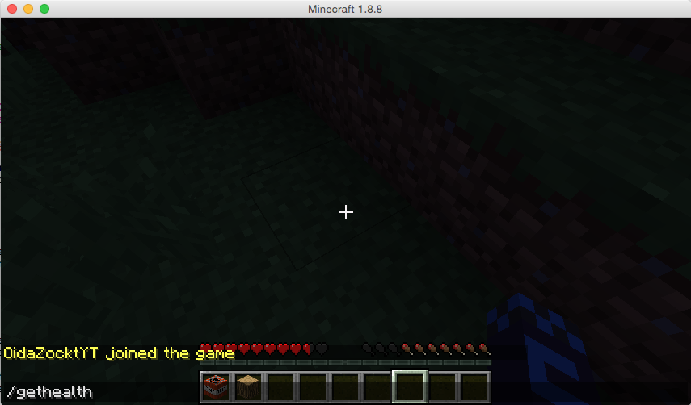
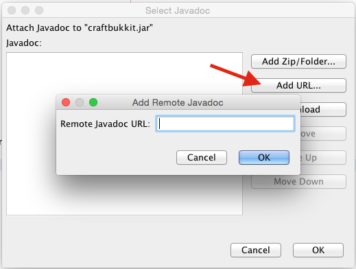

# Miraculix der Druide - Teil 1

Inhalt:

* [Einleitung](#intro)
* [Ausführliche Anleitung /gethealth](#long1)
* [Ausführliche Anleitung /heal](#long2)
* [Kurzversion für Profis](#short)

## Einleitung
Vielleicht hast du schon einmal Asterix und Obelix gelesen oder einen der Filme angesehen. Dann wirst du dich sicherlich an den Druiden Miraculix erinnern, das ist der, der den Zaubertrank zubereiten kann. Wir werden in dieser und einigen weiteren Episoden ein Plugin programmieren, mit dem du Miraculix spielen kannst. Wir fangen damit an, dass du dich und andere Spieler sofort heilen kannst. Auch kannst du deine Gesundheit oder die Gesundheit anderer Spieler anzeigen. Dazu soll es folgende Befehle geben:

    /gethealth me
    /gethealth OidaZocktYT
    /heal me
    /heal OidaZocktYT

Also im Grunde zwei Kommandos:

* `/gethealth`: Zeigt die Gesundheit von mir (`me` als Parameter) oder eines anderen Spielers (Name des anderen Spielers als Parameter) an
* `/heal`: Heilt mich oder einen anderen Spieler

Wenn du dich wunderst, warum das Plugin nun *Getafix* heißt, verrate ich dir, dass auf Englisch der Druide nicht Miraculix sonder Getafix heißt. Und du hast sicher schon bemerkt, dass wir Informatiker gerne Dinge in englischer Sprache benennen. Daher kommt das. Jetzt kannst du deine Englischlehrerin oder deinen Englischlehrer abtesten, ob er oder sie die wirklich wichtige Literatur auch auf Englisch gelesen hat :-).

### Grundsätzliche Überlegungen
Jetzt wollen wir mal überlegen, was wir zum Schreiben eines Plugins, welches die Gesundheit eines Spielers ausliest und verändert, brauchen und wie wir am besten vorgehen:

1. Wir müssen bei der Eingabe von ``/gethealth`` die Gesundheit des Senders ermitteln. Dazu benötigen wir eine Möglichkeit, die Gesundheit des Spielers zu ermitteln. Du erinnerst dich, dass der Spieler im `onCommand` als Parameter `sender` ansprechbar ist. Da brauchen wir dann für diesen Sender eine Methode, die irgendwas mit `health` im Namen hat. Die werden wir, nachdem du das NetBeans-Projekt angelegt hast, suchen.
2. Damit es für den Anfang schön einfach bleibt, werden wir die Geschichte mit dem `me` oder dem Namen eines anderen Spielers noch lassen und nur auf den Befehl `/gethealth` oder `/heal` (so, wie in den Screenshots oben) reagieren und immer unsere eigene Gesundheit ausgeben oder uns selbst heilen.

### Neues NetBeans-Projekt anlegen
Anfangen tut das Ganze mit bereits bekannten Arbeitsschritten. Wir legen ein Projekt an mit dem Namen ``Getafix``. Dann legst du gleich ein Package mit dem Namen ``getafix`` an (vergiss nicht, vorher deinen Namen plus eine Domain anzugeben. Bei mir hieße das ``com.bajupa.getafix``). Falls du dich nicht mehr ganz gut erinnern kannst, sieh einfach in der Episode 2 nach, wie wir ein neues Projekt und ein neues Package angelegt haben. Zum Schluss legen wir eine neue Klasse mit dem Namen ``Getafix`` an (achte bitte wieder auf die Groß- und Kleinschreibung). Kurz gesagt: du musst die ersten sechs Punkte der *Zusammenfassung für Profis* aus der zweiten Episode abgearbeitet haben.

Da das jetzt nicht mehr alles ganz neu ist für dich, wollen wir uns an dieser Stelle noch ein klein bisschen genauer umsehen. Du erinnerst dich, dass wir vom Parameter ``sender`` verschiedene Methoden aufrufen konnten (``sendMessage`` und ``getName`` im letzten Fall). Vielleicht hast du das letzte Mal schon bemerkt, dass, sobald du nach ``sender`` einen Punkt eintippst, ein Menü erscheint, in welchem alle Methoden, die du hier aufrufen kannst, aufgelistet sind. Falls das nicht der Fall ist, kannst du mit ``Strg`` und ``Space`` (also die große Taste unten für das Leerzeichen) nachhelfen, dass das Menü auch wirklich kommt. Dann sollte das ganze ca. so aussehen. Probiere es gleich mal aus:

Wenn du dich in dem Menü ein wenig umsiehst, kannst du alle verfügbaren Methoden für `sender` ansehen. Unter diesem Menü solltest du noch folgendes Fenster sehen.

Das ist jetzt noch nicht sonderlich hilfreich, weil eine Fehlermeldung drinsteht. Das wollen wir ändern, dass da immer eine genauere Beschreibung der Methode, die du gerade ausgewählt hast, drinstehen. Dazu müssen wir die fehlende Dokumentation noch dazulinken. Dazu klickst du auf `Attach Javadoc...` und im darauffolgenden Fenster klickst du zuerst auf **Add URL...** und dann tippst du `https://hub.spigotmc.org/javadocs/bukkit/` bei **Remote Javadoc URL** ein.

Nun solltest du für jede Methode eine kurze Beschreibung bekommen. Ich weiß ja nicht, wie es dir geht, aber zum Thema Gesundheit kann ich beim `sender` kein wirkliches Angebot finden. Damit wir hier weiterkommen, muss ich dir noch kurz eine Geschichte erzählen. Dauert auch nicht lange, versprochen:

### Über Menschen, Berufe, Variablen, Parameter und Datentypen
In der letzten Episode, als wir das erste Plugin geschrieben haben, war ich ein bisschen schlampig bei meinen Erklärungen. Du erinnerst dich sicher noch an den Parameter ``sender``, mit dem wir die Spielerin, die das Kommando eingetippt hat "ansprechen" konnten und ihr eine Nachricht mit Hilfe der Methode ``sendMessage`` senden konnten.

Ja gut und ich habe dir gar nicht gesagt, warum das so funktioniert, weil ich wollte, dass wir ganz schnell unser Plugin fertig bekommen. Diese Sache hole ich jetzt nach. Du erinnerst dich ja noch, dass die leere Methode `onCommand` so ausgesehen hat:

    public boolean onCommand(CommandSender sender, Command command, String label, String[] args) {
        return true;
    }

Wir haben dann gesagt, dass in den runden Klammern die Parameter stehen, damit man der Methode bestimmte Informationen, die sie zum Arbeiten braucht, "mitgeben" kann. So wie oben den Sender des Kommandos, also den, der das Kommando eingetippt hat.

Dabei ist nun folgendes zu beachten: `sender` ist der *Name* des Parameters und `CommandSender` der *Typ* des Parameters. Das ist ein bisschen so, wie im echten Leben mit den Menschen und ihren Berufen. Beispielsweise könnten wir sagen, dass in dem Falle, dass irgendwo gearbeitet wird, wir einen Tischler und einen Programmierer brauchen. "Anton ist ein Tischler" und "Sophia ist eine Programmiererin". In Java-Notation könnte das dann so aussehen:

	public boolean onWork(Joiner anton, Programmer sophia) {
		return true;
	}

Also `onWork` ist der Name der Methode und `anton` und `sophia` sind die Parameter. Wir werden noch eine andere Schreibweise kennenlernen:

    Joiner anton;
    Programmer sophia;

Das werden wir dann verwenden, wenn wir in einer Methode kurz mal jemanden mit einem bestimmten Beruf benötigen (äh, einen Namen mit einem bestimmten Typ natürlich). In diesem Fall sagen wir nicht *Parameter* sondern *Variable*, sonst ist es aber das gleiche.

Ja, Java ist eine etwas schlichte Sprache, aber so ist das nun mal. Außerdem schreiben wir Namen in Java immer klein, dafür die "Berufe" (eigentlich sprechen wir von Datentypen) immer groß. Auf unser Beispiel oben angewendet können wir jetzt sagen "`sender` ist ein `CommandSender`".

Wie im echten Leben auch, können wir Menschen mit unterschiedlichen Berufen unterschiedliche "Befehle" geben. Einem Tischler können wir sagen "baue mir bitte ein Wohnzimmer" und er wird das machen können. Eine Programmiererin können wir bitten "schreibe mir ein Minecraft-Plugin". In Java würde das vielleicht dann so aussehen

    Joiner anton;
    Programmer sophia;
    
    anton.buildLivingRoom();
    sophia.writeMinecraftPlugin();

Habe ich schon erwähnt, dass Java (wie die meisten Programmiersprachen) sehr schlicht ist und nicht viel Platz für Höflichkeitsfloskeln lässt? Also zusammengefasst: Welche Befehle ich einer Person (sinnvoll) geben kann, hängt von ihrem Beruf ab. In Informatikersprache heißt das: Welche Methoden ich bei einer Variable (Parameter) aufrufen kann hängt von ihrem (seinem) Datentyp ab.

Jetzt, da du das verstanden hast, kannst du dir auch vorstellen, dass du den Namen `sender` im `onCommand` ändern kannst, ohne dass die Funktionalität leiden würde. Wie im echten Leben kannst du deine Kinder nennen, wie du magst. Wenn du aber den Datentyp `CommandSender` ändern würdest, dann würde plötzlich nix mehr funktionieren, weil das `onCommand` als ersten Parameter einen `CommandSender` erwartet. Wieder hilft uns das echte Leben: Wenn du neue Möbel für dein Wohnzimmer brauchst, dann willst du einen Tischler und keinen Programmierer.

## Ausführliche Anleitung /gethealth
Wir beginnen mit einem einfachen Fall. Sobald der Spieler ``/gethealth`` im Spiel eingibt, soll die Gesundheit als Zahl zwischen 0 und 20 ausgegeben werden. Also sehen wir uns den Typ des Parameters ``sender`` einmal an. Das ist ein ``CommandSender`` und wenn du nun ``sender.`` in einer Zeile der Methode ``onCommand`` eintippst, dann siehst du, was so ein ``CommandSender`` alles kann. Du wirst feststellen, dass der aber mit Gesundheit nix am Hut hat, weil wir keine Methode finden, die irgendwo "Health" im Namen hat. Aber es gibt einen anderen Datentypen, nämlich ``Player``, der den Spieler in einem Minecraft-Game genauer spezifiziert. Genauer gesagt ist ein ``Player`` auch ein ``CommandSender``und kann aber noch um einiges mehr. Du kannst das ausprobieren, indem du folgendes eintippst:
<pre>
    public boolean onCommand(CommandSender sender, Command command, String label, String[] args) {
        <b>Player player;</b>
        <b>player.</b>
        return true;
    }
</pre>

Jetzt sollte das Menü mit den verfügbaren Methoden ein wenig länger sein. Du findest auch alle Methoden vom ``CommandSender`` wieder und eben noch mehr. Besonders auffallen sollten dir die Methoden ``getHealth`` und ``setHealth``.

Wenn also der ``sender`` nicht nur ein ``CommandSender`` sondern auch ein ``Player`` ist (und das ist er auf jeden Fall, wenn ein Spieler unser Command ``/gethealth`` eingibt), dann könnten wir auf das viel umfangreichere Methodenangebot von ``Player`` zurückgreifen. Dazu brauchen wir nur noch einen Trick, wie wir aus einem `CommandSender` einen `Player` machen können. Dazu legen wir uns eine Variable vom Type `Player` an und weisen ihr den sender zu. Das sieht dann folgendermaßen aus:

<pre>
    public boolean onCommand(CommandSender sender, Command command, String label, String[] args) {
        <b>Player player = sender;</b>
        return true;
    }
</pre>

Du wirst aber sehen, dass der Compiler noch nicht einverstanden ist. `incompatible types: CommandSender cannot be converted to Player` meint er und hat aber auch gleich mehrere Lösungsvorschläge. Wir nehmen den ersten, also wir *casten* den `sender` in einen `Player`.

<pre>
    public boolean onCommand(CommandSender sender, Command command, String label, String[] args) {
        Player player = <b>(Player)</b>sender;
        return true;
    }
</pre>

Nun ist die Variable `player` der Player, welcher das Kommando abgeschickt hat und wir haben den vollen Zugriff auf alle Methoden von `Player`. Und das nutzen wir gleich schamlos aus und geben die Gesundheit des Spielers aus:

<pre>
    public boolean onCommand(CommandSender sender, Command command, String label, String[] args) {
        Player player = (Player) sender;
        <b>sender.sendMessage("Health of " + player.getName() + ": " + player.getHealth());</b>
        return true;
    }
</pre>

Jetzt fehlt uns noch das ``plugin.yml``:

    ## YAML Template.
    ---
    name: Getafix
    main: com.bajupa.getafix.Getafix
    version: 0.1.0
    authors:
        - P. Bauer
    description: A miraculous healing plugin.
    commands:
        gethealth:
            description: Displays health level of player.
            usage: /gethealth <player name>

Damit kannst du das Plugin nun bauen und aus dem ``dist`` Verzeichnis in dein Testserver-Verzeichnis kopieren, den Server starten und dich dann von deinem Minecraft-Client aus mit deinem Server verbinden.

Als erstes achte darauf, dass du im survival mode bist (unten am Schirm sind Herzen und Becher zu sehen, die deine Gesundheit und deine Sättigung anzeigen). Wenn du das nicht siehst, dann tippe als erstes das Kommando `/gamemode 0` ein. Probiere gleich aus, wie dein health level ist, indem du ``/gethealth`` eintippst. Dann lass dich von einem größeren Blockhaufen runterfallen oder mach sonst etwas, das deine Gesundheit verschlechtert und gib das Kommando nochmals ein. 

### Eine notwendige Erweiterung
Wir können ja alle Minecraft-Befehle (also auch die von Plugins) in der Server-Konsole eintippen. Das probierst du am besten auch gleich aus. Achte darauf, dass in diesem Fall **kein** Schrägstrich davorkommt.

Und hast du schon probiert? Da haben wir nämlich jetzt den Salat und der heißt *Exception*. Wenn eine Exception passiert, dann heißt das immer, dass der Programmierer Mist gebaut hat und das wollen wir ja nun wirklich nicht auf uns sitzen lassen. Daher schauen wir uns das mal ein wenig genauer an:

    [16:32:03 WARN]: Unexpected exception while parsing console command "gethealth"
    org.bukkit.command.CommandException: Unhandled exception executing command 'gethealth' in plugin FirstPlugin v0.1.0
	at org.bukkit.command.PluginCommand.execute(PluginCommand.java:46) ~[craftbukkit.jar:git-Spigot-6d16e64-b105298]
	at org.bukkit.command.SimpleCommandMap.dispatch(SimpleCommandMap.java:141) ~[craftbukkit.jar:git-Spigot-6d16e64-b105298]
	at org.bukkit.craftbukkit.v1_8_R3.CraftServer.dispatchCommand(CraftServer.java:640) ~[craftbukkit.jar:git-Spigot-6d16e64-b105298]
	at org.bukkit.craftbukkit.v1_8_R3.CraftServer.dispatchServerCommand(CraftServer.java:626) [craftbukkit.jar:git-Spigot-6d16e64-b105298]
	at net.minecraft.server.v1_8_R3.DedicatedServer.aO(DedicatedServer.java:411) [craftbukkit.jar:git-Spigot-6d16e64-b105298]
	at net.minecraft.server.v1_8_R3.DedicatedServer.B(DedicatedServer.java:375) [craftbukkit.jar:git-Spigot-6d16e64-b105298]
	at net.minecraft.server.v1_8_R3.MinecraftServer.A(MinecraftServer.java:653) [craftbukkit.jar:git-Spigot-6d16e64-b105298]
	at net.minecraft.server.v1_8_R3.MinecraftServer.run(MinecraftServer.java:556) [craftbukkit.jar:git-Spigot-6d16e64-b105298]
	at java.lang.Thread.run(Thread.java:745) [?:1.8.0_31]
    Caused by: java.lang.ClassCastException: org.bukkit.craftbukkit.v1_8_R3.command.ColouredConsoleSender cannot be cast to org.bukkit.entity.Player
	at com.bajupa.getafix.Getafix.onCommand(Getafix.java:39) ~[?:?]
	at org.bukkit.command.PluginCommand.execute(PluginCommand.java:44) ~[craftbukkit.jar:git-Spigot-6d16e64-b105298]
	... 8 more

Da braucht man durchaus gute Magennerven um durch diese Lawine an Kauderwelsch durchzugraben. Daher gebe ich dir den Tipp, in der siebten Zeile von unten, bei der Stelle, die mit *Caused by:* anfängt, mit dem Lesen zu beginnen.

`org.bukkit.craftbukkit.v1_8_R3.command.ColouredConsoleSender cannot be cast to org.bukkit.entity.Player` steht da und weiters `at com.bajupa.getafix.Getafix.onCommand(Getafix.java:39)`. Der erste Teil sagt uns, dass wir `ColouredConsoleSender` nicht in einen `Player` casten können. Das ist ja auch verständlich, weil die Console halt wirklich kein Player ist. Der zweite Teil sagt uns, dass der Schlamassel in Zeile 39 passiert ist. Vielleicht steht da bei dir eine andere Zeilennummer. Wenn du jedenfalls im NetBeans auf die Zeilennummer, die bei dir steht schaust, dann siehst du, dass das (wenig überraschend) die Zeile `Player player = (Player) sender;` ist. Wenn deine Plugins größer werden, kann das aber sehr hilfreich sein, wenn du hier rauslesen kannst, in welcher Zeile dein Fehler passiert ist.

Also Houston, wir haben ein Problem: Wenn jemand in der Console seine eigene Health abrufen will, muss das unweigerlich in die Hose gehen. Wie lösen wir das? Was brauchen wir zur Lösung?

1. Wir müssen eine Möglichkeit haben um rauszufinden, ob der `sender` vom Datentyp `Player` ist.
2. Wir dürfen unseren code nur dann ausführen, wenn der `sender` vom Datentyp `Player` ist
3. Freundlich wäre, wenn wir, falls der `sender` **nicht** vom Datentyp `Player` ist, dem `sender` mitteilten, dass er eben kein `Player` ist und deswegen er keine Gesundheitsdaten hat, der Arme.

Zum Glück gibts für alle drei Dinge eine Lösung. Also der Reihe nach:
<ol>
<li> `sender instanceof Player` ist eine Aussage, die eindeutig mit wahr oder falsch beantwortet werden kann (so ähnlich wie "jetzt scheint die Sonne"). Wenn ein Spieler im Spiel unser Command aufruft, ist `sender instanceof Player` wahr (auf Englisch `true`), wenn jemand in der Console unser Command aufruft ist `sender instanceof Player` aber falsch (auf Englisch `false`)</li>

<li>Wenn wir Code ausführen wollen, der nur im Fall, wenn die Aussage `sender instanceof Player` wahr ist dann gibt es in Java das schöne Wort `if`. Insgesamt sieht das dann so aus:

<pre>
if (sender instanceof Player) {
}
</pre>

Achte darauf, dass die Aussage (meistens sagen wir einfach die Bedingung) in einem runden Klammernpaar geschrieben werden muss (so ähnlich wie die Parameter einer Methode). Zwischen den geschwungenen Klammern kommt dann der Code, der ausgeführt werden soll, wenn die Bedingung wahr ist.
</li>

<li>Für den Fall, dass die Aussage nicht wahr ist, und wir in diesem Fall anderen Code ausführen wollen, gibt es das Wort `else`. Alles zusammen sieht das dann so aus:

<pre>
    public boolean onCommand(CommandSender sender, Command command, String label, String[] args) {
        <b>if (sender instanceof Player) {</b>
            Player player = (Player) sender;
            sender.sendMessage("Health of " + player.getName() + ": " + player.getHealth());
            return true;
        <b>}</b>
        <b>else {
            sender.sendMessage("Poor guy you are no player -> no health data available");
            return false;
        }</b>
     }
</pre>
</li>
</ol>
Gut, dann bauen und testen!

## Ausführliche Anleitung /heal

### Das yml-file erweitern
Wir müssen unser Plugin so umschreiben, dass es nun auf zwei verschiedene Kommandos reagiert. Beginnen wir einmal damit, dass es überhaupt auf ein weiteres Kommando reagiert. Dazu erweitern wir das `plugin.yml`.

<pre>
    ## YAML Template.
    ---
    name: Getafix
    main: com.bajupa.getafix.Getafix
    version: 0.<b>2</b>.0
    authors:
        - P. Bauer
    description: A miraculous healing plugin.
    commands:
        gethealth:
            description: Displays health level of player.
            usage: /gethealth me | player-name
        <b>heal:
            description: Brings your health to the top level.
            usage: /heal me | player-name
        </b>
</pre>

Wir probieren das gleich aus, ob es funktioniert. Also baust du und dann kannst du in deinem Testserver-Verzeichnis einen weiteren Ordner namens **update** anlegen und dort kopierst du nun das `Getafix.jar` rein. Wenn dein Server vom letzten Test noch läuft, dann tippst du in der Konsole einfach `reload` ein und das neue jar-File wird geladen. Du erkennst es daran, dass das **update**-Verzeichnis nun leer ist. Wenn du nun `heal` in die Konsole eintippst bekommst du die Fehlermeldung, dass du in der Konsole keine Gesundheitsdaten zur Verfügung hast. Das ist noch nicht ideal, aber logisch, weil ja noch nix programmiert wurde. Wir sehen aber, dass unser Plugin schon mal auf den neuen Befehl reagiert.

### Wieder ein paar Überlegungen
Nun müssen wir uns überlegen, was wir eigentlich wollen.

1. Wir wollen unterscheiden, welches Kommando der Sender jetzt eingetippt hat. Dazu können wir einen weiteren Parameter, nämlich ``label`` verwenden.
2. Wir wollen, je nachdem, welches Kommando eingegeben wurde, unterschiedliche Code-Teile ausführen. Da klingelt's wahrscheinlich schon: das wird wieder einmal ein Fall für unser `if`.

Naja, das sieht ja schon ganz gut aus. 

### Erste Code-Erweiterungen
Als erstes sehen wir uns die Sache mit dem `label` an. Du erinnerst dich? `label` ist der Name und `String` ist der Datentyp. `String`s sind Zeichenketten, das hatten wir schon mal bei der Methode `sendMessage`, der wir einen Text zum Anzeigen mitgegeben haben und das war auch der mit dem + zum Aneinanderkleben von mehreren Strings. So ein String kann aber noch mehr.

Als erstes sehen wir uns aber an, ob im `label` auch wirklich das Kommando drinnensteht. Da wir mit `sendMessage` eine Methode haben, einen String auszugeben benutzen wir das gleich mal:

<pre>
    public boolean onCommand(CommandSender sender, Command command, String label, String[] args) {
        <b>sender.sendMessage("Label: " + label);</b>
        if (sender instanceof Player) {
            Player player = (Player) sender;
            sender.sendMessage("Health of " + player.getName() + ": " + player.getHealth());
            return true;
        }
        else {
            sender.sendMessage("Poor guy you are no player -> no health data available");
            return false;
        }
     }
</pre>

Wenn du das jetzt baust und das jar neu lädst müsste bei Aufruf von `/gethealth` oder auch `/heal` immer das Kommando, das du eingegeben hast, ausgegeben werden. Naja, damit haben wir doch schon mal unser Unterscheidungskriterium. Jetzt wollen wir das ganze in ein `if` verpacken und dann haben wir wieder schön unterscheidbare Code-Teile, die je nach Eingabe ausgeführt werden.

<pre>
    public boolean onCommand(CommandSender sender, Command command, String label, String[] args) {
        <b>if (label.equalsIgnoreCase("gethealth")) {</b>
            if (sender instanceof Player) {
                Player player = (Player) sender;
                sender.sendMessage("Health of " + player.getName() + ": " + player.getHealth());
                return true;
            }
            else {
                sender.sendMessage("Poor guy you are no player -> no health data available");
                return false;
            }
        <b>}
        else {
            sender.sendMessage("Healing will be done later, sorry");
            return true;
        }</b>
     }
</pre>

Gut, das `label.equalsIgnoreCase("gethealth")` ist vielleicht noch eine kleine Erklärung wert: Also, wir wissen, dass `label` vom Datentyp `String` ist und Strings können ein paar Dinge (Denke wieder an die Berufe). Eines davon ist sich selbst mit einem anderen String zu vergleichen. Das ist `equals`, welches ein `true` (wahr) zurückgibt, wenn der String, der als Parameter mitgegeben wird gleich ist und `false`, wenn nicht.

Das `equals` achtet aber auf Groß- und Kleinschreibung und damit würde das Kommando `/getHealth` nicht mehr erkannt werden (`equals` würde `false` zurückgeben). Damit das nicht passiert, gibt es `equalsIgnoreCase`, das eben über Groß- und Kleinschreibschwächen hinwegsieht.

Zum Schluss dieser Episode wollen wir noch den Code einfügen, der eigentlich gemacht werden soll, wenn der Spieler `/heal` eingibt. Wie immer dazu ...

### Ein paar weitere kleine Überlegungen
1. Wie bei `gethealth` werden wir diese Überprüfung mit `instanceof Player` brauchen und dann wieder den `sender` auf einen `Player` casten (merkst du, dass wir schon wie echte Informatiker sprechen, das heißt, dass dich deine Großeltern sicher nimmer verstehen).
2. Wir brauchen eine Methode von `Player`, um dessen Gesundheit zu verändern. Das ist die Methode `setHealth`.

###Letzte Code-Erweiterung
Da habe ich jetzt einen Vorschlag. Das probierst du jetzt schnell mal selber. Die Mentoren können dir dabei helfen. Außerdem gibt es in der nächsten Episode natürlich die Auflösung. Viel Spaß

## Kurzversion für Profis
1. Neues Projekt anlegen: Menüpunkt **File** > **New Project**, in Choose Project: **Java** > **Java Class Library** mit Projektnamen ``GetafixPlugin``
1. ``craftbukkit.jar`` zu den Libraries dazufügen: Rechte Maus-Klick auf **Libraries** > **Add JAR/Folder**
1. Package anlegen: Rechte Maus-Klick auf **Source Packages**, Auswahl von **New** > **Java Package** mit Package Name z.B. ``io.coderdojo.<dein-name>.getafix``
1. Klasse anlegen: Rechte Maus-Klick auf das eben erstellte Package, Auswahl von **New** > **Java Class** mit Class Name z.B. ``GetafixPlugin``
1. ``extends JavaPlugin`` nach dem Klassennamen dazuschreiben
1. Methode ``onCommand`` generieren: Rechte Maus-Klick im Editor zwischen den geschwungenen Klammern > **Inserter Code** > **Override Method** > Auswahl von ``onCommand`` > **Generate**
1. Die Methode ausprogrammieren, also reinschreiben, was geschehen soll, wenn eines der Kommandos aufgerufen wird:
	<pre>
	public boolean onCommand(CommandSender sender, Command command, String label, String[] args) {
        if (label.equalsIgnoreCase("gethealth")) {
            if (sender instanceof Player) {
                Player player = (Player) sender;
                player.sendMessage("Health of " + player.getName() + ": " + player.getHealth());
                return true;
            } else {
                sender.sendMessage("Poor guy you are no player -> no health data available");
                return false;
            }
        } else {
            //Aufgabe 1: Stelle sicher, dass nur Spieler geheilt werden können.
            //Aufgabe 2: Heile den Spieler, wenn du weißt dass du die Methode ``setHealth`` für den ``player`` aufrufen musst?
            //Aufgabe 3: Schreibe dem Spieler, dass du ihn geheilt hast, einmal auf der Minecraft Console, und einmal als Log Statement
            return true;
        }
    }
	</pre>
1. ``plugin.yml`` zum Projekt hinzufügen: Rechte Maus-Klick auf **Source Packages** > **New** auswählen > **YAML File** mit File Name ``plugin``
1. Die Details im ``plugin.yml`` eingeben, wobei du die Details in den eckigen Klammern [] durch deine Werte ersetzt:
	<pre>
	## YAML Template.
	---
	name: Getafix
	main: [Package Name].[Class Name]
	version: 0.1.0
	author: [dein Name]
	description: A miraculous healing plugin.
	commands:
		gethealth:
			description: Displays health level of player.
			usage: /gethealth player-name
		heal:
			description: Brings your health to the top level.
			usage: /heal me | player-name
	</pre>
1. Baue das Paket: In Icon Leiste auf den Hammer **Build Project (F11)** klicken
1. Kopiere bzw. ersetze das fertige jar File aus ``dist`` (siehe Pfad im **Output**) in das Minecraft Server Plugin-Verzeichnis. 
1. Starte den Server  oder gib ``reload`` in die Server Konsole ein.
1. Teste das Plugin indem du in Minecraft deine Kommandos ``/gethealth`` und ``/heal`` aufrufst.