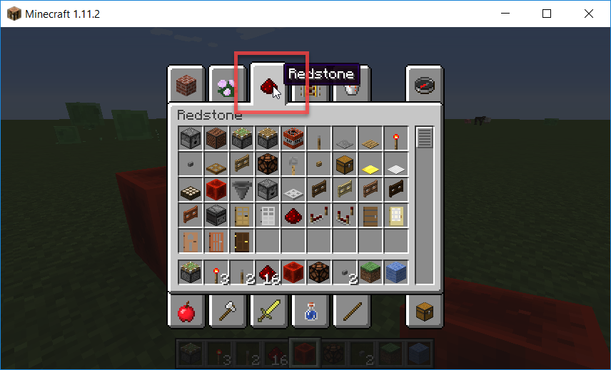

# Erste Schritte mit Redstone

## Voraussetzung

Für diese Übung brauchst du [Minecraft](https://minecraft.net/de-de/){:target="_blank"}. Du solltest mit den Grundfunktionen wie Steuerung des Spielers, verwenden von grundlegenden Blöcken etc. vertraut sein.

## Was ist *Redstone*?

{:right}
[Redstone](http://minecraft-de.gamepedia.com/Redstone){:target="_blank"} ist ein wichtiger Rohstoff in Minecraft. Wie in der echten Welt mit Strom kannst du mit Redstone in Minecraft Schaltkreise (Englisch *Ciruits*) bauen. Egal ob Falle für Monster, Lichtsteuerung oder automatische Türen - für all das verwendest du Redstone.

**Hinweis für Eltern:** Schaltungen mit Redstone sind ein gutes Beispiel dafür, warum Minecraft viel mehr ist als nur ein Unterhaltungsspiel. Viel Kreativität und logisches Denken ist gefragt, wenn man mit Redstone arbeiten möchte.

## Spiel zum Experimentieren vorbereiten

Um Redstone kennenzulernen, startest du am besten eine flache Welt im Kreativmodus.

## Dein erster Schaltkreis

Die Gegenstände, die mit Redstone zu tun haben, findest du im Inventar:

1. Setze einen [Redstone-Block](http://minecraft-de.gamepedia.com/Redstone-Block){:target="_blank"}. Er ist die **Energiequelle** für deine Schaltung.

1. Ein paar Felder daneben setzt du eine [Redstone-Lampe](http://minecraft-de.gamepedia.com/Redstone-Lampe){:target="_blank"}. Sie **leuchtet**, wenn sie mit Energie versorgt wird.

1. Anschließend verbinde die beiden Blöcke mit [Redstone](http://minecraft-de.gamepedia.com/Redstone){:target="_blank"}. Jetzt fließt Energie und die Lampe leuchtet.

## Schalter

1. Ersetze den Redstone-Block durch einen normalen Block. Ich verwende hier **blaue Wolle**. **Tipp:** Es ist üblich, dass Schaltkreise auf eingefärbter Wolle gelegt werden. Dadurch erkennt man leichter, wie eine Schaltung funktioniert.

1. Bringe einen **Schalter** an dem normalen Block an. Er ist eine **Energiequelle*, die du ein- und ausschalten kannst.

1. Schalte jetzt die Redstone-Lampe ein und wieder aus.

## Kolben

1. Setze einen **klebrigen Kolben**. **Tipp:** Wenn der Kolben nach oben ausfahren soll, muss du in den Flugmodus wechseln (2 x schnell hintereinander die Leertaste drücken) und ihn von oben setzen.

1. Setze einen beliebigen Block auf den Kolben. Ich verwende einen Gold-Block.

1. Füge zu deiner Schaltung eine Abzweigung hinzu. Verbinde sie mit dem Kolben.

1. Betätige den Schalter und beachte, wie Licht und Kolben sich gleichzeitig verändern.

