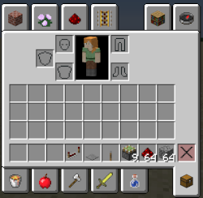
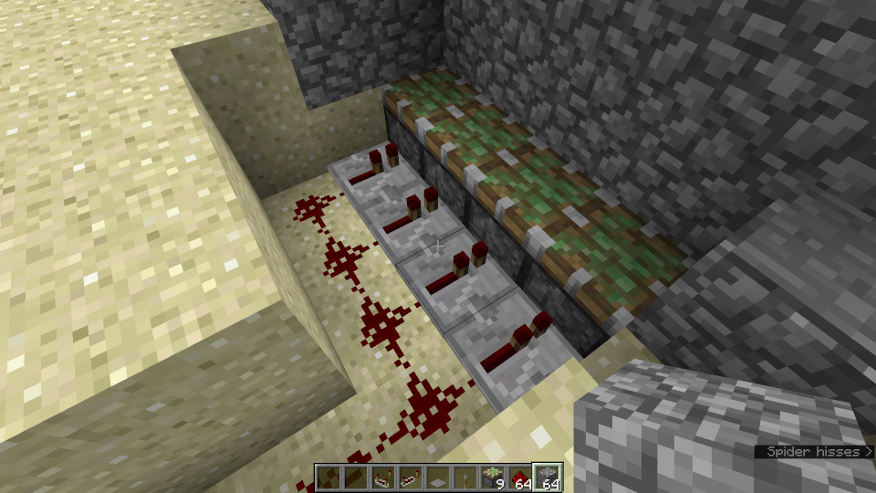
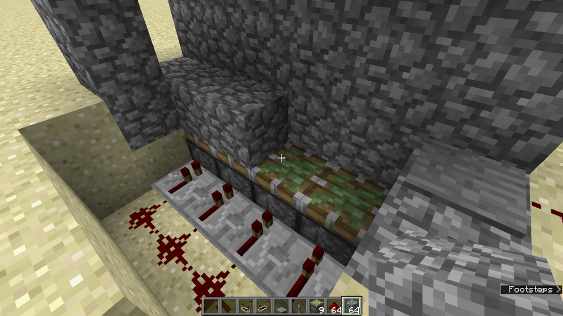
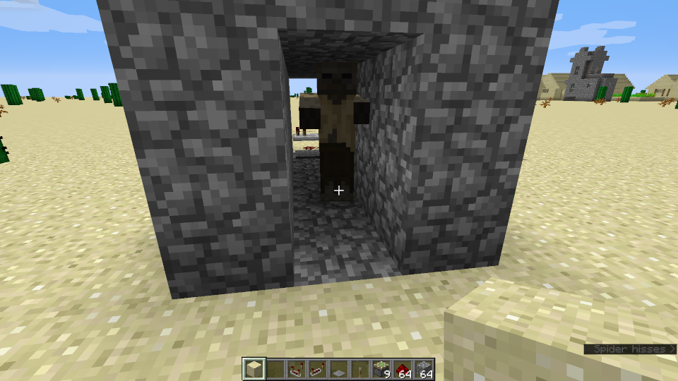
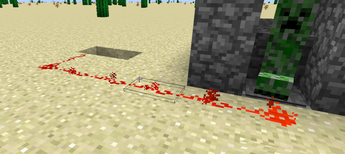

# Eine einfache Falle mit Redstone
In diesem Besipiel werden wir eine hinterhältige Falle bauen die Minecraft-Monster einfach zerquetscht.
Dazu müssen wir die Creeper und/oder Zombies einfach in einen Gang locken. Eignet sich auch zum [looten](https://www.zos-gaming.de/looten/)

<!--more-->
## Vorbereitung
Was wir dafür benötigen ist in erster linie Cobblestone (Bruchstein), 2-3 Pisons (Kolben), einen Schalter, eine Pressureplate (Druckplatte) und etwas Redstone. 

## Unterbau
Damit wir die Pistons ordentlich platzieren können, heben wir eine 2 Block tiefe grube und plazieren die Pistons. Anschließend noch Repeater an die Pistons anschließen (bitte auf die Richtung achten - müssen zum Piston hin zeigen). Dann noch alles mit Redstone verbinden und irgendwo weiter weg an die Oberfläche leiten. Am Eingang platzieren wir eine Pressure-Plate damit die Falle ausglöst werden kann.

Danach können wir alles schön mit Cobblestone zumachen damit man nicht gleich sieht dass es eine Falle ist.

Wenn der Gang mit der Versteckten _"Überraschung"_ dann fertig ist, sieht es ungefähr so aus:

Gut - die Falle selbst wäre jetzt fertig - unglücklicherweise kann man sie noch nicht auslösen. Das muss sich noch ändern.

## Steuerung der Falle

Als ersten versuch verbinden wir die Pressure-Plate einfach mittels Redstone-Leitung mit den Pistons. Damit wird die Falle sofort ausgläst sobald irgendetwas die Platte betritt.

Wie man auf dem Bild sieht bringt das leider noch nicht so viel, da die Falle zu schnell auslöst. Der Creeper hat sich lediglich etwas erschreckt ....

Besser wäre es die Falle ein wenig zu verzögern. Das geht mit Redstone-Repeatern:

 die Repeater müssen in die richtige Richtung zeigen, sonst funktioniert es nicht.

Durch rechtsklick auf die Repeater kann man eine Verzögerung in 3 Stufen einstellen. Damit hat der Creeper dann genug Zeit um in die Falle hineinzugehen, bevor sie zuschnappt. Probiert es einfach aus.

