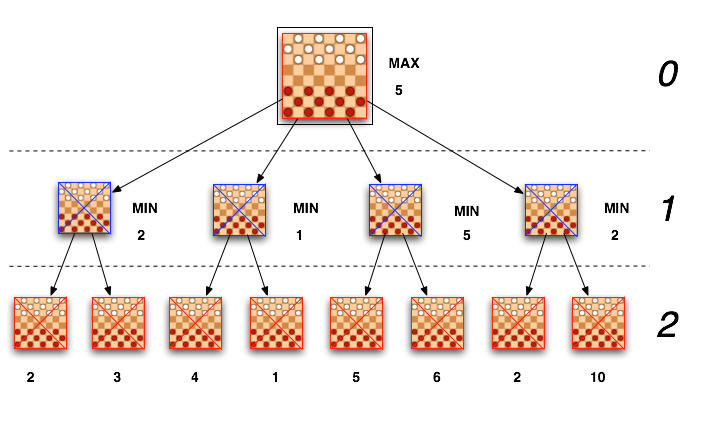

# Scratch Chess

	

	

		

		
In this example, we want to build a chess engine, and above all, the two most important functions - the application of different move combinations, and the evaluation of the resulting board.

		
You can also try the finished project at <a href="https://scratch.mit.edu/projects/148769358/" target="_blank">https://scratch.mit.edu/projects/148769358/</a>

		<table class="table sushi-stats">
			<tbody>
				<tr>
					<td>Figuren</td>
					<td>4</td>
				</tr>
				<tr>
					<td>Skripte</td>
					<td>35</td>
				</tr>
				<tr>
					<td>Daten</td>
					<td>70</td>
				</tr>
			</tbody>
		</table>
	

Chess programs try to find the optimal move choice and calculate as many moves in advance as possible. As a result, the number of resulting boards to be examined grows exponentially, so that even modern computers reach their computing limits. Our chess program must therefore be quick and smart. "Smart" means that not every move combination is calculated, by discarding bad moves immediately. Once the program has calculated a sequence of moves, it will evaluate the resulting board and compare that to other previous results.
## Preparation

Log in to Scratch with your user. If you do not have a scratch user yet, a mentor will be happy to help. Prerequisite for creating a Scratch user is an existing e-mail address. You need to be logged in to Scratch so you can remix the project template, thus obtain a working copy. Open the project [https://scratch.mit.edu/projects/150304452/](https://scratch.mit.edu/projects/150304452/){:target="_blank"}, and click on "Remix". Now you have a project copy that you can continue working on.

We would like to implement these two function blocks. You can find them in the upper left corner sprite "Board"'s script:

Our program will play with the black pieces, the user plays white.

## Board Evluation - EvaluateBoard()

The board evluation is implemented by the custom block "EvaluateBoard". It is important that we select option "Run without screen refresh" (right-click on the custom block header, then "Edit"). Otherwise our program would be too slow.

The evaluation is composed of the material value and the position value. Each piece has an assigned value; a king is valued higher than everything else combined (20,000), as a defeated king means loss by checkmate. Next comes the queen (900), then rooks (500), and so on. The opponent's pieces have a negative value so that all numbers can be added up. Having one pawn and one tower more than the other side results in a bard evaluation of 900 + 500 = 1400. Thus we can search for moves that promise the best evaluation, and discard others.

Piece values are stroed in constant variables named "BlackKing", "WhiteKing", etc. Our current chessboard is stored in the "Board" list. Board has 64 list entries, one for each square. For a board evaluation, we loop over the list and add up the entry values.

The second evaluation aspect is the piece position. A queen in the middle of the board usually is preferrable to a corner placement, because it then has a lot more attack options. Similar rules apply to other pieces. However, placing a king in the center is not good, at least not at the beginning of the game. Pawns can be active in the center, or protect the king once it has castled, or advance to a pawn promotion later.

In order to be able to automatically evaluate piece positions, there are lists like "KingPieceSquare", "QueenPieceSquare", etc. Those lists again contain 64 entries. Because our program play black, whit piece position values must be negated. For the black pieces we have to mirror the position on the board. This is done by accesing list index "65 - Idx". The entire custom block looks like this:

## Move Selection - AlphaBetaMinMaxImpl()

Now that we can evluate a board, we have to calculate the the boards that result from playing move sequences we want to look into. For this, we first calculate a list of possible moves. We then loop over those moves, and apply the current move. We then inoke AlphaBetaMinMaxImpl() again, so it can calculate the opponent's followup-move and so on.

When calculating the opponent's moves, we can assume that the opponent chooses the best move available (Min evaluation for white) - and so so we (Max evaluation for black).

The runtime performance of Scratch onl allows to look ahead a few  moves. Thereafter, the resulting board is evaluated and compared with previous scores. This results in a decision tree as below, with the nodes representing the boards and their evaluation, with the arrows  representing the respective moves in between. The best guaranteed evaluation in this example is 5. Even if a board with an evaluation f 10 seems possible, the opponent can prevent this by a skillful countermove, which then results in a worse rating (namely 2). We therefore choose the move that ensures an evaluation of 5, no matter which move the opponent chooses.

In diesem Entscheidungsbaum-Beispiel gibt es jeweils nur wenige Zugmöglichkeiten, bei Schach sind dies deutlich mehr. Bei vier aufeinanderfolgenden Zügen und 30 Zugmöglichkeiten ergeben sich 30 hoch 4 mögliche Bretter, also 810.000. Für jedes Brett ist dann eine Bewertung nötig, bei 64-fachem Schleifendurchlauf sind das 51.840.000 Feldprüfungen. Das ist in Java oder C++ Programmen noch möglich (wenngleich nicht gut, besser wäre es die Rechenleistung für größere Zugtiefen zu verwenden; dort wird nicht eine Schleife 64-mal durchlaufen, sondern das ganze Brett steht in je einer 64bit-Zahl pro Figur), in Scratch geht das dann aber gar nicht mehr.

Wir können auch hier etwas unternehmen, nämlich das Gleiche was der Mensch intuitiv beim Schachspielen macht: Aussichtslose Zugmöglichkeiten sofort ausblenden. Züge die schlechter sind als der bisher garantierte Bestwert braucht man gar nicht weiter zu betrachten. Und beim Gegner ist es auch so - wenn er eine bessere Zugmöglichkeit hat, muss man sich eine schlechtere nicht mehr weiter ansehen. Man nennt das auch Alpha/Beta-Suche - Alpha und Beta sind die garantierten oberen und unteren Bewertungs-Grenzen für die aktuelle Berechnung. Alle Varianten außerhalb dieser Grenzen kann man verwerfen.

Wir programmieren das alles in einem Funktionsblock, der sich immer wieder selbst aufruft. Man nennt das eine rekursive Funktion. Wir führen einen Zug aus, und rufen die aktuelle Funktion nochmal auf, damit der darauffolgende Zug ausgeführt wird. Irgendwann müssen wir das natürlich beenden - und zwar dann, wenn wir eine Zugtiefe von MaxDepth erreicht haben (je nach Schwierigkeitsgrad sind das zwei, drei oder vier Züge). Dann wird das Brett bewertet. Unsere Zwischendaten (Min, Max, Alpha, Beta, Züge) werden alle in Listen gespeichert. Das ist in Scratch bei Rekursionen nötig, weil es keine lokalen Variablen gibt und Funktions-Parameter nicht verändert werden können. Figuren-Variablen reichen dafür nicht, da wir sonst die Variablenwerte in kaskadierten Aufrufen überschreiben würden. In diesen Listen gibt es für jede Zugtiefe einen Eintrag, also zum Beispiel für den gerade berechneten Zug. Eine Alternative wäre die Variablen von 1 bis N durchzunummerieren, und den ganzen Funktionsblock für jede Zugtiefe zu duplizieren. Aber das möchten wir eigentlich nicht.
Die einfachste MiniMax/Alpha-Beta Implementierung ergibt sich daraus wie folgt: 

Super, du bist fertig! Starte jetzt das Programm. Du bist am Zug, danach beginnt der Computer zu rechnen, und zwar genau mit den beiden Funktionsblöcken, die du gerade programmiert hast.

Dabei sind noch nicht alle Spezialfälle abgedeckt. Zum Beispiel beachtet unser Programm noch kein Schach in dem sich Schwarz befinden könnte, und auf das reagiert werden muss. Außerdem gilt es ein mögliches Unentschieden zu verhindern, wenn man sich im Vorteil glaubt. Ähnliches gilt für die Brettbewertung - die Mobilität, also wie frei sich Figuren resultierend aus der Zugwahl später bewegen können, sollten wir auch noch berücksichtigen.

Die vollständige Implementierung mit all diesen Details kannst du unter [https://scratch.mit.edu/projects/148769358/](https://scratch.mit.edu/projects/148769358/){:target="_blank"} einsehen.

Weiterführende Informationen zu unserem Schachprojekt gibt es im Scratch Diskussionsforum unter [https://scratch.mit.edu/discuss/post/2967632/](https://scratch.mit.edu/discuss/post/2967632/){:target="_blank"}. Schachprogrammierung im Allgemeinen wird in dieser Präsentation näher behandelt: [https://www.slideshare.net/ArnoHuetter/chess-engine-programming](https://www.slideshare.net/ArnoHuetter/chess-engine-programming){:target="_blank"}

Viel Spaß beim Spielen – gewinnst du gegen den Computer? Wie könnte man ihn noch besser machen – vielleicht indem man bei einigen ausgewählten Zügen doch bis zu einer höheren Zugtiefe vorberechnet, auch wenn es dann etwas länger dauert? Das Original-Programm unter [https://scratch.mit.edu/projects/148769358/](https://scratch.mit.edu/projects/148769358/){:target="_blank"} schafft dank vieler  Optimierungen bis zu Zugtiefe 8 plus 7 Folge-Schlagmöglichkeiten bei Schwierigkeitsgrad "Difficult", und ist damit das spielstärkste Schachprogramm auf Scratch. Die besten Schachprogramme der Welt können einzelne Sub-Bäume sogar bis zu Zugtiefe 35 berechnen.
