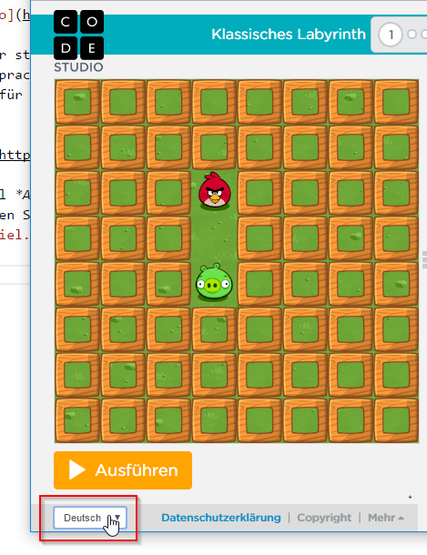

# Programmieren lernen mit *Hour of Code*

## Anfänger: Programmieren mit Blöcken

1. {: .right}
Kennst du das Spiel *Angry Birds* von Smartphone oder Tablet? In *Hour of Code* kannst du die ersten Schritte des Programmierens mit den *Angry Birds* erlernen. Programmierspiel unter [https://studio.code.org/hoc/1](https://studio.code.org/hoc/1){:target="_blank"} starten...

1. {: .right}
Bist du ein Fan von Anna und Elsa? In *Hour of Code* kannst du ihre Bewegungen programmieren und damit schöne Muster aufs Eis zeichnen. Programmierspiel unter [https://hourofcode.com/frzn](https://hourofcode.com/frzn){:target="_blank"} starten...

1. {: .right}
Kennst du den *BB-8* aus Star Wars? In *Hour of Code* bist du für seine Programmierung zuständig. Programmierspiel unter [https://hourofcode.com/star-wars](https://hourofcode.com/star-wars){:target="_blank"} starten...

1. {: .right}
Wusstest du, dass es auch Minecraft-Varianten gibt, mit denen du Programmieren lernen kannst? In *Hour of Code* programmierst du die Handlungen von *Alex* oder *Steve*. Programmierspiel unter [https://studio.code.org/s/mc/reset](https://studio.code.org/s/mc/reset){:target="_blank"} starten...

1. {: .right}
**Tipp:** Die *Hour of Code* Programmierspiele gibt es in vielen Sprachen. Du kannst die Sprache links unten im Browser-Fenster beim jeweiligen Spiel einstellen.

## Fortgeschrittene: Scratch

Bei den oben erwähnten Spielen folgst du vorgegebenen Übungsaufgaben. Du möchtest jetzt anfangen, deine eigenen Ideen umzusetzen? Dafür ist [Scratch](http://scratch.mit.edu) super geeignet.

1. Für das CoderDojo haben wir [eine Menge Beispiele](http://coderdojo-linz.github.io/infos/uebungsbeispiele.html){:target="_blank"} ausgearbeitet, mit denen du starten kannst. Hast du eigene Ideen für Änderungen oder Erweiterungen? In Scratch kannst du deinen Ideen freien Lauf lassen.

1. Auch in *Hour of Code* gibt es Scratch-Beispiele. Unter [https://hourofcode.com/scratchmus](https://hourofcode.com/scratchmus){:target="_blank"} kannst du zum Beispiel deine eigene Musik programmieren.

## Der nächste Schritt: Spiel programmieren mit *JavaScript*

1. {: .right}
Du hast schon Erfahrung mit grafischer Programmierung. Scratch-Spiele sind dir nicht mehr genug? Profis verwenden Programmiersprachen wie *JavaScript* oder *Python*. Im Spiel *Code Combat* kannst du die Grundlagen dieser Sprachen erlernen und dabei dein eigenes Spiel programmieren. 
Programmierspiel unter [https://hourofcode.com/cocomgame](https://hourofcode.com/cocomgame){:target="_blank"} starten...