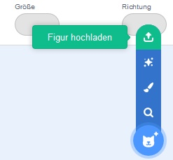
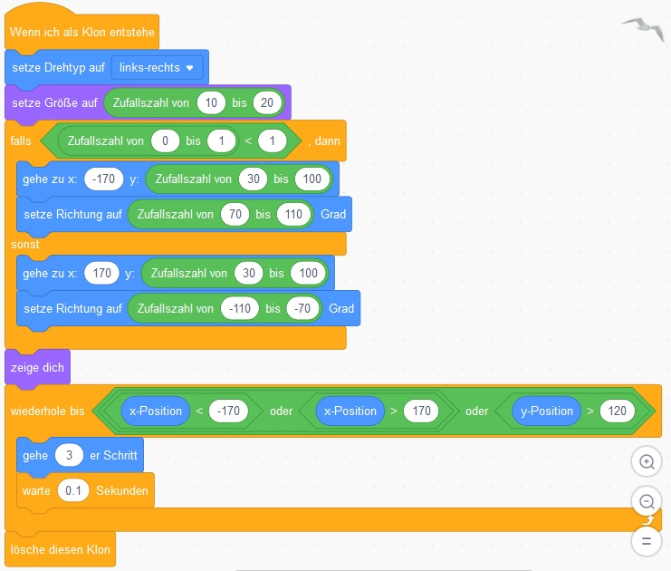

# Animierte Ansichtskarte Scratch 3.0

Die gute alte Ansichtskarte mit Briefmarke war Gestern - heute bauen wir uns unsere eigene animierte Karte und verschicken sie an unsere Freunde. 

Eine solche Karte kannst du zum Beispiel verwenden:
* als Ansichtskarte vom Urlaub
* als Grußkarte zum Geburtstag

## Schritt 1: Scratcher werden

Damit du deinen Freunden die Ansichtskarte schicken kannst, musst du dich bei Scratch registrieren. Die Registrierung ist kostenlos und du benötigst dafür nur einen Benutzernamen und eine E-Mail-Adresse. Wenn du dich in Zukunft vor dem Arbeiten mit Scratch anmeldest, dann werden deine Projekte automatisch gespeichert und du kannst von überall auf sie zugreifen, egal von welchem Computer!

1. Starte deinen Browser (z.B. Firefox) und öffne die Adresse [https://scratch.mit.edu]().
2. Klicke auf den Knopf **Scratcher werden**.  

3. Folge den Menüs von Scratch und fülle die Felder aus. Verwende einen Benutzernamen, bei dem andere nicht folgern können, dass du das bist.  

4. Sobald du die Registrierung abgeschlossen hast, kannst du dich mit deinem Benutzernamen und Passwort bei Scratch anmelden. Dazu klicke einfach auf den **Anmelden** Knopf und gib deinen Benutzernamen und Passwort ein.  

5. Bei einer erfolgreichen Anmeldung siehst du deinen Benutzernamen rechts oben im Fenster (hier z.B. "et_nd").  

6. Klicke auf **Entwickeln** um mit dem Erstellen deiner Ansichtskarte fortzufahren.  

## Schritt 2: Deinem Projekt einen Namen geben

Damit du dein Projekt später leicht wiederfinden kannst, solltest du ihm einen entsprechenden Namen geben.

## Schritt 3: Einen Hintergrund (Bühnenbild) verwenden

Um deiner Ansichtskarte eine persönliche Note zu verleihen, verpasse ihr einfach dein eigenes Hintergrundbild das in Scratch Bühnenbild genannt wird.

1. Klicke auf **Bühnenbild hochladen**.  

2. Wähle im erschienen Auswahlfenster ein Foto für deinen Hintergrund aus.  

## Schritt 4: Eigene Figuren einbauen und animieren

In diesem bringst du etwas Leben in deine Ansichtskarte.

1. Entferne Scratchy (die Katzenfigur) indem du ihn mit der linken Maustaste anklickst und dann auf das weiße **x** im blauen Kreis klickst.  

2. Klicke auf **Figur hochladen** und suche das Bild aus, das du für deine Figur verwenden möchtest.  

3. Damit der Hintergrund deiner Figur nicht sichtbar ist, musst du ihn wegradieren. Klicke mit der linken Maustaste auf die Figur und öffne danach die Registerkarte (Englisch: tab) *Kostüme*. Im Zeicheneditor kannst du den Radierer auswählen und damit all jene Bereiche im Bild entfernen, die durchsichtig sein sollen.  
  
Nach dem Radieren sollte der durchsichtige Bereich das Schachbrettmuster enthalten.  
  
4. Damit die Figur gut in die Szene passt, kannst du die Größe der Figur anpassen indem du im Feld **Größe** den Wert änderst. Je größer der Wert desto größer ist die Figur.  
  
5. Im nächsten Schritt leg die folgenden Variablen an.  
  
6. Da sich die Figur bewegen soll, musst du ihr das noch beibringen. Erstell für deine Figur folgende Scripts:   
  
  
  
7. Wenn du jetzt auf die **grüne Flagge** klickst, sollte sich das Boot im Wasser zufällig bewegen.  
  

## Schritt 4: Ein paar Möwen zur Szene hinzufügen

Damit noch mehr Leben in die Karte kommt, kannst du eine Möwe hinzufügen. Da sich das Vorgehen nur im verwendeten Bild und in den Scripts vom Segelboot unterscheidet, folgt hier nur das Script - der Rest ist genauso wie beim Boot durchzuführen. Die Möwe hat eine Besonderheit, sie erzeugt von sich selbst immer wieder Kopien(Klone) die nach einer zufälligen Zeit von selbst verschwinden. Sieh dir das Script an wie das funktioniert ...

Scripts für die Möwen:

  

  

Deine Szene sollte jetzt in etwa so aussehen ...

  

Jetzt wäre wieder ein guter Zeitpunkt deine Karte zu testen. Klick auf die **grüne Fahne** um die Animation zu starten. Es sollte sich das Boot bewegen und Möwen hin und wieder auftauchen und durchs Bild fliegen.

## Schritt 5: Einen Urlaubsgruß hinzufügen

Jetzt fehlt bei deiner Ansichtskarte nur noch ein kurzer Gruß. 

1. Lege eine neue Figur an indem du auf **Malen** klickst.   
  
2. Schreibe deine Gruß und ziehe ihn an die Position, an der du in haben möchtest.  
  

## Schritt 6: Deine Ansichtskarte für Andere freischalten/veröffentlichen

Damit die Empfänger deiner Ansichtskarte diese ansehen können ohne dass du ihnen dafür einen Scratch Benutzernamen und Passwort verraten muss, gibt es die Möglichkeit Projekte in Scratch zu veröffentlichen. Solche Projekte kann sich dann jeder ansehen und ausprobieren aber nicht ändern.

Achtung: Wenn du ein Projekt veröffentlichst, dann bedenke, dass jeder dein Projekt sehen kann. Du solltest daher in deinem Projekt nur Bilder verwenden die du selbst gemacht hast. Wenn Personen auf den Bildern sind, dann sollten diese auch damit einverstanden sein, dass du das Foto verwendest!

Falls Du die Ansichtskarte als Einladung zu deiner Feier verschickst, dann bedenke, dass auch Fremde die Karte ansehen können und dann vielleicht auch deiner Einladung folgen!

Deine Ansichtskarte veröffentlichst du wie folgt:

1. Klick auf den Knopf **Veröffentlichen**.  
  
2. Damit sich die Empfänger Deiner Karte auskennen, was zu tun ist, kannst du ihnen im Textfeld **Anleitung** eine kurze Anleitung hinterlassen.  
  

## Schritt 7: Deine Ansichtskarte verschicken

Jetzt hast du es fast geschafft. Klick auf den Knopf **Link kopieren** (siehe voriges Bild rechts unten). Es erscheint ein Fenster in dem du unter **Link** die Adresse (URL) deiner Ansichtskarte findest. Diese Adresse kannst du jetzt zum Beispiel per E-Mail verschicken.  
  

Zum Herunterladen gibt es das Projekt [hier](scratch-animated-postcard/animated_postcard.sb3).
