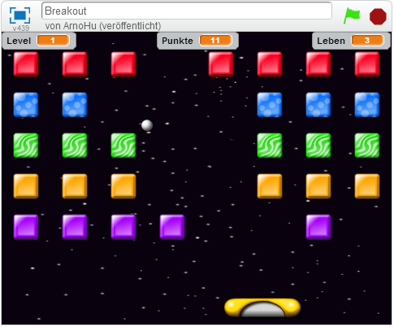
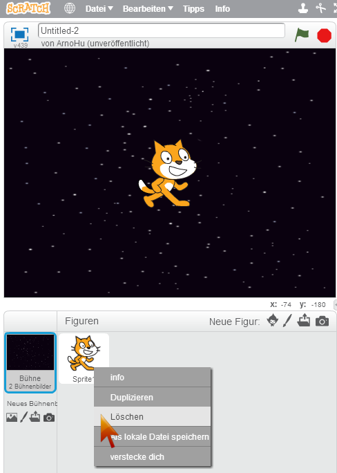
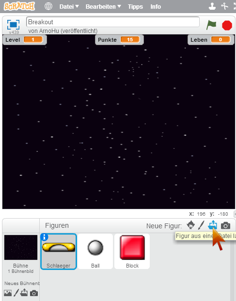
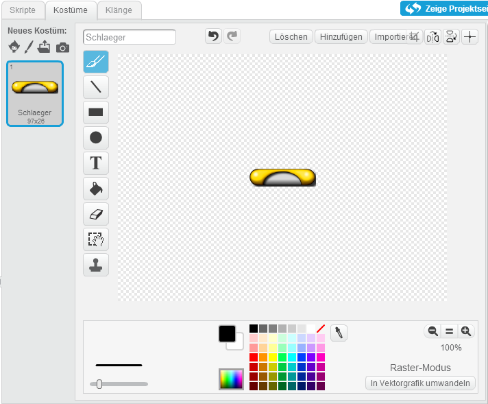
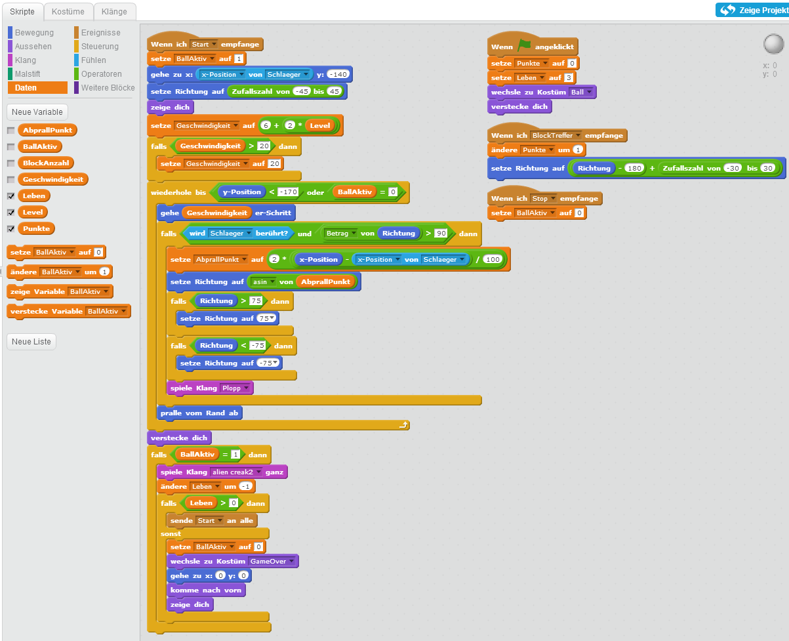

# Scratch Breakout

	

	

		
In diesem Spiel pulverisierst du bunte Mauersteine, indem du mit deinem Schläger einen Ball darauf schleuderst. Wenn alle Mauersteine zerstört sind, kommst du in den nächsten Level, wo dein Ball dann noch schneller fliegt.

		
Du kannst das fertige Spiel unter <a href="https://scratch.mit.edu/projects/72990950" target="_blank">https://scratch.mit.edu/projects/72990950</a> auch gleich ausprobieren.

		<table class="table sushi-stats">
			<tbody>
				<tr>
					<td>Figuren</td>
					<td>3</td>
				</tr>
				<tr>
					<td>Skripte</td>
					<td>8</td>
				</tr>
				<tr>
					<td>Daten</td>
					<td>4 / 4 / 7 / 6</td>
				</tr>
			</tbody>
		</table>
	

## Downloads

<table class="table sushi-overview">
	<tr class="subtitle">
		<td>Figur</td>
		<td></td>
	</tr>
	<tr>
		<td>Ball</td>
		<td><a href="scratch-breakout/Ball.sprite2">Figur downloaden</a></td>
	</tr>
	<tr>
		<td>Block</td>
		<td><a href="scratch-breakout/Block.sprite2">Figur downloaden</a></td>
	</tr>
	<tr>
		<td>Schläger</td>
		<td><a href="scratch-breakout/Schlaeger.sprite2">Figur downloaden</a></td>
	</tr>
</table>

## Bühne und Figuren anlegen

1. {: .right}
Zuerst suchen wir uns ein cooles Bühnenbild aus. Klicke auf "Bühnenbild aus der Bibliothek wählen". Das Bild "stars" unter Thema "Weltraum" passt recht gut, aber du kannst dir aussuchen, was du möchtest.

2. {: .right}
Als nächstes lösche die Figur "Scratchy" mit dem Namen "Sprite1", indem du mit der rechten Maustaste darauf klickst und "Löschen" auswählst. 

3. {: .right}
Wir brauchen insgesamt drei neue Figuren: Den Schläger, den Ball und einen Block. Lege drei neue Figuren an, indem du jeweils auf "Figur aus einer Datei laden" klickst. Deine Mentoren haben passende Grafiken auf einem Memorystick dabei, die du in dein Projekt laden kannst. Oder du kannst ähnliche Figuren selbst zeichnen, ganz wie du möchtest!
Nenne deine Figuren "Schlaeger", "Ball" und "Block". Das funktioniert, indem du die Figur auswählst, und dort das weiße "i" im blauen Kreis klickst. Dann wird ein Textfeld angezeigt, in das du den Namen eingeben kannst.

4. {: .right}
Beim Platzieren der Grafiken oder beim Zeichnen ist wichtig, dass die Kostüme genau in der Mitte der Zeichnung liegen.

5. {: .right}
Der Ball braucht ein zweites Kostüm, damit wir bei Spielende "Game Over" anzeigen können. Auch dafür gibt es von den Mentoren eine vorbereitete Grafik, oder du kannst den Text selbst in ein Kostüm schreiben, indem du im Malbereich das "T"-Symbol (für "Text") drückst und den Text eingibst.
Achte darauf, wie die Kostüme heißen: "Ball" und "GameOver".

6. {: .right}
Für den Block gibt es gleich fünf Kostüme, damit die Sache etwas bunter wird. Die Kostüme findest du wieder auf den Memorysticks der Mentoren. Achte auch hier auf die Namen der Kostüme.

7. {: .right}
Schließlich benötigen wir noch Klänge. Klänge werden ebenfalls Figuren zugeordnet. Selektiere zuerst die Figur "Ball", und klicke dort oben auf "Klänge", und danach auf das Lautsprecher-Symbol ("Klang aus der Bibliothek wählen"). Zwei passende Klänge sind "Plopp" und "alien creak2".
Ähnlich funktioniert das beim Block, dort brauchen wir den Klang "laser1"

Unsere Figuren sind fertig, jetzt geht's ans Programmieren der Skripte.

## Der Schläger

{: .right}

Der Schläger hat nur ein Skript und das ist ganz einfach. Gesteuert wird der Schläger mit der Maus. Du kannst hier auch gleich die vier globalen Variablen des Spiels anlegen. Globale Variable gelten für alle Figuren. Klicke dazu auf den Knopf "Neue Variable", und lege folgende Variablen an: "BlockAnzahl", "Leben", "Level" und "Punkte". Beachte dass im Dialog der Auswahlknopf "Für alle Figuren" selektiert sein muss. Alle diese Variablen außer "BlockAnzahl" wollen wir auch am Spielfeld anzeigen. Klicke dazu den Auswahlknopf links vom Variablennamen. 

* Ab Programmstart wird fortlaufend die X-Koordinate des Mauszeigers abgefragt, und der Schläger entsprechend positioniert. Außerdem müssen wir aufpassen, dass der Schläger nicht verschwindet wenn die Maus über die Spielfeldgrenze hinaus bewegt wird (x-Position < -240 oder x-Position > 240). 

## Der Ball

{: .right}

Der Ball ist schon ein bisschen komplizierter. So hat der Ball zusätzliche Variable, die aber nur für den Ball gelten (also "Nur für diese Figur"): "AbprallPunkt", "BallAktiv" und "Geschwindigkeit". 

* Bei Programmstart versteckt sich der Ball. Erst wenn er Nachrichten empfängt, tut er etwas.  
* Wenn die Nachricht "Start" ankommt, zeigt sich der Ball oberhalb des Schlägers, und beginnt nach oben zu fliegen.  Seine Geschwindigkeit ergibt sich aus dem Level - je höher der Level, desto schneller. Nach jedem Schritt überprüft der Ball, ob er den Schläger berührt oder unten am Schläger vorbeigefallen ist. Bei Schläger-Berührung ändert er seine Flugbahn abhängig vom Abprall-Punkt (dazu benötigt man die spannende mathematische Funktion "asin", die einen Wert zwischen -1 und +1 in einen Winkel umwandelt) - das macht das Spiel interessanter, weil die Spieler die Flugbahn beeinflussen kann. Außerdem muss der Ball ständig abfragen, ob er nicht vielleicht vom Rand abprallen muss. Zum Schluss versteckt er sich wieder, und prüft noch ob weitere Bälle ("Leben") vorhanden sind.
* Die Kollisionsabfrage mit den Blöcken macht der Ball nicht selbst, weil er nicht alle Blöcke kennt. Stattdessen erhält der von den Blöcken die Nachricht "BlockTreffer". Dann zählt er einen Punkt dazu und ändert seine Richtung um 180 Grad. 
* Manchmal muss man den Ball auch stoppen. Erhält er die Nachricht "Stop", setzt er die Variable "BallAktiv" auf "0" (was so viel wie "falsch" bedeutet, also der Ball ist dann nicht aktiv). "BallAktiv" = "0" ist ein Abbruchkriterium für die Hautpschleife, er versteckt sich dann wieder und führt keine Aktionen mehr aus. 

## Der Block

{: .right}

Zuguterletzt der Block. Oder vielmehr die Blöcke, denn wir wollen ja viele Mauersteine abschießen. Die große Zahl unterschiedlicher Blöcke erzeugen wir, indem wir Klone mit verschiedenen Kostümen anlegen.
Der Block braucht zwei neue Variablen:  "Spalte" und "Zeile". Bitte beachte: Die Variablen gelten wieder "Nur für diese Figur". 

* Zu Beginn schickt der Block die Nachricht "NeuerLevel", auf die er selbst reagiert. 
* Wenn der Block als Klon entstanden ist, wartet er eigentlich nur darauf von einem Ball getroffen zu werden. Ist das der Fall, spielt er noch einen Klang, fragt ab ob er der letzte Block war und startet dann einen neuen Level, und löscht sich schließlich selbst. 
* Interessant ist wie die Blöcke vervielfältigt werden. Das passiert bei der Nachricht "NeuerLevel". Da heißt es erstmal "Stop" für alle, v.a. für den Ball, der während des Aufbaus des neuen Levels nicht stören soll. Darauf folgt eine geschachtelte Schleife für 5 Zeilen zu je 8 Blöcken. Jeder Block wird neu geklont, und erbt die Position des Ursprungs-Blocks, den wir jeweils weiterverschieben. Nach jeder Zeile von Blöcken ändern wir außerdem das Kostüm und damit die Farbe. 

Super, du hast es geschafft. Viel Spaß beim Spielen!

## Erweiterungen

Sicher hast du noch eine Menge Ideen, um das Breakout-Spiel zu verbessern. Ein paar Vorschläge: 

* In jedem Level sollen sich Anzahl, Farbe und Position der Blöcke verändern. 
* Die Blöcke können sich bewegen, damit sie schwerer zu treffen sind. 
* Wenn der Ball am unteren Bildschirmrand verschwindet, sollte der Schläger explodieren - zum Beispiel indem man mehrere Explosions-Kostüme hintereinander anzeigt, und einen passenden Klang dazu abspielt. 

## Ausprobieren

Du kannst das fertige Projekt unter [https://scratch.mit.edu/projects/72990950/](https://scratch.mit.edu/projects/72990950/){:target="_blank"} ausprobieren.
