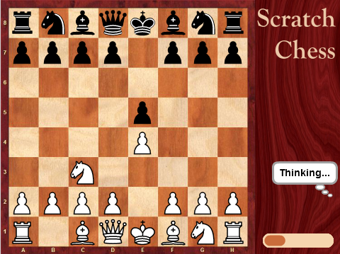
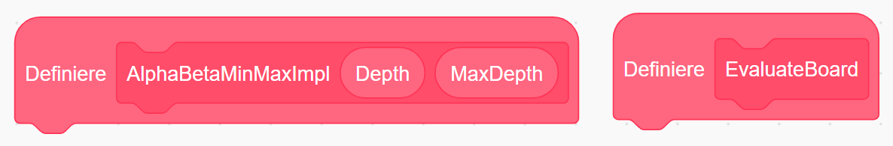
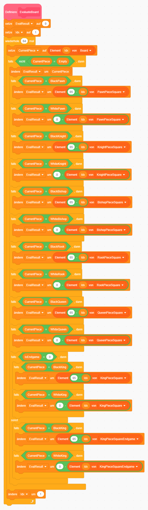

# Scratch Chess

	

	

		

		
In diesem Beispiel wollen wir die beiden wichtigsten Funktionen eines Schachprogramms implementieren: Das Ausführen von verschiedenen Zugkombinationen, und die Bewertung des daraus resultierenden Brettbilds.

		
Das gesamte Spiel zu programmieren wäre sehr aufwändig und würde den Rahmen eines zweistündigen CoderDojos sprengen. Du kannst es aber auch gleich einmal unter <a href="https://scratch.mit.edu/projects/148769358/" target="_blank">https://scratch.mit.edu/projects/148769358/</a> ausprobieren.

		<table class="table sushi-stats">
			<tbody>
				<tr>
					<td>Figuren</td>
					<td>4</td>
				</tr>
				<tr>
					<td>Skripte</td>
					<td>35</td>
				</tr>
				<tr>
					<td>Daten</td>
					<td>70</td>
				</tr>
			</tbody>
		</table>
	

Schachprogramme versuchen den besten Zug zu finden, und müssen dabei möglichst viele Züge im Voraus berechnen. Die Anzahl der zu untersuchenden Brettbilder wächst dadurch enorm an (exponentielles Wachstum), sodass sogar moderne Computer an ihre Rechengrenzen stoßen. Unser Schachprogramm muss daher schnell und schlau sein. Schlau heißt, dass nicht jede Zugkombination nachverfolgt wird, sondern schlechte Züge gleich verworfen werden. Wenn das Programm einige Züge hintereinander berechnet hat, bewertet es das entstandene Brettbild.

## Vorbereitung

Melde dich bei Scratch mit deinem Benutzer an. Wenn du noch keinen Scratch-Benutzer hast, hilft dir ein Mentor gerne dabei. Voraussetzung dafür ist eine Mailadresse. Den Benutzer brauchst du, damit du die Projektvorlage remixen, also eine Arbeitskopie erstellen kannst. Öffne das Projekt [https://scratch.mit.edu/projects/150304452/](https://scratch.mit.edu/projects/150304452/){:target="_blank"}, und klicke auf „Remixen“. Nun hast du eine Kopie des Projekts, mit der du weiterarbeiten kannst.

Diese beiden Funktionsblöcke möchten wir implementieren, du findest sie links oben im Skript der Figur „Board“:

Unser Programm wird mit den schwarzen Figuren spielen, der Benutzer hat Weiß.

## Brettbewertung – EvaluateBoard

Die Brettbewertung programmieren wir in der Funktion „EvaluateBoard“. Wichtig ist, dass wir dafür „Ohne Bildschirmaktualisierung laufen lassen“ auswählen (Rechtsklick auf Funktionskopf, dann „Bearbeiten“ - das gilt für alle Blöcke). Das Programm wäre sonst zu langsam.

Die Bewertung setzt sich aus dem Figurenmaterial und der Position der Figuren am Brett zusammen. Jede Figur hat einen Wert, am meisten der König (20000), da ein geschlagener König Schachmatt bedeutet. Dann die Dame (900), die Türme (500), und so weiter. Die Figuren des Gegners sind mit negativem Vorzeichen versehen, damit die Werte addiert werden können. Ein Spieler, der einen Bauern und einen Turm mehr hat als sein Gegner, hat eine Bewertung von 900 + 500 = 1400. Somit können wir den Zug suchen, der in der Zukunft die beste Bewertung verspricht.

Der Wert jeder Figur ist bereits in Variablen namens „BlackKing“, „WhiteKing“ usw. gespeichert. Unser aktuelles Schachbrett selbst steht in der Liste „Board“. Board hat 64 Einträge, einen für jedes Feld. In einer Schleife mit 64 Iterationen zählen wir dann die Werte aller Figuren zusammen.

Der zweite Aspekt ist die Position der Figuren. Eine Dame in der Mitte des Felds ist besser als am Rand oder gar in einer Ecke, weil sie dann mehr Angriffsoptionen hat. Das gilt auch für viele andere Figuren. Für den König ist das jedoch nicht so, zumindest nicht zu Beginn des Spiels. Bauern können im Zentrum aktiv sein, oder am Rand den König beschützen, oder später für einen Damentausch auf die andere Seite bewegt werden. Das alles müssen wir beachten.

Um die Position der Figuren automatisch beurteilen zu können, gibt es vorgefertigte Listen namens „KingPieceSquare“, „QueenPieceSquare“, usw. Die Listen haben ebenfalls 64 Elemente. Weil unser Programm die schwarzen Figuren hat, müssen die Werte der weißen Figuren mit einem Minus versehen werden. Für die schwarzen Figuren hingegen müssen wir die Position am Feld spiegeln, weil sie ja auf der anderen Seite stehen. Das geht einfach indem man Position „65 - Idx“ verwendet.
Der gesamte Funktionsblock sieht dann so aus:

## Zugauswahl - AlphaBetaMinMaxImpl

Nachdem wir nun ein Brett bewerten können, müssen wir nun noch die möglichen zukünftigen Brettstellungen berechnen. Dazu simulieren wir alle möglichen Züge, die nacheinander ausgeführt werden können, beginnend mit dem nächsten schwarzen Zug - dann Weiß, dann wieder Schwarz, usw.

Wichtig ist, dass wir auch die Zwischenzüge des Gegners berechnen. Und dabei müssen wir davon ausgehen, dass der Gegner einen für uns schlechten Zug wählt. Das heißt während wir bei unseren Zügen den besten aussuchen (Max), ist es beim Gegner der für uns schlechteste (Min).

Die Geschwindigkeit von Scratch erlaubt es uns nur wenige Züge in die Zukunft zu sehen, im Falle von vier Zügen ist das Schwarz - Weiß - Schwarz - Weiß. Danach wird das resultierende Brett bewertet, und mit bisherigen Bewertungen verglichen. Daraus entsteht ein Entscheidungsbaum wie unten, wobei die Knoten die Bretter mit Bewertung darstellen, und die Pfeile die jeweiligen Züge dazwischen. Die beste garantiert erreichbare Bewertung in diesem Beispiel ist 5. Auch wenn ein Brett mit der Bewertung 10 möglich ist, kann der Gegner dies durch einen geschickten Gegenzug verhindern, was dann in einer schlechteren Bewertung (nämlich 2) resultiert. Wir wählen daher den Zug, der eine Bewertung von 5 sicherstellt.

In diesem Entscheidungsbaum gibt es jeweils nur zwei mögliche Züge, bei Schach sind dies deutlich mehr. Bei drei aufeinanderfolgenden Zügen und 50 Zugmöglichen ergeben sich 50 hoch 3 mögliche Bretter, also 125.000. Für jedes Brett ist dann eine Bewertung nötig, bei 64-fachem Schleifendurchlauf sind das 8.000.000 Feldprüfungen. Das ist in Java oder C++ Programmen noch möglich (wenngleich nicht gut, besser wäre es die Rechenleistung für größere Zugtiefen zu verwenden - dort wird i.d.R. nicht eine Schleife 64-mal durchlaufen, sondern das ganze Brett steht je Figur in einer 64bit-Zahl), in Scratch geht das dann aber gar nicht mehr.

Wir können auch hier etwas unternehmen, nämlich das Gleiche was der Mensch intuitiv beim Schachspielen macht: Aussichtslose Zugmöglichkeiten sofort ausblenden. Züge die schlechter sind als der bisher garantierte Bestwert braucht man gar nicht weiter zu betrachten. Und beim Gegner ist es auch so - wenn er eine bessere Zugmöglichkeit hat, muss man sich eine schlechtere nicht mehr weiter ansehen. Man nennt das auch Alpha/Beta-Suche - Alpha und Beta sind die garantierten oberen und unteren Bewertungs-Grenzen für die aktuelle Berechnung. Alle Varianten außerhalb dieser Grenzen kann man verwerfen.

Wir programmieren das alles in einem Funktionsblock, der sich immer wieder selbst aufruft. Man nennt das eine rekursive Funktion. Wir führen einen Zug aus, und rufen die Funktion nochmal auf, damit der darauffolgende Zug ausgeführt wird. Irgendwann müssen wir das natürlich beenden - und zwar dann, wenn wir eine Zugtiefe von MaxDepth erreicht haben (je nach Schwierigkeitsgrad sind das zwei, drei oder vier Züge). Dann wird das Brett bewertet. Unsere Zwischendaten (Min, Max, Alpha, Beta, Züge) werden alle in Listen gespeichert. Das ist in Scratch bei Rekursionen nötig, weil es keine lokalen Variablen gibt und Funktions-Parameter nicht verändert werden können. Figuren-Variablen reichen dafür nicht, da wir sonst die Variablenwerte in kaskadierten Aufrufen überschreiben würden. In diesen Listen gibt es für jede Zugtiefe einen Eintrag, also zum Beispiel für den gerade berechneten Zug. Eine Alternative wäre die Variablen von 1 bis N durchzunummerieren, und den ganzen Funktionsblock für jede Zugtiefe zu duplizieren. Aber das möchten wir eigentlich nicht.
Die einfachste MiniMax/Alpha-Beta Implementierung ergibt sich daraus wie folgt: 

Super, du bist fertig! Starte jetzt das Programm. Du bist am Zug, danach beginnt der Computer zu rechnen, und zwar genau mit den beiden Funktionsblöcken, die du gerade programmiert hast.

Dabei sind noch nicht alle Spezialfälle abgedeckt. Zum Beispiel beachtet unser Programm noch kein Schach in dem sich Schwarz befinden könnte, und auf das reagiert werden muss. Außerdem gilt es ein mögliches Unentschieden zu verhindern, wenn man sich im Vorteil glaubt. Ähnliches gilt für die Brettbewertung - die Mobilität, also wie frei sich Figuren resultierend aus der Zugwahl später bewegen können, sollten wir auch noch berücksichtigen.

Die vollständige Implementierung mit all diesen Details kannst du unter [https://scratch.mit.edu/projects/148769358/](https://scratch.mit.edu/projects/148769358/){:target="_blank"} einsehen.

Weiterführende Informationen zu unserem Schachprojekt gibt es im Scratch Diskussionsforum unter [https://scratch.mit.edu/discuss/post/2967632/](https://scratch.mit.edu/discuss/post/2967632/){:target="_blank"}. Schachprogrammierung im Allgemeinen wird in dieser Präsentation näher behandelt: [https://www.slideshare.net/ArnoHuetter/chess-engine-programming](https://www.slideshare.net/ArnoHuetter/chess-engine-programming){:target="_blank"}

Viel Spaß beim Spielen – gewinnst du gegen den Computer? Wie könnte man ihn noch besser machen – vielleicht indem man bei einigen ausgewählten Zügen doch bis zu einer höheren Zugtiefe vorberechnet, auch wenn es dann etwas länger dauert? Das Original-Programm unter [https://scratch.mit.edu/projects/148769358/](https://scratch.mit.edu/projects/148769358/){:target="_blank"} schafft dank vieler  Optimierungen bis zu Zugtiefe 8 plus bis zu 7 Folge-Schlagmöglichkeiten bei Schwierigkeitsgrad "Difficult", und ist damit das spielstärkste Schachprogramm auf Scratch. Die besten Schachprogramme der Welt können einzelne Sub-Bäume sogar bis zu Zugtiefe 35 berechnen.
