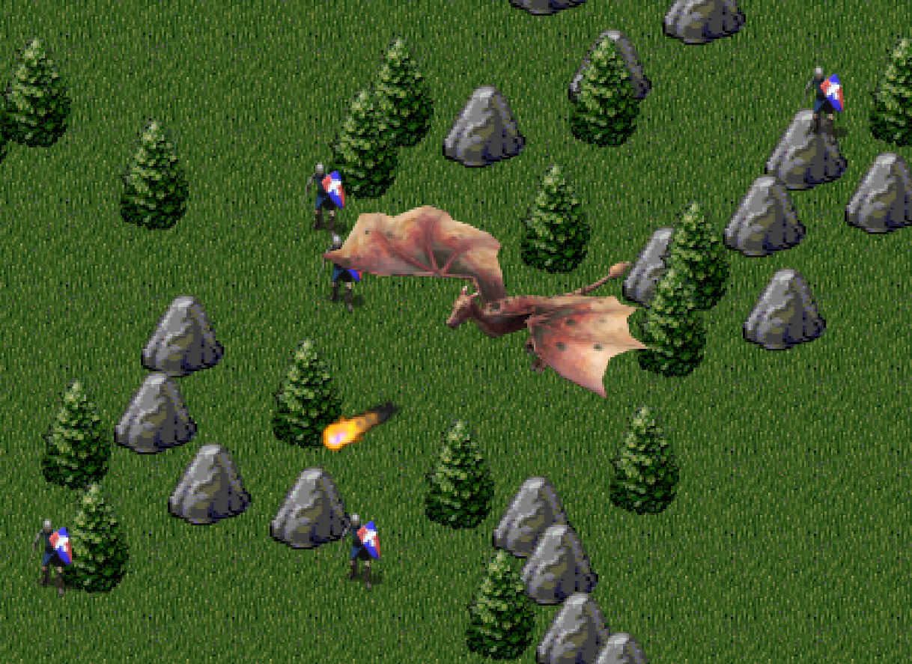
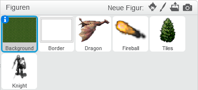
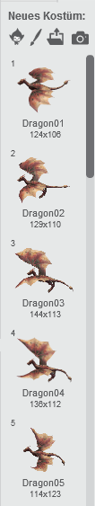
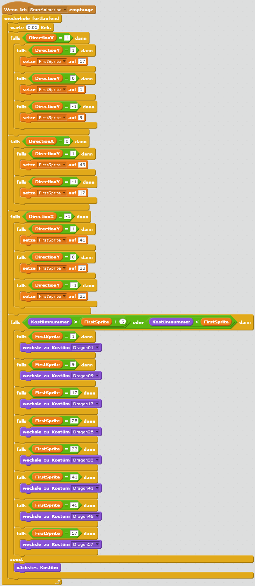
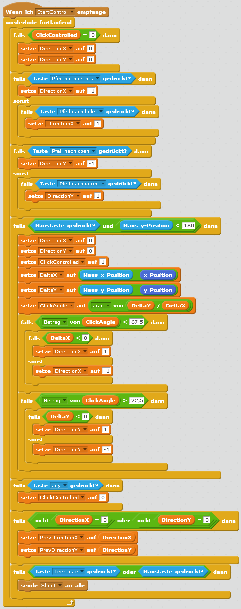
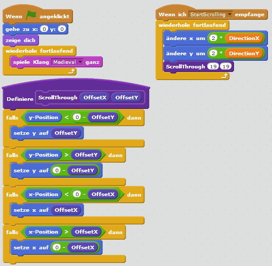
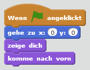

# Scratch Dragons Realm

Bei Dragons Realm steuerst du einen Drachen, der sein Territorium gegen eindringende Raubritter verteidigt. 
Mit den Pfeiltasten lenkst du den Drachen (du kannst auch zwei Tasten gleichzeitig drücken, mit ↑ und → fliegt man zum Beispiel nach rechts oben). 
Mit der Leertaste spuckt der Drache Feuer, und kann Ritter zu Stein erstarren lassen. 
Damit das Spiel auch auf Tablets und Handys funktioniert, wurde nachträglich eine Maus/Touch-Steuerung eingebaut. 
Generell ist das Spielerlebnis mit der Tastatur aber besser.

Möchtest du das Spiel zuerst einmal ausprobieren? Rufe dazu die Adresse [https://scratch.mit.edu/projects/81928816](https://scratch.mit.edu/projects/81928816){:target="_blank"} auf. 
Dort kannst du außerdem nachsehen und vergleichen, ob in deinem Code nichts vergessen wurde.

Dragons Realm beinhaltet viele Grafiken. Du bekommst die Grafiken auf Anfrage von deinen Mentoren, oder kannst sie gesammelt hier herunterladen: [scratch-dragons-realm/dragons.zip](scratch-dragons-realm/dragons.zip)

Das Spiel besteht aus 6 Figuren und 19 Skripten.

## Die Figuren

Wir brauchen insgesamt sechs Figuren: Background, Border, Dragon, Fireball, Tiles und Knight:

Die Kostüme findest du unter den Grafikdateien, die du von deinen Mentoren erhalten oder heruntergeladen hast, 
und zwar in den jeweiligen Unterverzeichnissen mit identem Namen. Also Verzeichnis „dragon“ für den Drachen, usw.

Das Anlegen der Figuren geschieht immer gleich: Klick auf „Neue Figur“ / „Neue Figur zeichnen“. 
Im „Kostüme“ Karteireiter wählst du dann „Kostüme aus einer Datei laden“. 
Als nächstes selektierst du gleich alle Grafiken des entsprechenden Unterverzeichnisses aus – 
damit geht das Laden schneller. Das geht im Windows Dateidialog so:

## Die Figur Dragon

Etwas speziell ist es beim Drachen, der aus insgesamt 64 Kostümen besteht, die noch dazu in der richtigen Reihenfolge im Scratch Editor vorliegen müssen, 
das heißt zu Beginn Dragon01, dann Dragon02, Dragon03 und so weiter. 

Man kann zwar alle Kostüme auf einmal laden, aber Scratch verändert dabei deren Reihenfolge. 
64 Kostüme händisch wieder in die richtige Reihenfolge zu bringen, ist viel Arbeit. 
Unser Tipp daher: Lade immer acht aufeinanderfolgende Kostüme auf einmal, also erstmal Dragon01 bis Dragon08:

Daraufhin kannst du diese 8 Drachen mittels Ziehen der Maus sortieren, sodass die Kostüm-Liste so aussieht:

Also nächstes machst du das gleiche mit Dragon09 bis Dragon 16, und so weiter.

Bei den Drachenkostümen ist auch zu beachten, dass deren Drehpunkt immer an der gleichen Stelle ist, 
und zwar beim Kopf. Dadurch wird sichergestellt, dass die Flugbewegung gleichmäßig abläuft, 
und dass die Feuerbälle aus seinem Maul kommen. 
Das ist bei 64 Kostümen ebenfalls viel Arbeit, du kannst das daher auch später einmal machen, 
wenn der Rest des Spiels schon funktioniert.

## Die Skripte

Beginnen wir mit der Liste von Variablen, die angelegt werden müssen. 
Bitte achte genau darauf, dass du die richtige Auswahl zwischen „Für alle Figuren“ und „nur für diese Figur triffst“:

<table>
    <tr>
        <td>Variable</td>
        <td>Figur</td>
    </tr>
    <tr>
        <td>ClickAngle</td>
        <td>Dragon</td>
    </tr>
    <tr>
        <td>ClickControlled</td>
        <td>Dragon</td>
    </tr>
    <tr>
        <td>DeltaX</td>
        <td>Dragon</td>
    </tr>
    <tr>
        <td>DeltaY</td>
        <td>Dragon</td>
    </tr>
    <tr>
        <td>FirstSprite</td>
        <td>Dragon</td>
    </tr>
    <tr>
        <td>FireBallDirX</td>
        <td>Fireball</td>
    </tr>
    <tr>
        <td>FireBallDirY</td>
        <td>Fireball</td>
    </tr>
    <tr>
        <td>Frozen</td>
        <td>Knight</td>
    </tr>
    <tr>
        <td>KnightX</td>
        <td>Knight</td>
    </tr>
    <tr>
        <td>KnightY</td>
        <td>Knight</td>
    </tr>
    <tr>
        <td>DirectionX</td>
        <td>Für alle Figuren</td>
    </tr>
    <tr>
        <td>DirectionY</td>
        <td>Für alle Figuren</td>
    </tr>
    <tr>
        <td>PrevDirectionX</td>
        <td>Für alle Figuren</td>
    </tr>
    <tr>
        <td>PrevDirectionY</td>
        <td>Für alle Figuren</td>
    </tr>
    <tr>
        <td>Score</td>
        <td>Für alle Figuren</td>
    </tr>
    <tr>
        <td>ShootActive</td>
        <td>Für alle Figuren</td>
    </tr>
</table>

Für die Figur des Drachen sollten die Variablen danach so aussehen:

## Skripte der Figur Dragon 

Wir wollen den Drachen lenken und Feuerbälle abfeuern. 
Gleichzeitig müssen wir dafür sorgen, dass der Drache immer die Flügel bewegt. 
Das nennt man eine Animation. 
In dem „StartAnimation“ Skript werden laufend Kostüme ausgetauscht, um für die Flügelbewegung zu sorgen. 
Im Skript „StartControl“ ist die Tastatur- und Maus-Steuerung des Drachen implementiert.

Der Drache sollte sich jetzt eigentlich schon steuern lassen und mit den Flügeln flattern. Probiere es einmal aus!
  
## Skripte der Figur Background

Die Figur „Background“ enthält das Gras, über das der Drache fliegt. 
Dennoch ist das kein Bühnenbild – denn wir wollen dass sich die Landschaft bewegt. 
Wir verwenden hier erstmals einen selbst definierten Block namens „ScrollThrough“. 
Blöcke dienen der Wiederverwendung von Code. Du erkennst sie an der dunkelvioletten Farbe. 
Sie werden unter „Weitere Blöcke“ / „Neuer Block“ angelegt.

Wie du sieht, wird hier auch die Hintergrundmusik abgespielt („spiele Klang Medieval ganz“). 
Diesen Klang musst du zunächst laden. Klicke dazu auf „Klänge“ / „Klang aus einer Datei laden“. 
Selektiere die Datei Medieval.mp3. Sie liegt im „dragons“ Verzeichnis, das du von den Mentoren erhalten hast.

So legt man den Block „ScrollThrough“ an:

Wenn man genau schaut, bemerkt man dass der „ScrollThrough“-Block eigentlich nur einmal aufgerufen wird. 
So gesehen wäre er nicht unbedingt nötig um Code-Duplikate zu vermeiden. 
In einer ersten Implementierung von Dragons Realm war das Kostüm „Grass“ Teil der Figur „Tiles“, 
wo der Block noch einmal existiert, und von dort stammt der Block auch jetzt noch. 
Leider erlaubt Scratch die Wiederverwendung von Blöcken nur innerhalb einer Figur, nicht über mehrere Figuren hinweg.

## Skripte der Figur Border

Das Kostüm „Border“ ist nur ein grauer Rand. Wir benötigen ihn, um das Scrollen der Landschaft umsetzen zu können. 
Gras, Bäume und Felsen bewegen sich bis hinter dem Rand, und tauchen auf der anderen Seite des Spiels wieder auf. 
Dadurch entsteht der Eindruck einer Bewegung. 
Da Scratch Figuren nur eine beschränkte Anzahl von Pixeln hinter dem Spielrand verschwinden können, 
benötigen wir diesen zusätzlichen Randbereich. Andernfalls würde das Spiel zu sehr flackern.

## Skripte der Figur Fireball

Der Feuerball wird abgeschossen wenn er die Nachricht „Shoot“ erhält. 
Da wir immer wieder Feuerbälle brauchen, wird er als Klon angelegt. 
Im Hauptskript wird das passende Kostüm gewählt, danach bewegt sich der Feuerball rasch in der Richtung, 
in die der Drache zu dem Zeitpunkt blickt. 

## Skripte der Figur Tiles

Bäume und Felsen werden zu Spielstart an zufälliger Position angelegt. 
Dabei ist die Reihenfolge der Klone wichtig, damit weiter vorne liegende Objekt vor dahinterliegenden Objekten erscheinen 
und diese verdecken. Daher starten wir bei einer Y-Position von 180 und arbeiten uns bis -180 durch.

Ähnlich wie das Gras müssen auch Bäume und Felsen unter dem Drachen durchscrollen. 
Wir haben daher die gleiche Implementierung, wenn die „StartScrolling“ Nachricht empfangen wird.

## Skripte der Figur Knight

Unser letztes Figuren-Skript ist für den Ritter. 
Ritter erscheinen zufällig, und müssen zuerst an einer freien Position platziert werden. 
Das fragen wir mittels einer „wird Tiles berührt“ Kondition ab. Danach wandert der Ritter weiter, 
bis er auf ein Hindernis trifft, woraufhin er seine Richtung wieder ändert.

Berührt der Ritter den Feuerball, so erstarrt er 
(die Variable „Frozen“ wird auf 1 gesetzt, und er wird zu Stein und bewegt sich nicht mehr).

	
## Ausprobieren

Du kannst das fertige Projekt unter [https://scratch.mit.edu/projects/81928816/](https://scratch.mit.edu/projects/81928816/){:target="_blank"} ausprobieren.