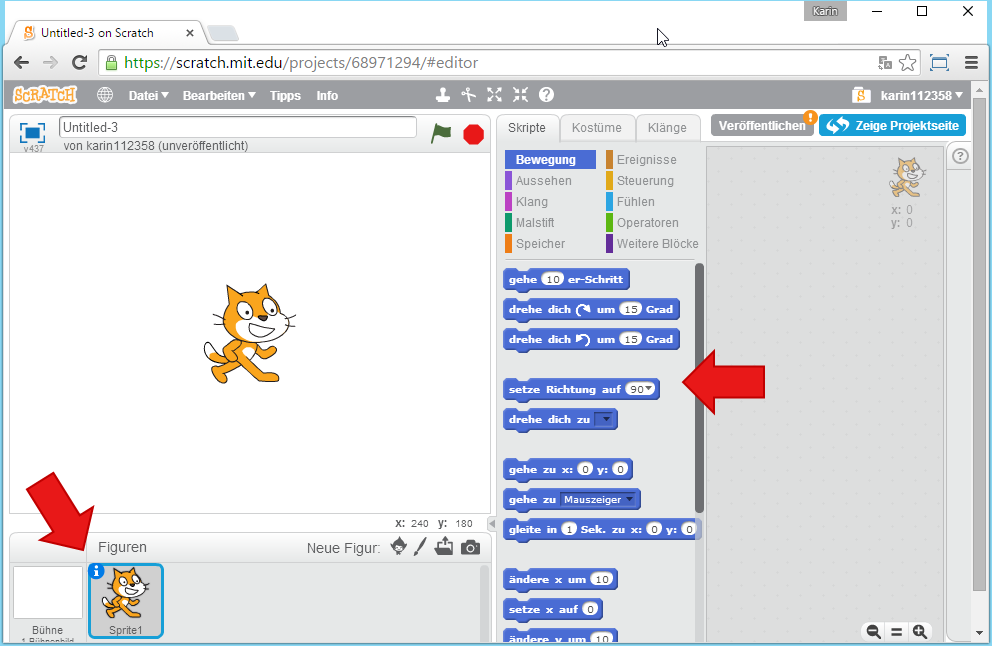
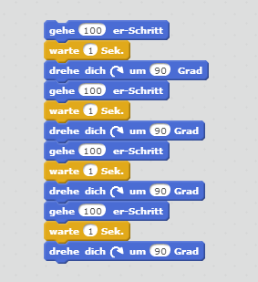
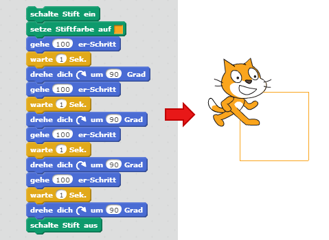
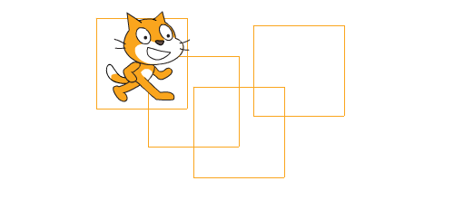

# Erste Schritte mit Scratch

In dieser Übung legst du ein neues Projekt an und lässt Scratchy, die Katze, am Bildschirm herumlaufen.

## Neues Projekt erstellen

1. {: .right}
Öffne Scratch und klicke links oben im Menü auf *Entwickeln*. Im neuen Projekt siehst du Scratchy, die Katze. Noch macht Scratchy nichts, da sie noch kein Programm hat.

## Die Katze Scratchy läuft herum

1. Du findest alle Figuren des Projekts im linken unteren Bereich. Im Moment gibt es hier nur Scratchy, die Katze. Wenn du sie auswählst, kannst du bestimmen, was sie machen soll. Dazu gibt es in der Mitte verschiedene Blöcke, mit denen du sie steuern kannst.

2. Lass Scratchy ein paar Schritte laufen. Wähle dazu den Block *gehe 10er Schritt* und ziehe ihn nach rechts in den leeren grauen Bereich. Wenn du auf den blauen Block klickst, führt Scratchy den Befehl aus. Sie läuft 10 Schritte. Klickst du nochmal, läuft wie wieder 10 Schritte. Den Wert im weißen Feld kannst du verändern, um Scratchy mehr Schritte gehen zu lassen.

3. {: .right}
Du kannst auch mehrere Blöcke kombinieren, um Scratchy mehrere Aufgaben ausführen zu lassen. Lass Scratchy zuerst 100 Schritte laufen, dann warte eine Sekunde und dann drehe sie um 90 Grad. Wenn du das viermal wiederholst, läuft Scratchy im Kreis. Den Befehl, eine Sekunde zu warten, findest du bei den gelben Blöcken *Steuerung*. 
Klicke den ganzen entstanden Block an, um zuzusehen, wie Scratchy deine Befehle ausführt.

## Scratchy malt

1. {: .right}
Scratchy kann den Weg, den sie läuft, auch aufmalen. Verwende dazu die grünen Blöcke im Bereich *Malstift*. Schalte den Stift ein, bevor sie losläuft, wähle eine Farbe und schalte den Stift wieder aus, wenn sie angekommen ist. Wenn du dann den ganzen Block angklickst, malt Scratchy ein Quadrat.

2. {: .right}
Du kannst Scratchy mit der Maus an eine andere Stelle setzen und den ganzen Block erneut anklicken, dann malt sie ein weiteres Quadrat an eine andere Stelle.

3. {: .right}
Mit dem Block *wische Malspuren weg*, kannst du alles wieder löschen.

4. {: .right}
Damit du nicht immer die Blöcke anklicken musst, kannst du definieren, wann ein Block ausgelöst werden soll. 
Du findest diese Auslöser im Bereich *Ereignisse*. Im Beispiel rechts siehst du, wie du einen Block ausführen kannst, wenn eine Taste auf der Tastatur gedrückt wird. Wenn die Taste m (wie malen) gedrückt wird, soll Scratchy das Quadrat malen. Wenn die Taste l (wie löschen) gedrückt wird, sollen alle Malspuren wieder weggelöscht werden.

## Ausprobieren

Du kannst das fertige Projekt unter [https://scratch.mit.edu/projects/68975126/](https://scratch.mit.edu/projects/68975126/){:target="_blank"} ausprobieren.