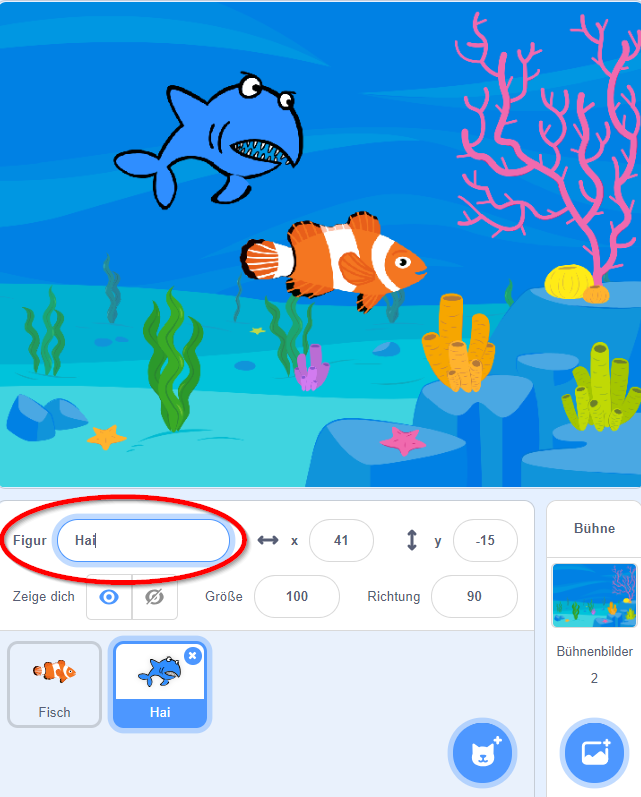

# Scratch Fang-Mich

In diesem Spiel bist du ein Fisch, der dem großen Haifisch entkommen muss. Schaffst du es?

## Bühne und Figuren anlegen

1. {: .right}
Als erstes legst du fest, wie dein Spielfeld aussehen soll. Wir brauchen zuerst das Aquarium, in dem die Fische schwimmen. Wähle als erstes rechts unten unter *Bühnenbild wählen* ein Bühnenbild aus, zum Beispiel ein Aquarium.

2. {: .right}
Als nächstes lösche die Figur Scratchy mit dem Namen *Sprite 1* indem du mit der rechten Maustaste darauf klickst. 
Im angezeigten Menü kannst du Scratchy löschen.

3. {: .right}
Jetzt brauchen wir einen Haifisch sowie einen Fisch, mit dem wir dem Haifisch entkommen wollen. Klicke dazu auf *Figur wählen* und füge einen Fisch sowie einen Haifisch dazu. Natürlich können es auch andere Figuren sein, zum Beispiel ein Käfer, der dem Vogel davonfliegt oder eine Person die dem Löwen davonläuft.

7. {: .right}
Damit du später die Figuren leichter verwenden kannst, gib ihnen Namen wie *Hai* und *Fisch*. Du kannst den Namen von Figuren ändern, indem du unter der weißen Leinwand rechts neben dem Wort Figur auf das Namensfeld klickst und den neuen Namen eingibst.

## Fisch bewegen

1. {: .right}
Damit du den Fisch bewegen kannst, musst er nach links und rechts sowie oben und unten bewegt werden können.

  * Wähle zuerst den Fisch aus, damit er blau umrandet ist.
  * Im Tab *Code* kannst du deinen Fisch nun bewegen. Verwende das Ereignis *Wenn Taste ... gedrückt* unter *Ereignisse*.
  * Verknüpfe es jeweils mit einer Drehung *setze Richtung auf ...* unter *Bewegung*, damit der Fisch in die richtige Richtung schaut.
  * Außerdem brauchen wir *gehe ...er Schritt*, um den Fisch zu bewegen.
    * Für *Pfeil nach oben* gedrückt: Richtung 0 Grad, gehe 10er-Schritte.
    * Für *Pfeil nach unten* gedrückt: Richtung 180 Grad, gehe 10er-Schritte.
    * Für *Pfeil nach rechts* gedrückt: Richtung 90 Grad, gehe 10er-Schritte.
    * Für *Pfeil nach links* gedrückt: Richtung -90 Grad, gehe 10er-Schritte.

Je größer die Schrittanzahl, desto schneller ist dein Fisch.

## Haifisch bewegen

1. {: .right}
Jetzt soll der Haifisch im Aquarium herumschwimmen.

  * Wähle dazu den Haifisch aus, damit er blau umrandet ist.
  * Im Tab *Code* kannst du den Haifisch nun bewegen.
  * Unter *Ereignisse* wähle *Wenn ... angeklickt*.
  * Anschließend wähle *wiederhole fortlaufend* bei *Steuerung* aus.
  * Bewege den Haifisch mit *gehe 10er-Schritt*, *warte 0.1 Sek." *Hinweis: Scratch akzeptiert nur einen Punkt als Kommazeichen*, *pralle vom Rand ab* und *drehe dich um ... Grad*
  * Um etwas mehr Zufall reinzubringen, nimm im Menü *Operatoren* den Block *Zufallszahl von 1 bis 10* und ziehe ihn an die Stelle der 15 Grad.

## Fisch fangen

1. {: .right}
Wenn der Haifisch den Fisch berüht, soll der Fisch ausgeblendet und wieder ins linke obere Eck gesetzt werden.

  * Wähle dazu den Fisch aus, damit er blau umrandet ist.
  * Im Tab *Code* kannst du den Fisch verschwinden lassen, sobald er den Haifisch berührt.
  * Unter *Ereignisse* wähle *Wenn ... angeklickt*.
  * Setze den Fisch an Position -230 und 170 mittels *gehe zu x: -230, y: 170*, um den Fisch ins linke obere Eck zu setzen, und *zeige dich*.
  * Falls jetzt der Hai berührt wird (*Steuerung* *falls ... dann*), dann *sende "berührt" an alle*, *verstecke dich*, *warte 5 Sekunden*, *zeige dich*, und gehe wieder ins linke obere Eck mit *gehe zu x: -230, y: 170*. Anschließend sage *Willkommen zurück* für 2 Sekunden.

2. {: .right}
Wenn der Haifisch den Fisch berüht, soll er zwei mal schnappen und das Spiel "Game Over" sein.

  * Wähle dazu den Haifisch aus, damit er blau umrandet ist.
  * Im Tab *Code* kannst du den Haifisch "Game Over" sagen lassen.
  * Unter *Ereignisse* wähle *Wenn ich ... empfange*, der Hai reagiert somit auf die vom Fisch ausgelöste Nachricht.
  * Anschließend wähle *wiederhole 2 mal* bei *Steuerung* aus.
  * Um den Haifisch schnappen zu lassen, gibt es unter *Aussehen* verschiedene Varianten des Hais. Füge folgende Blöcke in den Wiederhol-Block: *wechsle zu Kostüm b*, *warte 0,3 Sek.*, *wechsel zu Kostüm a*, *warte 0,3 Sek.*
  * Und um den Haifisch "Game over" sagen zu lassen, füge einen neuen *Wenn ich ... empfange* Block hinzu und *sage "Game Over!" für 4.5 Sekunden*.

## Weitere Ideen

* Mach das Spiel schwieriger, indem du einen zweiten, langsameren Haifisch dazu gibst.
* Baue eine Uhr ein, um zu sehen, wie lange du dem Haifisch entkommen kannst.
* Steuere den Fisch mit der Maus anstatt der Tastatur.

## Herunterladen

Du kannst das fertige Projekt unter [fang.mich.sb3](scratch-fang-mich-v3/fang-mich.sb3) herunterladen.