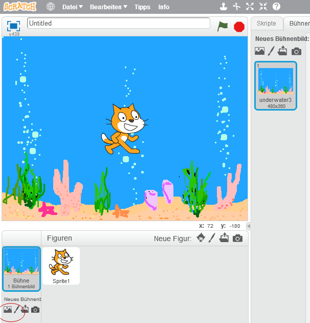
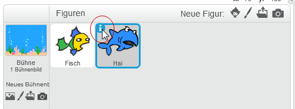
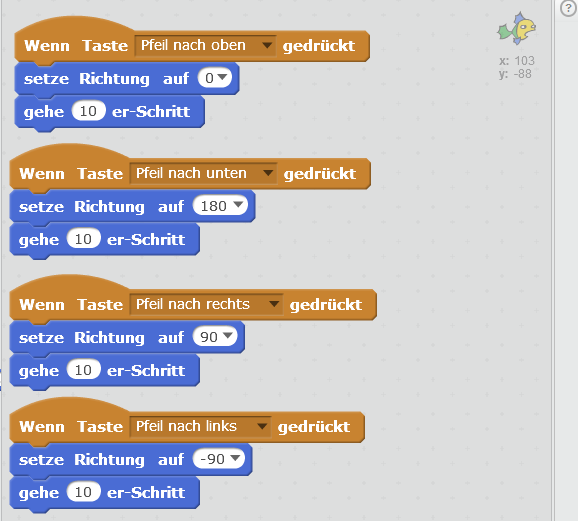
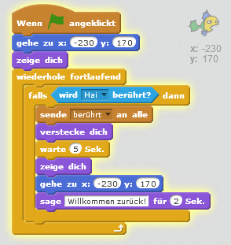

# Scratch Fang-Mich

In diesem Spiel bist du ein Fisch, der dem großen Haifisch entkommen muss. Schaffst du es?

## Bühne und Figuren anlegen

1. {: .right}
Als erstes legst du fest, wie dein Spielfeld aussehen soll. Wir brauchen zuerst das Aquarium, in dem die Fische schwimmen. Wähle als erstes links unten unter *Bühnenbild aus der Bibliothek wählen* ein Bühnenbild aus, zum Beispiel ein Aquarium.

2. {: .right}
Als nächstes lösche die Figur Scratchy mit dem Namen *Sprite1* indem du mit der rechten Maustaste darauf klickst. 
Im angezeigten Menü kannst du Scratchy löschen.

3. {: .right}
Jetzt brauchen wir einen Haifisch sowie einen Fisch, mit dem wir dem Haifisch entkommen wollen. Klicke dazu auf *Figur aus der Bibliothek wählen* und füge einen Fisch sowie einen Haifisch dazu. Natürlich können es auch andere Figuren sein, zum Beispiel ein Käfer, der dem Vogel davonläuft oder eine Person, die dem Löwen davon läuft.

4. {: .right}
Damit der kleine Fisch auch kleiner ist als der große Haifisch, müssen wir den Fisch verkleinern. Wähle dazu den Fisch bei den Figuren aus, sodass er blau umrandet ist. Klicke anschließend auf den Tab *Kostüme*, wähle den Fisch aus und verkleinere ihn, indem du ihn an den Ecken kleiner ziehst.

5. {: .right}
Damit der kleine Fisch sich auch um den richtigen Punkt dreht, wenn er umdreht, musst du den Drehpunkt des Kostüms anpassen. Wähle dazu den Fisch bei den Figuren aus, sodass er blau umrandet ist. Klicke anschließend auf den Tab *Kostüme*, wähle den Fisch aus und klicke auf das Kreuz-Bildchen im rechten oberen Eck. Das angezeigte Kreuz soll genau über der Mitte des Fisches sein.

6. {: .right}
Damit du später die Figuren leichter verwenden kannst, gib ihnen Namen wie *Haifisch* und *Fisch*. Du kannst die Eigenschaften von Figuren ändern, indem du auf das blaue *i* links über der Figur klickst.

## Fisch bewegen

1. {: .right}
Damit du den Fisch bewegen kannst, musst er nach links und rechts sowie oben und unten bewegt werden können.  
  • Wähle zuerst den Fisch aus, damit er blau umrandet ist. 
  • Im Tab *Skripte* kannst du deinen Fisch nun bewegen. Verwende das Ereignis *Wenn Taste ... gedrückt* unter *Ereignisse*. 
  • Verknüpfe es jeweils mit einer Drehung *setze Richtung auf ...* unter *Bewegung*, damit der Fisch in die richtige Richtung schaut. 
  • Außerdem brauchen wir *gehe ...er Schritt*, um den Fisch zu bewegen.  
Für *Pfeil nach oben* gedrückt: Richtung 0 Grad, gehe 10er-Schritte. 
Für *Pfeil nach unten* gedrückt: Richtung 180 Grad, gehe 10er-Schritte. 
Für *Pfeil nach rechts* gedrückt: Richtung 90 Grad, gehe 10er-Schritte. 
Für *Pfeil nach links* gedrückt: Richtung -90 Grad, gehe 10er-Schritte.  
Je größer die Schrittanzahl, desto schneller ist dein Fisch.

## Haifisch bewegen

1. {: .right}
Jetzt soll der Haifisch im Aquarium herumschwimmen.   
  • Wähle dazu den Haifisch aus, damit er blau umrandet ist. 
  • Im Tab *Skripte* kannst du den Haifisch nun bewegen. 
  • Unter *Ereignisse* wähle *Wenn ... angeklickt*. 
  • Anschließend wähle *wiederhole fortlaufend* bei *Steuerung* aus. 
  • Bewege den Haifisch mit *gehe 10er-Schritt*, *warte 0,1 Sek.", *pralle vom Rand ab* und *drehe dich um ... Grad* 
  • Um etwas mehr Zufall reinzubringen, nimm im Menü *Operatoren* den Block *Zufallszahl von 1 bis 10* und ziehe ihn an die Stelle der 15 Grad.

## Fisch fangen

1. {: .right}
Wenn der Haifisch den Fisch berührt, soll der Fisch ausgeblendet und wieder ins linke obere Eck gesetzt werden.  
  • Wähle dazu den Fisch aus, damit er blau umrandet ist. 
  • Im Tab *Skripte* kannst du den Fisch verschwinden lassen, sobald er den Haifisch berührt. 
  • Unter *Ereignisse* wähle *Wenn ... angeklickt*. 
  • Setze den Fisch an Position -230 und 170 mittels *gehe zu x: -230, y: 170*, um den Fisch ins linke obere Eck zu setzen, und *zeige dich*. 
  • Falls jetzt der Hai berührt wird (*Steuerung* *falls ... dann*), dann *sende "berührt" an alle*, *verstecke dich*, *warte 5 Sekunden*, *zeige dich*, und gehe wieder ins linke obere Eck mit *gehe zu x: -230, y: 170*. Anschließend sage *Willkommen zurück* für 2 Sekunden.

2. {: .right}
Wenn der Haifisch den Fisch berüht, soll er zwei mal schnappen und das Spiel "Game Over" sein.   
  • Wähle dazu den Haifisch aus, damit er blau umrandet ist. 
  • Im Tab *Skripte* kannst du den Haifisch "Game Over" sagen lassen. 
  • Unter *Ereignisse* wähle *Wenn ich ... empfange*, der Hai reagiert somit auf die vom Fisch ausgelöste Nachricht. 
  • Anschließend wähle *wiederhole 2 mal* bei *Steuerung* aus. 
  • Um den Haifisch schnappen zu lassen, gibt es unter *Aussehen* verschiedene Varianten des Hais. Füge folgende Blöcke in den Wiederhol-Block: *wechsle zu Kostüm b*, *warte 0,3 Sek.*, *wechsel zu Kostüm a*, *warte 0,3 Sek.* 
  • Und um den Haifisch "Game over" sagen zu lassen, füge einen neuen *Wenn ich ... empfange* Block hinzu und *sage "Game Over!" für 4.5 Sekunden*.

## Weitere Ideen

* Mach das Spiel schwieriger, indem du einen zweiten, langsameren Haifisch dazu gibst.
* Baue einen Uhr ein um zu sehen, wie lange du dem Haifisch entkommen kannst.
* Steuere den Fisch mit der Maus anstatt der Tastatur.

## Ausprobieren

Du kannst das fertige Projekt unter [https://scratch.mit.edu/projects/72919318/](https://scratch.mit.edu/projects/72919318/){:target="_blank"} ausprobieren.