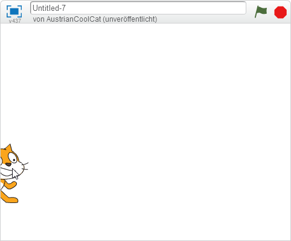
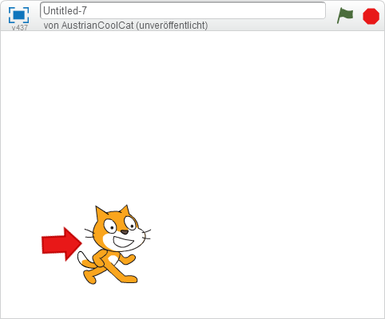
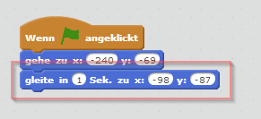
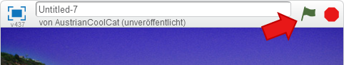
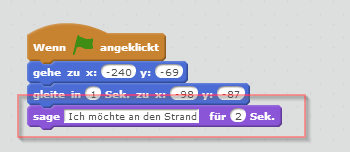
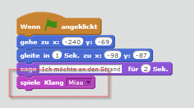
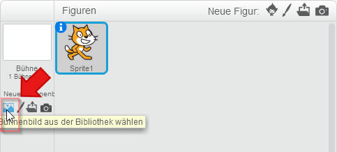
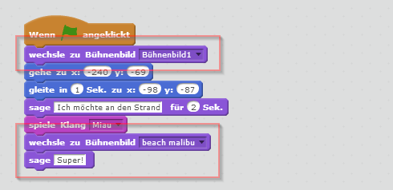
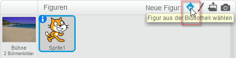
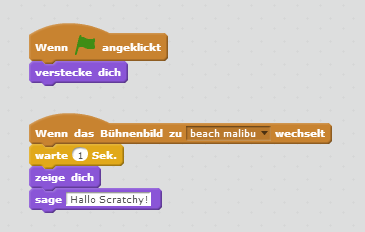

# Mit Scratch eine Geschichte erzählen

Mit Scratch kannst du Geschichten erzählen. Du kannst Figuren erscheinen lassen, sie bewegen, den Hintergrund austauschen und vieles mehr.

## Neues Projekt erstellen

1. {: .right}
Öffne Scratch und klicke links oben im Menü auf *Entwickeln*. Im neuen Projekt siehst du Scratchy, die Katze. Noch macht Scratchy nichts, da sie noch kein Programm hat.

## Scratchy auftreten lassen

1. Schiebe Scratchy ganz nach links. Man darf nur ein kleines Stück von ihr sehen. 

2. {: .right}
Wir möchten, dass Scratchy immer dort links außen ist, wenn wir die Geschichte starten. Deshalb setzen wir ihn auf diese Position wenn die grüne Flagge angeklickt wird. Dazu reagiert unser Programm auf ein *Ereignis". Wenn es eintritt, verwenden wir den *gehe* Block, um Scratchy an die gewünschte Stelle zu positionieren. 

3. Schiebe Scratchy jetzt etwas weiter in die Mitte wie du es am Bild siehst. 

4.  {: .right}
Wir möchten, dass Scratchy nicht zu dieser Position springt sondern dort langsam hingleitet. Es soll aussehen, als ob er die Bühne langsam betritt. Das machen wir mit dem *gleite* Block.

5. {: .right}
Klicke auf die grüne Flagge und sieh dir an, wie Scratchy die Bühne betritt.

## Scratchy etwas sagen lassen

6. {: .right}
Mit dem "sage" Block kannst du Scratchy etwas sagen lassen. Achte darauf, dass die Blöcke unterschiedliche Farben haben. Die Farben helfen dir, die Blöcke wiederzufinden.

7. {: .right}
Scratchy kann auch Geräusche machen. Lass ihn "Miau" sagen. Das machst du mit dem Block *spiele Klang*.

## Hintergrund ändern

8. {: .right}
Damit wir Scratchy an den Strand bringen, müssen wir ein Bühnenbild hinzufügen.

9. Wähle ein Bild vom Strand aus und klicke auf "OK". 

10. {: .right}
Ändere dein Programm so, dass am Beginn das leere Bühnenbild sichtbar ist und am Ende zum Strand gewechselt wird. Probiere dein Programm mit der grünen Flagge aus. Scratchy wünscht sich den Strand, der Stand erscheint und Scratchy freut sich.

## Eine zweite Figur einblenden

11. {: .right}
Öffne die Bibliothek, damit du dir eine neue Figur auswählen kannst.

12. Wähle die Krabbe aus und klicke auf "OK". Schiebe sie anschließend an den rechten unteren Rand. 

13. {: .right}
Damit du das Programm für die Krabbe ändern kannst, klicke sie in der Figurenliste an.

14. {: .right}
Die Krabbe soll am Anfang unsichtbar sein. Sie soll erst sichtbar werden, wenn der Strand als Hintergrund erscheint. Das Bild rechts zeigt dir, wie dein Programm dafür aussehen muss. Probiere es mit der grünen Flagge aus. Scratchy wird jetzt von der Krabbe begrüßt, wenn sie an den Strand kommt.

## Ausprobieren

Du kannst das fertige Projekt unter [https://scratch.mit.edu/projects/69122768/](https://scratch.mit.edu/projects/69122768){:target="_blank"} ausprobieren.