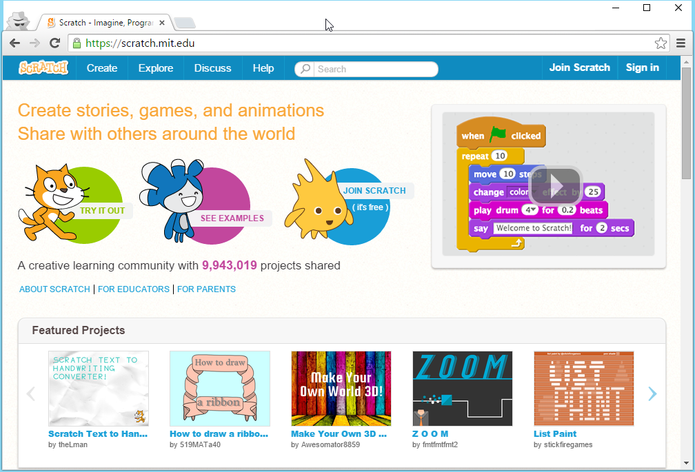

# Scratch Konto anlegen #

Um deine Projekte in Scratch speichern und teilen zu können, brauchst du ein Konto. Die folgende Schritte zeigen dir, wie du ein neues Konto anlegst.

## Anleitung ##

1. Öffnen einen Webbrowser und navigiere zur Scratch Webseite: [http://scratch.mit.edu](http://scratch.mit.edu){:target="_blank"}

2. Wenn die Seite nicht in Deutsch angezeigt wird, scrolle ganz nach unten und wähle in der Combobox "Deutsch" aus.

3. Wähle rechts oben im Menü das Element "Scratcher werden" aus und führe die drei Schritte durch, um dein Scratch Konto zu erstellen.

