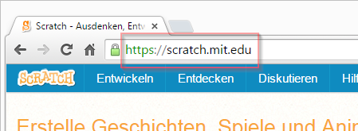
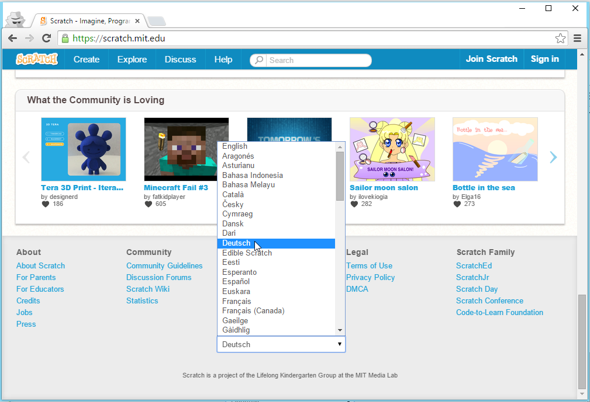
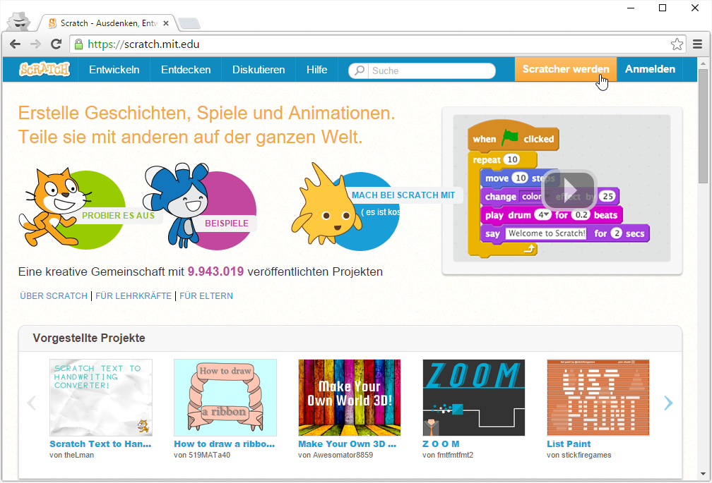
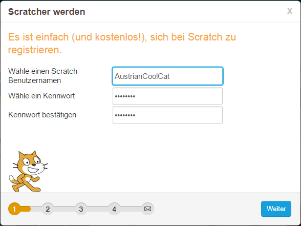
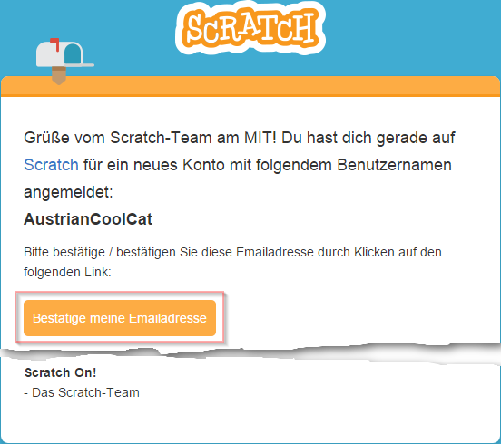
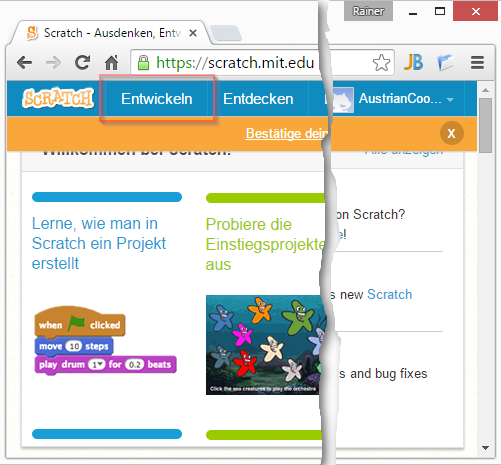

# Scratch Konto anlegen und starten #

Um deine Projekte in Scratch speichern und teilen zu können, brauchst du ein Konto. Die folgende Schritte zeigen dir, wie du ein neues Konto anlegst. Anschließend starten wir Scratch zum ersten Mal.

## Scratch Webseite öffnen

1. {: .right}
Öffne einen Webbrowser, gib in der Adresszeile die Adresse [scratch.mit.edu](https://scratch.mit.edu){:target="_blank"} ein und drücke *Enter*. Das *https://* vor der Scratch-Adresse musst du nicht unbedingt eingeben. Es wird automatisch erscheinen, nachdem du auf *Enter* gedrückt hast.

2. {: .right}
Falls die Scratch-Seite nicht in Deutsch angezeigt wird, scrolle ganz nach unten und wähle aus der Liste der Sprachen *Deutsch* aus.

## Scratch Konto anlegen

3. {: .right}
Klicke rechts oben *Scratcher werden* an.

4. {: .right}
Beantworte die Fragen über dich, die für das Anlegen des Scratch-Kontos notwendig sind. Sobald du eine Seite ganz ausgefüllt hast, klicke auf *Weiter*, um auf die nächste Seite zu kommen. Falls du dir bei manchen Fragen nicht sicher bist oder du noch keine Emailadresse hast, bitte deine Eltern oder einen CoderDojo-Mentor dir zu helfen. Hast du es bis auf Seite vier geschafft? Gratuliere, du bist jetzt ein Scratcher :-) Klicke auf *Gut - Los geht's*, um zu starten.

6. {: .right}
Du wirst von Scratch eine Willkommensnachricht per Email erhalten. Wenn du Zeit hast, öffne die Email und klicke auf *Bestätige meine Emailadresse*, damit Scratch weiß, dass du deine Emailadresse richtig eingegeben hast. Diesen Schritt musst du nicht sofort machen. Falls du gerade nicht auf deine Emails zugreifen kannst, mach diesen Schritt einfach später.

## Spieleentwicklung starten

7. {: .right}
Um dein erstes Spiel zu erstellen, klicke auf *Entwickeln*.

8. {: .right}
Jetzt bist du im *Scratch Editor* und kannst beginnen, dein erstes Spiel zu entwickeln. Verwende weitere Trainingsanleitungen, falls du erste Ideen und Anleitungen möchtest.

