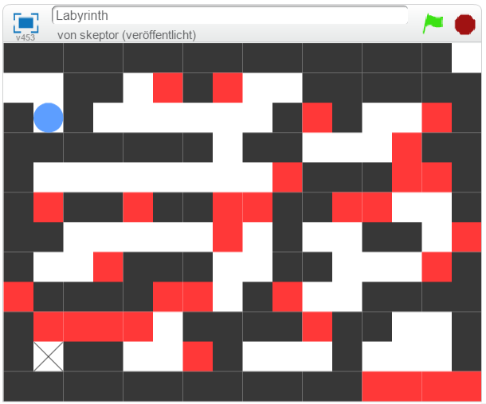
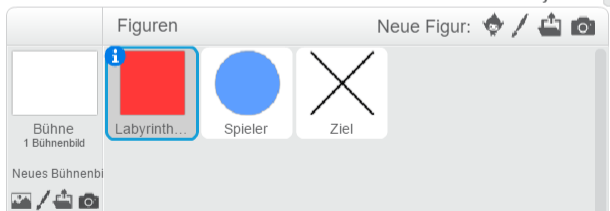
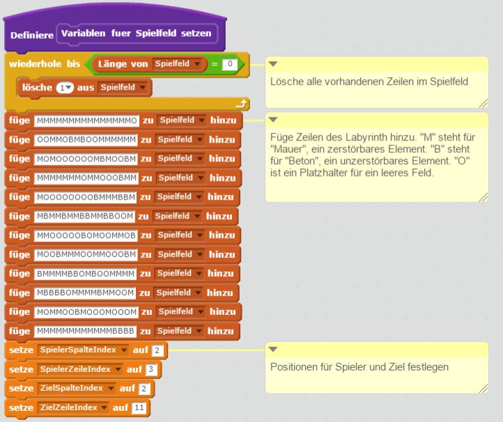
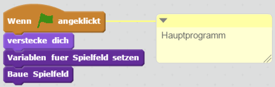
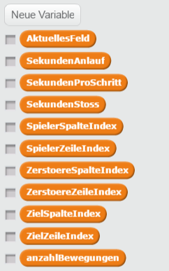
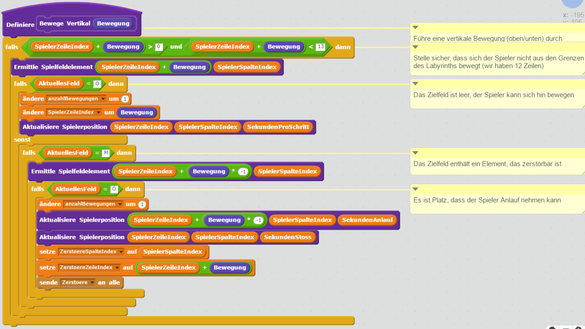
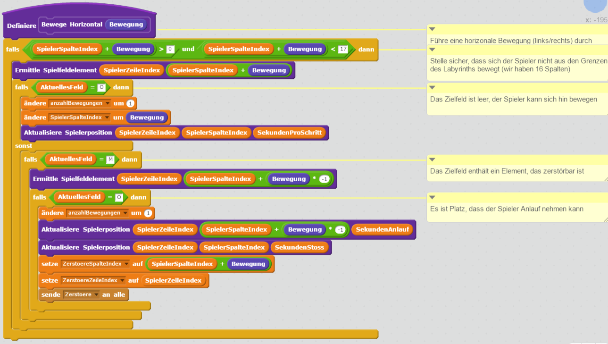
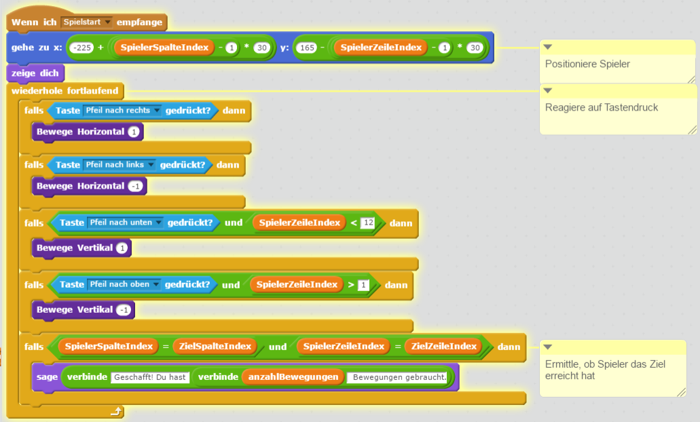
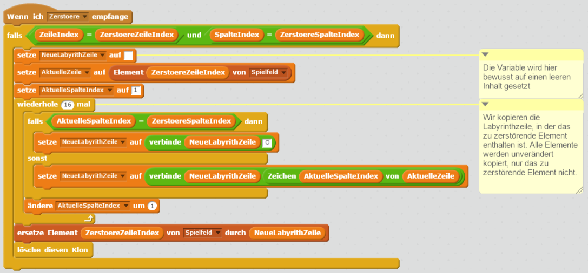
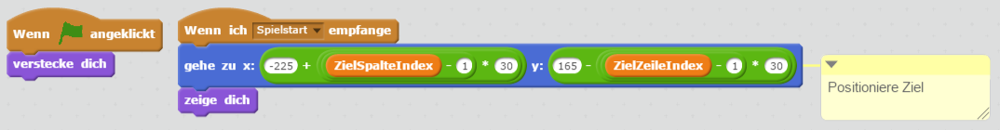

# Labyrinth-Spiel mit Scratch und JavaScript Scratch 2.0 <a href="scratch-labyrinth-v3.html" class="change-scratch-version">Scratch 3.0</a>

## Ziel der Übung

In dieser Übung programmierst du ein Labyrinth-Spiel erst mit Scratch und danach mit JavaScript. So lernst du, das, was du in Scratch über Programmieren gelernt hast, in einer textbasierten Programmiersprache anzuwenden.

## Spielbeschreibung

	

	

		
Steuere mit den Cursortasten den Spieler (blaue Kugel). Dein Ziel ist es, das mit "X" markierte Ziel zu erreichen.

		
Die schwarzen und roten Felder sind Hindernisse. Schwarze Felder kannst du zerstören, indem du Anlauf nimmst. Rote kannst du nicht zerstören.

		
Ziel ist es, mit möglichst wenigen Bewegungen das Ziel zu erreichen. Damit du deine Versuche vergleichen kannst, soll beim Erreichen des Ziels ausgegeben werden, wie viele Bewegungen du gebraucht hast.

		<table class="table sushi-stats">
			<tbody>
				<tr>
					<td>Figuren</td>
					<td>3</td>
				</tr>
				<tr>
					<td>Skripte</td>
					<td>13</td>
				</tr>
				<tr>
					<td>Daten</td>
					<td>18</td>
				</tr>
			</tbody>
		</table>
	

## Scratch

Als erstes programmieren wir das Spiel mit Scratch. Öffne als erstes den Scratch Editor unter [https://scratch.mit.edu/projects/editor/](https://scratch.mit.edu/projects/editor/){:target="_blank"}.

### Figuren

1. {: .right}
Lösche *Scratchy*. Wir brauchen für unser Spiel andere Figuren.

1. {: .right}
Klicke auf *Neue Figur zeichnen*. Gib der neuen Figur den Namen *LabyrinthElement*.

1. Du musst die Figuren für dieses Spiel nicht selbst zeichnen. Du kannst sie [herunterladen](scratch-labyrinth/figuren.zip). Falls du noch nicht weißt, wie du mit ZIP-Dateien umgehen musst, frag eine Mentorin oder einen Mentor im CoderDojo.

1. {: .right}
Lade die Bilder *Beton.svg* und *Mauer.svg* als Kostüme in dein Spiel. Das automatisch angelegte Kostüm *Kostüm1* kannst du löschen.

1. {: .right}
Wiederhole die letzten drei Schritte und lege dir zwei weitere Figuren für den Spieler (*spieler.svg*) und das Ziel (*ziel.svg*) an. Am Ende solltest du drei Figuren in deinem Spiel haben.

### Globale Variablen

1. {: .right}
Lege die im Bild gezeigten Variablen an. Alle diese Variablen müssen **für alle Figuren** gelten.

1. {: .right}
Lege eine Liste an. Diese Liste muss ebenfalls **für alle Figuren** gelten.

### Spielfeld aufbauen

1. **Wir arbeiten als erstes an der Figur *LabyrinthElement*.**

1. {: .right}
Wir brauchen für unsere Figur noch weitere Variablen. Lege die Variablen an, die dir noch fehlen. Diese Variablen gelten **nur für diese Figur**.

1. Das Spielfeld in Scratch ist horizontal ("x") 480 Punkte breit. Vertikal ("y") ist es 360 Punkte breit. Für unser Spiel teilen wir es in 30 mal 30 Punkte breite Quadrate. Wir haben also 16 mal 12 Quadrate. **Beachte, dass bei Scratch der Mittelpunkt die Koordinaten x=0 und y=0 hat.** 

1. Das Spielfeld wird in der Liste *Spielfeld* definiert. Das folgende Bild zeigt den neuen Block *Variablen fuer Spielfeld setzen*, den du dafür anlegen musst. 

1. Damit du nicht alle Zeilen vom Bild abschreiben musst, findet du hier das Spielfeld als Text. Kopiere den Text jeder Zeile in die Zwischenablage (*Strg + C*) und füge den Text in Scratch ein (*Strg + V*). Wenn das für dich ganz neu ist, frage eine Mentorin oder einen Mentor um Hilfe. 
`MMMMMMMMMMMMMMMO` 
`OOMMOBMBOOMMMMMM` 
`MOMOOOOOOMBMOOBM` 
`MMMMMMMOMMOOOBMM` 
`MOOOOOOOOBMMMBBM` 
`MBMMBMMBBMMBBOOM` 
`MMOOOOOBOMOOMMOB` 
`MOOBMMMOOMMOOOBM` 
`BMMMMBBOMBOOMMMM` 
`MBBBBOMMMMBMMOOM` 
`MOMMOOBMOOOMOOOM` 
`MMMMMMMMMMMMBBBB`

1. Das folgende Bild zeigt den neuen Block *Baue Spielfeld*, den du anlegen musst, damit aus der Liste *Spielfeld*, die du im letzten Schritt angelegt hast, das Spielfeld gebaut wird. **Wichtig: Achte darauf, dass du die Option "Ohne Bildschirmaktualisierung laufen lassen" aktivierst wenn du den neuen Block erstellst!** Ansonsten braucht dein Spiel sehr lange zum starten. 

1. Im vorigen Block erstellen wir Klone. Diese Klone müssen wir an die richtige Position bringen, wenn sie entstehen. Das machen wir mit diesem Block. 

1. {: .right}
Jetzt müssen wir nur noch dafür sorgen, dass unsere neuen Blöcke aufgerufen werden, wenn das Programm startet. 

1. So, jetzt kannst du dein Programm ausprobieren. Das Labyrinth müsste am Bildschirm erscheinen. Klappt es?

## Den Spieler programmieren

1. **Wir arbeiten als nächstes an der Figur *Spieler*.**

1. {: .right}
Wir brauchen für unsere Spieler-Figur noch weitere Variablen. Lege die Variablen an, die dir noch fehlen. Diese Variablen gelten **nur für diese Figur**.

1. Bei der Programmierung des Spielers müssen wir oft herausfinden, welches Element sich an einer gewissen Position am Spielfeld befindet. Damit wir nicht jedes Mal die Programmelemente dafür immer wieder und wieder einfügen müssen, erstellen wir uns einen neuen Block *Ermittle Spielfeldelement* dafür. Den können wir dann überall verwenden, wo wir diese Logik brauchen. Man bezeichnet in der Praxis solche Programmteile auch als *Hilfsfunktionen*. 

1. Die zweite *Hilfsfunktion*, die wir brauchen, bewegt den Spieler an eine angegebene Position am Spielfeld. Auch das werden wir später mehrfach brauchen. 

1. Jetzt kommt eine Herausforderung auf dich zu: Wir müssen den Block *Bewege Vertikal* bauen, der den Spieler vertikal (nach oben/unten) bewegt. 

1. Für die horizonale (nach links/rechts) Bewegung sieht der Block *Bewege Horizontal* ganz ähnlich aus wie der, den du zuvor erstellt hast. 
**Tipp:** Programmiere nicht also nochmals neu sondern kopiere den vorigen Block und ändere ihn nur entsprechend ab. 

1. Nachdem du jetzt alle *Hilfsfunktionen* programmiert hast, können wir sie mit der Tastensteuerung verknüpfen. 

1. {: .right}
Jetzt müssen wir nur noch dafür sorgen, dass unsere neuen Blöcke aufgerufen werden, wenn das Programm startet. 

1. So, jetzt kannst du dein Programm ausprobieren. Du müsstest jetzt den Spieler steuern können. Klappt alles?

## Schwarze Hindernisse zerstören

1. **Wir arbeiten an der Figur *LabyrinthElement* weiter.**

1. Du hast sicher gemerkt, dass der Spieler die Nachricht *Zerstoere* verschickt. Noch empfängt aber niemand diese Nachricht. Das ändern wir jetzt. 

1. So, jetzt kannst du dein Programm ausprobieren. Jetzt müsste der Spieler schon schwarze Hindernisse zerstören können. Klappt alles?

## Das Ziel programmieren

1. **Wir arbeiten als letztes an der Figur *Ziel*.**

1. Das Ziel muss beim Spielstart richtig positioniert werden: 

1. Fertig! Versuche mit dem Spieler das Ziel zu erreichen. Wie viele Bewegungen brauchst du? Fordere deine Freundinnen und Freunde heraus. Schaffen sie es genauso schnell wie du?

## Weitere Ideen

* Lass dir ein neues, schwierigeres Labyrinth einfallen. Versuche es durch Anpassen des Programms in dein Spiel einzubauen.

* Nachdem du jetzt das Programm in Scratch geschafft hast, könntest du es als nächstes in JavaScript programmieren. Im Bereich *Web* findest du genau [das gleiche Spiel als JavaScript-Übung](../web/labyrinth-mit-svg.html). Du wirst sehen, dass vieles ganz ähnlich funktioniert wie in Scratch.

## Ausprobieren

Du kannst das fertige Projekt unter [https://scratch.mit.edu/projects/138821302/](https://scratch.mit.edu/projects/138821302/){:target="_blank"} ausprobieren.
