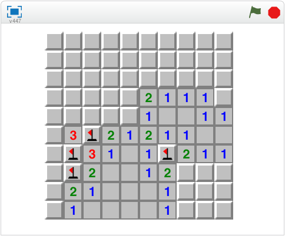
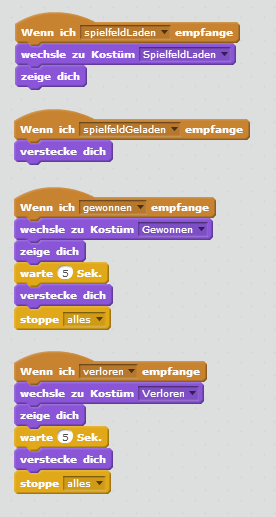
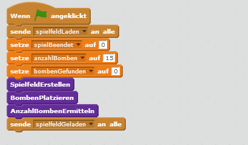
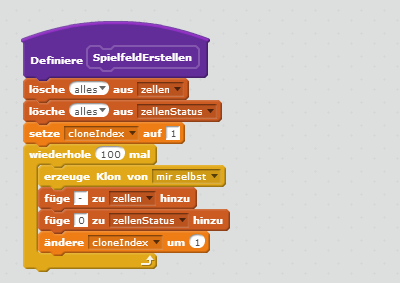

# Scratch Minesweeper

In diesem Spiel musst du die Bomben im Spielfeld finden. Klicke auf eine Zelle um sie umzudrehen. Wenn du gleichzeitig die Leertaste drückst, markierst du eine Zelle als Bombe.

Das Spiel besteht aus 2 Figuren und 15 Skripten.

## Figuren anlegen

Das Spiel besteht aus nur zwei Figuren: einer Zelle für das Spielfeld und verschiedenen Nachrichten, die dem Spieler angezeigt werden können.

1. {: .right}
Lösche als erstes die Figur Scratchy mit dem Namen *Sprite1* indem du mit der rechten Maustaste darauf klickst. 
Im angezeigten Menü kannst du Scratchy löschen.

2. {: .right}
Die Figur "Zelle" besteht aus mehreren Kostümen - einer nicht aufgedeckten Zelle, einer Bombe, einer leeren Zelle, einer Fahne und den Ziffern 1 bis 8. 
Damit du nicht alle Figuren selbst zeichnen musst, kannst du die Figur unter <a href="scratch-minesweeper/Zelle.sprite2">Zelle.sprite2</a> downloaden.

3. {: .right}
Die zweite Figur "Nachrichten" besteht aus drei Kostümen - den Nachrichten "Spielfeld laden", "Gewonnen" und "Verloren". Diese kannst du nach deinen Vorstellungen gestalten.

## Daten anlegen

In diesem Spiel werden eine ganze Menge an Daten benötigt. Sie werden später in den Skripten verwendet. Lege als erstes folgende Daten an:

### Daten für alle Figuren

* anzahlBomben
* anzahlGefundeneBomben
* anzahlUmliegendeBomben
* i
* spielBeendet

### Listen für alle Figuren

* zellen
* zellenStatus

### Daten für die Zelle

* klonIndex

Wenn du alle Variablen und Listen richtig angelegt hast, solltest du bei den Figuren "Zelle" und "Nachrichten" folgende Daten sehen:

## Skripte für die Nachrichten

1. {: .right}
Für die Figur "Nachrichten" brauchen wir nur wenige Skripte. Sie reagiert auf Nachrichten, 
die von der Figur "Zelle" geschickt werden und zeigt dem Benutzer die entsprechende Nachricht an. 
Es gibt vier mögliche Nachrichten, auf die die Figur reagieren kann: spielfeldLaden, spielfeldGeladen, gewonnen und verloren.

## Skripte für die Zelle

1. {: .right}
Als erstes müssen wir das Spielfeld initialisieren. Dazu schicken wir zuerst einmal eine Nachricht an die Figur "Nachrichten", 
dass die Meldung "Spielfeld laden" angezeigt werden soll. Dann werden die Daten auf einen passenden Wert gesetzt. 
  Als nächstes erstellen wir das Spielfeld, platzieren die Bomben und ermitteln für jedes Feld die Anzahl der umliegenden Bomben. 
Dazu verwenden wir eigene, neue Blöcke. Der Inhalt dazu kommt später. Am Schluss schicken wir nochmal eine Nachricht, dass das Spielfeld jetzt fertig geladen ist.

1. {: .right}
Zum Erstellen des Spielfelds füllen wir die Listen "zellen" und "zellenStatus" mit Initialwerten.
  Die Liste "zellen" 
enthält für jede der 100 Positionen (10 x 10) auf dem Spielfeld eine der folgenden Informationen: - = nicht definiert, b = Bombe, 1 = 1 Bombe in den umliegenden Zellen, 
2 = 2 Bomben in den umliegenden Zellen, usw. Zum Initialisieren setzen wir den Wert "-" für nicht definiert.
  Die Liste "zellenStatus" enthält für jede Zelle nur die Information, ob sie aufgedeckt sein soll (0 = nicht aufgedeckt, 1 = aufgedeckt). Das brauchen wir erst später, um bei Klick auf eine Zelle ohne umliegende Bomben automatisch auch die umliegenden Zellen aufzudecken.
  Außerdem erzeugen wir für jedes Feld einen Klon der Zelle. Diese wird dann im nächsten Skript an der richtigen Position im Spielfeld platziert.

1. {: .right}

## Ausprobieren

Du kannst das fertige Projekt unter [https://scratch.mit.edu/projects/111781317/](https://scratch.mit.edu/projects/111781317/){:target="_blank"} ausprobieren.