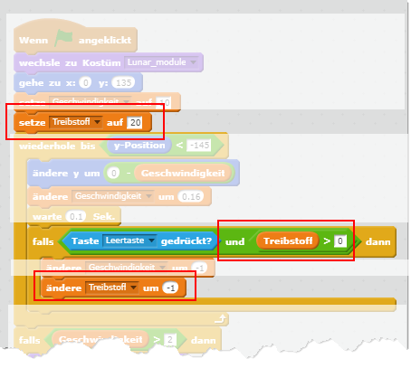

# Scratch Moonhack

	

	

		
In diesem Spiel musst du mit dem <em>Lunar Module</em> auf dem Mond landen. Aber Vorsicht, die Landung muss sanft sein und du hast nur eine begrenzte Menge an Raktentreibstoff.

		
Du kannst das fertige Spiel unter <a href="https://scratch.mit.edu/projects/236734138/" target="_blank">https://scratch.mit.edu/projects/236734138/</a> auch gleich ausprobieren.

		<table class="table sushi-stats">
			<tbody>
				<tr>
					<td>Figuren</td>
					<td>1</td>
				</tr>
				<tr>
					<td>Skripte</td>
					<td>8</td>
				</tr>
				<tr>
					<td>Daten</td>
					<td>2 Variablen</td>
				</tr>
			</tbody>
		</table>
	

## Downloads

<table class="table sushi-overview">
	<tr class="subtitle">
		<td>Figur</td>
		<td></td>
	</tr>
	<tr>
		<td>Hintergrund</td>
		<td><a href="scratch-moonhack/backdrop1.png">Hintergrund downloaden</a></td>
	</tr>
	<tr>
		<td>Lunar Module</td>
		<td><a href="scratch-moonhack/Lunar_Module.sprite2">Figur downloaden</a></td>
	</tr>
</table>

## Einleitung

Am 20. Juli 1969 erreichten die ersten Menschen mit der [Mondlandefähre (Englisch *Lunar Module*)](https://de.wikipedia.org/wiki/Mondlandef%C3%A4hre) den Mond. Das Raumschiff zu landen war nicht einfach. Der Pilot, [Neil Armstrong](https://de.wikipedia.org/wiki/Neil_Armstrong), musste eine sanfte Landung schaffen, um einen Crash zu verhindern. Er hatte aber nur eine begrenzte Menge Treibstoff zur Verfügung, um die Fähre abzubremsen.

In dieser Übung programmierst du einen Simulator für die Landung auf dem Mond mit der Mondlandefähre.

## Bühne und Figuren anlegen

1. {: .right}
Zuerst suchen wir uns ein cooles Bühnenbild aus. Wir haben für dich eines vorbereitet. Du kannst es [hier herunterladen](scratch-moonhack/backdrop1.png) und anschließend in Scratch die heruntergeladene Datei als Hintergrund einfügen.

2. {: .right}
Als nächstes lösche die Figur "Scratchy" mit dem Namen *Figur 1*, indem du mit der rechten Maustaste darauf klickst und *Löschen* auswählst.

3. {: .right}
Jetzt fügen wir die Figur für die Mondlandefähre ein. Du kannst sie [hier herunterladen](scratch-moonhack/Lunar_Module.sprite2) und anschließend in Scratch die heruntergeladene Datei als Figur einfügen.

4. {: .right}
Beachte, dass unsere Figur mehrere Kostüme und Klänge enthält. Zum Beispiel gibt es ein eigenes Kostüm für den Crash und einen Klang für den Düsenantrieb. Schau dir die Kostüme an und höre dir die Klänge an. Wir werden sie später in das Spiel einbauen.

Die Computergrafik für unser Spiel ist fertig, jetzt geht's ans Programmieren der Skripte.

## Spielbeginn

{: .right}

Wenn das Spiel durch Klicken auf die grüne Flagge startet, soll die Mondlandefähre oben in der Mitte des Bühnenbildes erscheinen. Außerdem möchten wir das Standardkostüm ohne Crash oder Düsenantrieb verwenden.

## Variable

{: .right}

Die Geschwindigkeit, mit der die Mondlandefähre nach unten gleitet, ist nicht immer gleich. Durch die [Gravitation](https://de.wikipedia.org/wiki/Gravitation) nimmt die Geschwindigkeit zu. Wenn man die Düsen zündet, nimmt sie ab. Daher brauchen wir eine *Variable* mit Namen *Geschwindigkeit*, um die Geschwindigkeit der Mondlandefähre zu speichern.

## Mondgravitation simulieren

{: .right}

Wir verwenden eine *Schleife* um etwas zu wiederholen, bis die Mondlandefähre den unteren Rand des Bünenbildes erreicht hat. 

Als nächstes fügen wir Code hinzu, der die Geschwindigkeit simuliert, mit der die Mondlandefähre in Richtung Mond fällt. Wusstest du, dass die Gravitation auf dem Mond nur 0.16-mal so stark ist wie auf der Erde?

## Antrieb zünden

{: .right}

Um die Mondlandefähre abzubremsen, muss man den Raketenantrieb zünden. Damit kann man die Geschwindigkeit, mit der man sich dem Mond nähert, reduzieren.

Super, du hast Level 1 geschafft. Probiere das Spiel aus.

## Crash oder sichere Landung?

Die Mondlandefähre erreicht schon den Mond. Jetzt müssen wir prüfen, ob es wegen zu hoher Landegeschwindigkeit einen Crash gibt oder es sich um eine sichere Landung handelt.

{: .right}

Wir verwenden eine *Bedingung* um zu prüfen, ob die Geschwindigkeit höher als 2m/s beim Aufsetzen am Mond war. Falls ja, ist unsere Mondelandefähre kaputt. Ansonsten melden wir eine erfolgreiche Landung.

Gratulation, Level 2 ist erledigt. Probiere, ob du erfolgreich am Mond landen kannst.

## Treibstoff

Es wäre schön, wenn wir immer beliebig viel Treibstoff verfügbar hätten. Unsere Mondlandefähre hat das - genauso wie Neil Armstrong - natürlich nicht. Machen wir unseren Mondladesimulator realistischer, indem wir die Menge an Treibstoff limitieren.

{: .right}

Lege als erstes eine weitere Variable namens *Treibstoff* an. 

Wir setzen den verfügbaren Treibstoff auf 20 und ziehen 1 ab wenn man den Antrieb zündet. Der Antrieb funktioniert nur so lange, wie man Treibstoff zur Verfügung hat.

Gratulation, dein Moonhack-Spiel ist fertig. Kannst du trotz Treibstofflimit am Mond landen?

## Erweiterungen

Sicher hast du noch eine Menge Ideen, um das Breakout-Spiel zu verbessern. Ein paar Vorschläge:

* Ermögliche es, dass man die Mondlandefähre nach links und rechts bewegen kann.
* Erlaube die Landung nur in einem gewissen Bereich am Mond.
* Wechsle das Kostüm kurz auf *thrusters* und spiele den Klang *thrusters* wenn man den Antrieb zündet.

## Ausprobieren

Du kannst das fertige Projekt unter [https://scratch.mit.edu/projects/236734138/](https://scratch.mit.edu/projects/236734138/){:target="_blank"} ausprobieren.
