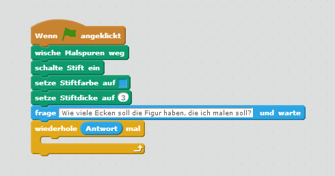
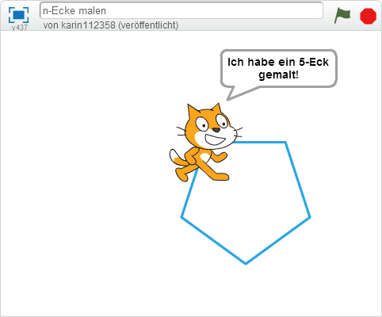

# n-Ecke malen

In dieser Übung lässt du Scratchy Figuren mit beliebig vielen Ecken malen, wie zum Beispiel ein Dreieck oder ein Viereck.

## Lösche vorhandene Malspuren und schalte den Stift ein

1. {: .right}
Wische alle bereits vorhandenen Malspuren weg, schalte den Stift ein und wähle eine Farbe und Dicke für den Stift.

## Lass Scratchy fragen, wie viele Ecken sie malen soll

1. {: .right}
Lass Scratchy fragen *Wie viel Ecken soll die Figur haben, die ich malen soll?* Du bekommst unten ein Eingabefeld, in dem du angeben musst, wieviel Ecken die Figur haben soll.

2. So sieht es aus, wenn Scratchy um die Anzahl an Ecken fragt: 

## Male eine Figur mit der angegebenen Anzahl an Ecken

1. {: .right}
Eine Figur mit 3 Ecken (Dreieck) muss aus drei Kanten bestehen, eine Figur mit vier Ecken (Viereck) braucht vier Kanten. Für ein Dreieck kannst du Scratchy dreimal sagen, dass sie eine Linie malen soll und sich dann um einen Drittelkreis, also 120 Grad, drehen soll. Für ein Viereck musst du die beiden Anweisungen vier mal wiederholen.  
Damit du beliebig viele Kanten malen kannst, kannst du einen Block einfügen, der die beiden Aufgaben *Linie malen* und *um x Grad drehen* beliebig oft wiederholt.  
Wir müssen das Malen der Kante so oft wiederholen, wie wir als Antwort auf Scratchies Frage angegeben haben.

2. {: .right}
Innerhalb des Wiederhol-Blocks gibst du nun nur einmal an, dass Scratch 100 Schritte gehen soll und sich dann nach rechts drehen soll.  
Um herauszufinden, um wie viele Grad sich Scratchy drehen soll, musst du wissen, dass für eine geschlossene Figur in Summe immer 360 Grad notwendig sind. Wenn du nun für ein Dreieck drei Drehungen brauchst, dann muss jede davon 360 : 3 = 120 Grad groß sein. Für ein Viereck brauchst du vier Drehungen mit 360 : 4 = 90 Grad.  
Du kannst im Befehl *drehe dich um x Grad* also 360 durch die Anzahl der gewünschten Ecken dividieren.

3. {: .right}
Lass Scratchy, wenn sie fertig ist, sagen, was sie gemacht hat. Damit sie die Antwort auf die Frage 
*Wie viele Ecken soll die Figur haben, die ich malen soll?* einbauen kann, musst du mehrere Text-Teile verbinden. 

4. {: .right}
Du kannst jetzt Figuren mit vielen Ecken malen. Je mehr Ecken die Figur hat, desto größer wird sie. Ab ungefähr 10 Ecken reicht der Platz auf der Malfläche nicht mehr aus und Scratchy kann die Figur nicht mehr richtig malen.  
Damit die Figur auch bei mehr Ecken wieder Platz hast, musst du die Anzahl der Schritte anpassen. Die gesamte Malfläche ist 480 breit. Wir dividieren diese Zahl durch die Anzahl der Ecken - so hat die Figur auch bei vielen Ecken wieder Platz.

5. {: .right}
Je mehr Ecken du Scratchy malen lässt, desto ähnlicher wird die Figur einem Kreis.

## Ausprobieren

Du kannst das fertige Projekt unter [https://scratch.mit.edu/projects/69094342/](https://scratch.mit.edu/projects/69094342/){:target="_blank"} ausprobieren.