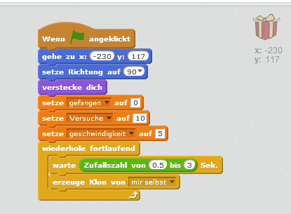
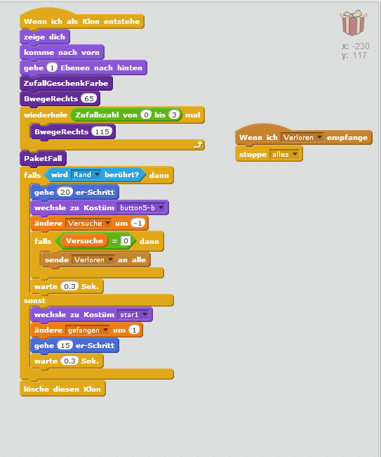
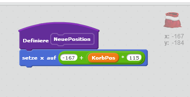
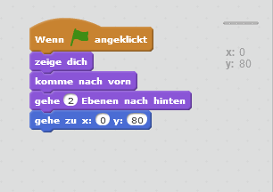
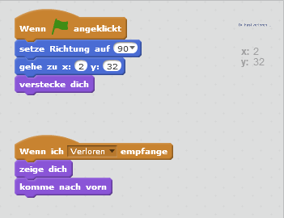

# Weihnachtspakete fangen

Leider ist das Förderband in der Werkstatt des Weihnachtsmanns kaputt. Kannst du die Pakete auffangen bevor sie auf den Boden fallen
und kaputt gehen.

{: .right}

## Vorbereitung

Lade dir zuerst die [Zip Datei](scratch-pakete-fangen/figuren.zip) herunter.

Du brauchst als erstes 4 Figuren:
* die Geschenkspakte (aus der Scratch bibliothek)
* das Förderband (du findest es in der ZIP-Datei)
* den Weihnachtssack (du findest ihn in der ZIP-Datei)
* die Mitteilung dass du zu viele Pakete fallen gelassen hast (bitte selbst erstellen)

In der Figur Paket müssen wir zuerst noch 2 kostüme hinzufügen, die anzeigen ob das Paket am Boden zerbrochen oder erfolgreich gefangen wurde.

{:style="float:left;"}

ich habe ein rotes X und einen Stern dafür genommen. Du findest sie auch in der Scratch Bibiliothek und kanns sie einfach in der Kostümauswahl hinzufügen.

Danach können wir auch schon mit den Skripten beginnen.
## Steuerung der Pakete

{:style="float:right;"}
Als erstes Stellen wir die Basiseinstellungen ein und werden alle 0,5 - 3 Sekunden ein neues Paket erzeugen. Dieses Paket wird dann dem Förderband entlang gleiten.

Wir benötigen auch noch ein paar Funktionsblöcke ("Weitere Blöcke") damit wir das Haupt-Skript ein wenig aufteilen können.
{:style="float:right;"}

Dann geht es auch schon los. Wir werden das neue Paket zuerst bis zu einer von 4 zufälligen Positionen fahren lassen bis das Paket dann schlussendlich runterfällt
{:style="float:right;"}
Das kann auf eine von 2 Arten ausgehen:
* der Rand wir berührt (Geschenk ist kaputt)
* Der Sack wird getroffen (Geschenk wurde eingesammelt)

Als nächsts möchten wir natürlich auch den Geschenk-Sack steuern

## Steuerung des Geschenk-Sacks

{:style="float:right;"}
Auch der Geschenk-Sack möchte am Anfang an die richtige Position gestellt werden.

{:style="float:right;"}
Auch hier definieren wir einen Funktionsblock ("Weitere Blöcke") damit wir die Postitionsformel nicht jedes mal eingeben müssen.

{:style="float:right;"}
Weiters soll sich der Sack mit den Pfeiltasten nach rechts und links bewegen lassen. Dafür verwenden wir natürlich den Funktionsblock den wir vorhin definiert haben.

## Das Förderband

{:style="float:right;"}
Die Förderband Figur befindet sich in der ZIP-Datei und kann einfach hinzugefügt werden. Die Skripte dafür sind sehr einfach und sollen nur die Position festlegen.

## Die Abschiedsmeldung

{:style="float:right;"}
Diese Figur solltest du selbst entwerfen. Lass dir etwas lustiges oder tröstendes einfallen.

{:style="float:right;"}
Auch dafür sind die Skripte sehr einfach und legen nur die Position fest. Ausserdem soll die Abschiedsnachricht angezeigt werden, wenn das Spiel beendet wurde.

**Viel Spass beim Pakete sammeln!**
