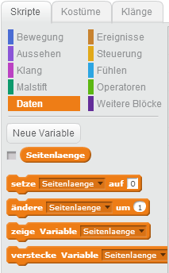

# Scratch Sierpinski Dreieck

Ein Fraktal ist ein Objekt, dass oft aus mehreren verkleinerten Kopien seiner selbst besteht. Hier siehst du ein großes Dreieck, 
das aus mehreren kleineren Dreiecken zusammengesetzt ist, die wiederum aus noch kleineren Dreiecken bestehen. Man nennt dieses 
Fraktal Sierpinski Dreick.

Die Übung besteht aus 1 Figur und 2 Skripten.

## Figuren anlegen

1. {: .right}
Um im Scratch zu malen, brauchen wir zwar eine Figur, es muss am Bildschirm aber nichts angezeigt werden. Du kannst also eine Figur mit einem leeren Kostüm anlegen. 
Die Skripte werden für diese leere Figur erstellt.

## Daten

1. {: .right}
Für das Sierpinski Dreieck zeichnen wir Dreiecke mit verschiedenen Seitenlängen. Wir legen daher eine Variable "Seitenlaenge" an. Wir werden später mit Klonen 
arbeiten, um Dreiecke mit verschiedenen Seitenlängen zu arbeiten, darum darf die Variable nur für eine Figur gelten.

**ACHTUNG: Achte darauf, dass die Variable "Nur für diese Figur" gilt.**

## Skripte zum Malen der Dreiecke

1. {: .right}
Lege als erstes für die leere Figur ein Skript an, dass beim Klick auf die grüne Flagge die Malfläche initialisiert. Dazu gehören folgende Schritte:
 * Starte das Script mit der grünen Flagge
 * Wische alle Malspuren weg
 * Wähle eine Stiftfarbe
 * Setzte die Variable "Seitenlaenge" auf 200 - wir malen als erstes das größte Dreieck in der Mitte, das eine Seitelänge von 200 Schritten haben soll
 * Gehe zur Position x: 0, y: -170 - das grüne Sternchen im Bild kennzeichnet diese Startposition
 * Erzeuge einen Klon deiner Figur

2. {: .right}
Male das größte Dreick in der Mitte. Dazu sind folgende Schritte notwendig:
 * Starte das zweite Skript wenn ein Klon entsteht
 * Setze als erstes die Richtung auf 30°
 * Schalte den Stift ein
 * Wiederhole die folgenden beiden Anweisungen dreimal: 1) Gehe "Seitenlaenge" Schritte 2) Drehe dich um 120° nach links
 * Schalte den Stift wieder aus - das erste Dreieck ist fertig und wir sind wieder am Ausgangspunkt x: 0, y: -170 angelangt

3. {: .right}
Nun müssen wir die zweite Runde an Dreiecken malen. Dazu müssen wir die Ausgangspunkte der drei umliegenden Dreiecke finden. 
Dann können wir einfach einen Klon der Figur erstellen und das Malen startet von vorne. Folgende Schritte brauchen wir dazu (am zweiten Skript anschließend):
 * Setze die Variable "Seitenlaenge" auf "Seitenlaenge" / 2 - die neuen Dreiecke haben nur halb so lange Kanten
 * Wenn die Seitenlänge noch größer als 5 ist, führe die nachfolgenden Schritte aus
 * Drehe dich 60° nach rechts - die Figur schaut jetzt genau nach rechts (90°)
 * Gehe "Seitenlaenge" Schritte - damit kommen wir zum grünen Dreieck rechts unten
 * Wiederhole jetzt noch folgende Schritte dreimal: 1) Erzeuge einen Klon der Figur 2) Drehe dich um 120° nach links 3) Gehe "Seitenlaenge" * 2 Schritte - 
damit erreichst du alle drei grünen Dreiecke und erzeugst an jeder Position einen Klon
 * Lösche ganz am Ende des Skripts den Klon - auch wenn die Seitenlänge schon kleiner oder gleich 5 ist

4. {: .right}
Gratuliere - dein Sierpinski Dreieck ist nun fertig! Du kannst die Farben für jeden Klon veränden - dann sieht dein Dreieck noch interessanter aus.
  
## Ausprobieren

Du kannst das fertige Projekt unter [https://scratch.mit.edu/projects/92837701/](https://scratch.mit.edu/projects/92837701/){:target="_blank"} ausprobieren.