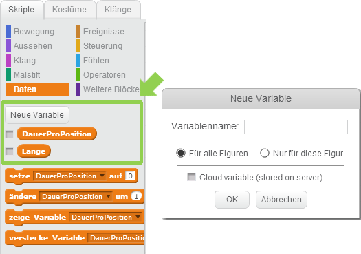

# Scratch Snake

Steuere die Schlange, um die Äpfel aufzusammeln. Aber pass auch, dass du nicht den Rand berührst und auch keinen Knoten in die Schlange machst, wenn sie länger wird.

Das Spiel besteht aus 3 Figuren und 14 Skripten. In der folgenden Anleitung findest du einige Fragezeichen in den Skripten. Hier bist du gefordert, die richtige Lösung zu finden!

Wenn du noch keine Idee hast, welche Bausteine hier fehlen könnten, findest am Ende der Anleitung die vollständigen Skripte.

## Figuren anlegen

1. {: .right}
Lösche als erstes die Figur Scratchy mit dem Namen *Sprite1* indem du mit der rechten Maustaste darauf klickst. 
Im angezeigten Menü kannst du Scratchy löschen.

2. {: .right}
Die Schlange besteht aus zwei Kostümen - dem Kopf und dem Körper. Wir wollen, dass sich die Schlange später in 20iger Schritten bewegt. Die Figur darf daher nicht größer als 20 sein. 
Eine Ausnahme ist die Zunge, die darf etwas länger sein.

3. {: .right}
Der Apfel braucht nur ein Kostüm. Damit er von der Schlange nur erwischt wird, wenn diese sich genau über den Apfel bewegt, darf auch der Apfel nicht größer als 20 sein.

4. {: .right}
Dann brauchst du noch eine Figur für die "Game Over" Meldung (Englisch für "das Spiel aus aus"), die angezeigt wird, wenn der Spieler verloren hat.

5. {: .right}
Vergiss nicht, dass du mit Hilfe des Fadenkreuzes rechts oben für alle Figuren den Mittelpunkt markieren musst. Bei der Schlange musst du das für beide Kostüme machen.

## Daten

1. {: .right}
Damit sich die Schlange bewegen kann müssen wir zwei Informationen speichern: die Länge der Schlange und wie lange jeder Teil der Schlange auf einer Position bleibt.  
Lege dafür zwei Variablen mit den Namen "DauerProPosition" und "Länge" an, die für alle Figuren zur Verfügung stehen.

## Skripte für die Schlange

1. {: .right}
Jetzt soll der Haifisch im Aquarium herumschwimmen.   
  • Wähle dazu den Haifisch aus, damit er blau umrandet ist. 
  • Im Tab *Skripte* kannst du den Haifisch nun bewegen. 
  • Unter *Ereignisse* wähle *Wenn ... angeklickt*. 
  • Anschließend wähle *wiederhole fortlaufend* bei *Steuerung* aus. 
  • Bewege den Haifisch mit *gehe 10er-Schritt*, *warte 0,1 Sek.", *pralle vom Rand ab* und *drehe dich um ... Grad* 
  • Um etwas mehr Zufall reinzubringen, nimm im Menü *Operatoren* den Block *Zufallszahl von 1 bis 10* und ziehe ihn an die Stelle der 15 Grad.

  
## Skripte für den Apfel

1. {: .right}
Der Apfel muss zwei Aufgaben erfüllen: er muss eine Position finden, an der sich die Schlange gerade nicht befindet und er muss erkennen, wenn er von der Schlange berührt wird.   
  • Zeige den Apfel als erste an und setzte ihn auf die Position x: 20, y: 0. 
  • Dann wiederhole fortlaufend folgende Schritte: 
    • Finde eine Position, an der sich die Schlange gerade nicht befindet. 
    • Generiere dazu Zufallszahlen, die ein Vielfaches von 20 sind. Wir bewegen die Schlange in 20iger Schritten, daher sollte auch der Apfel auf einem Vielfachen von 20 platziert sein. 
    • Wiederhole das Generieren der Zufallszahlen solange, bis du eine Position findest, an der die Schlange gerade nicht berührt wird. 
	• Dann warte bis der Apfel von der Schlange berührt wird. 
	• Spiele einen Klang ab und mach die Schlange um einen Körperteil länger. 
	• Dann beginne wieder von vorne und suche eine neue Position für den Apfel.
	
## Skripte für SpielZuEnde

1. {: .right}  
  • Beim Start des Spiels verstecke die Figur SpielZuEnde und setzte sie in die Mitte der Bühne. 
  • Wenn du die Nachricht "Verloren" empfängst, zeige die Figur an und spiele einen Klang. Nach drei Sekunden kannst du die Figur wieder verstecken und alle Skripte stoppten.

## Weitere Ideen

* ...

## Ausprobieren

Du kannst das fertige Projekt unter [https://scratch.mit.edu/projects/73821694/](https://scratch.mit.edu/projects/73821694/){:target="_blank"} ausprobieren.

## Gesamte Skripte je Figur

### Schlange

### Apfel

### SpielZuEnde

