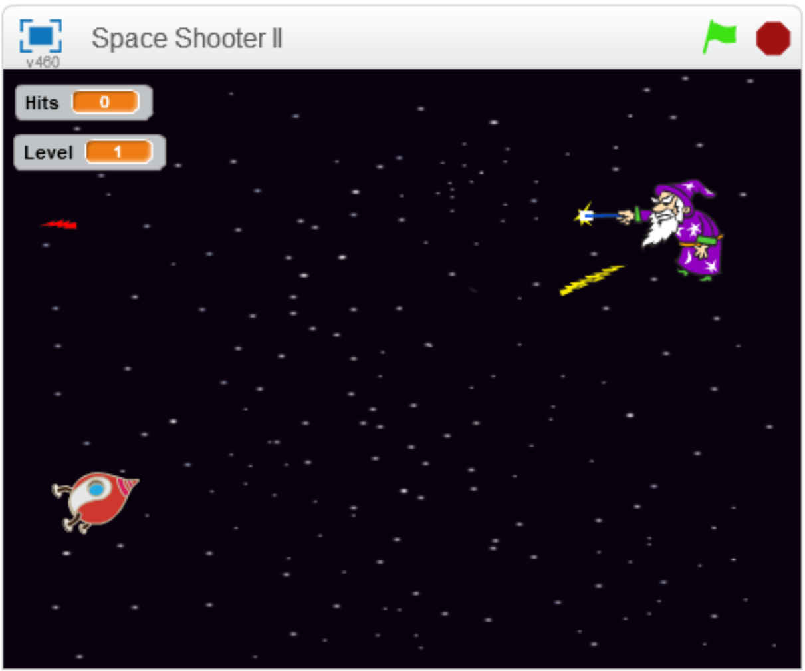
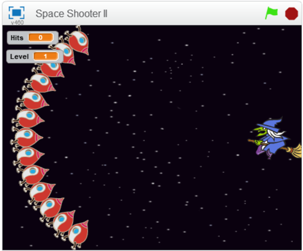
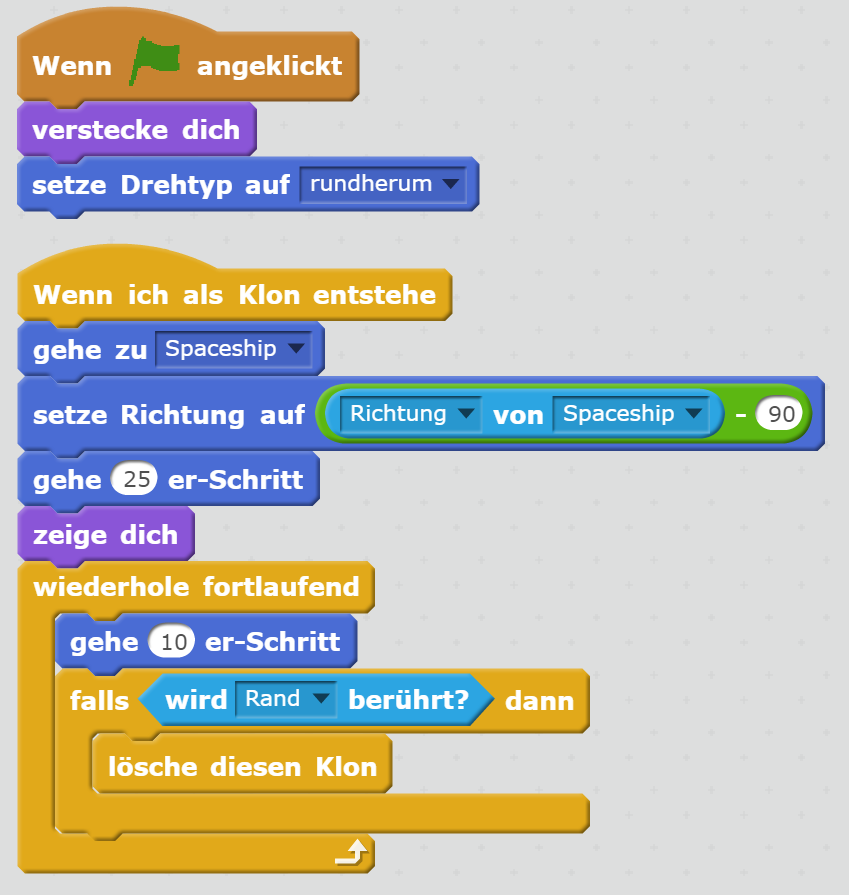

# Scratch Space Shooter II

	

	

		
Hast du die <a href="scratch-space-shooter.html">Space Shooter Scratch Übung</a> schon geschafft? Dann bist du genau richtig hier. Deine Aufgabe ist es, einen modifizierten Space Shooter zu bauen - diesmal aber ohne kompletter Anleitung.

		
Falls du Hilfe brauchst, kannst du dir Anregungen beim fertigen Spiel unter <a href="https://scratch.mit.edu/projects/236866631/" target="_blank">https://scratch.mit.edu/projects/236866631/</a> holen.

		<table class="table sushi-stats">
			<tbody>
				<tr>
					<td>Figuren</td>
					<td>4</td>
				</tr>
				<tr>
					<td>Skripte</td>
					<td>6</td>
				</tr>
				<tr>
					<td>Daten</td>
					<td>2 Variablen</td>
				</tr>
			</tbody>
		</table>
	

## Bühne und Figuren anlegen

1. Verwende einen Sternenhimmel als **Bühnenbild** für dein Spiel.

1. Füge das Raumschiff als **Figur** hinzu. Mache es so groß oder klein wie du möchtest.

1. {: .right}
Füge den Blitz **zwei Mal** als **Figur** hinzu. Einmal soll er gelb sein (Laser, den dein Raumschiff schießt) und einmal rot (Laser, den deine Gegner schießen). Drehe den Laser im **Kostümeditor**, damit er nach rechts zeigt.

1. {: .right}
Füge die Hexe als **Figur** hinzu. Füge der neuen Figur den Zauberer **als zweites Kostüm** hinzu.

## Bewegen des Raumschiffs

Um das Spiel schwieriger zu machen, bewegt sich das Raumschiff nicht einfach nach oben und unten. Es bewegt sich entlang einer Kurve. Das Bild oben zeigt verschiedene Positionen des Raumschiffs auf der Kurve.

1. Wenn man die *Pfeil nach links* Taste drückt, soll sich das Raumschiff von ihm aus gesehen nach links, also im Bild nach oben entlang der Kurve bewegen.

1. Wenn man die *Pfeil nach rechts* Taste drückt, soll sich das Raumschiff von ihm aus gesehen nach rechts, also im Bild nach unten entlang der Kurve bewegen.

Hier eine Animation, die die Bewegung zeigt:

Wenn du nicht sicher bist, wie die Bewegung aussehen soll, probiere das Spiel unter [https://scratch.mit.edu/projects/236866631/](https://scratch.mit.edu/projects/236866631/) aus. Aber nicht schummeln und in die Scripts schauen! Probiere erst, selbst auf die Lösung zu kommen.

## Schießen

Wenn man auf die Leertaste drückt, soll das Raumschiff einen Schuss abgeben. Verwende den gelben Pfeil als "Laser-Impuls". Man kann durch mehrmaliges Drücken der Leertaste viele Schüsse kurz hintereinander abgeben. Das Bild oben zeigt, wie das dann aussieht.

## Gegner tauchen auf

Die Gegner fliegen von rechts nach links ins Spielfeld.

1. Der Gegner erscheint immer auf der Höhe (Y-Position), auf der das Raumschiff gerade steht.

1. Der Gegner fliegt eine zufällige Entfernung nach links (maximal bis zur Mitte des Spielfelds). Danach dreht er um und fliegt wieder nach rechts zurück.

1. Bevor der Gegener umdreht, gibt er einen Schuss mit dem roten Laser ab.

1. Ist er zurück am rechten Rand, taucht der nächste Gegner auf.

Wenn du nicht sicher bist, wie sich die Gegner verhalten sollen, probiere das Spiel unter [https://scratch.mit.edu/projects/236866631/](https://scratch.mit.edu/projects/236866631/) aus. Aber nicht schummeln und in die Scripts schauen! Probiere erst, selbst auf die Lösung zu kommen.

## Treffer

1. Wenn der gelbe Laser einen Gegner trifft, gibt das einen Punkt. Zeige die aktuelle Anzahl an Punkten am Bildschirm an.

1. Wenn der rote Laser das Raumschiff trifft, hat der Spieler verloren und das Spiel stoppt.

## Level

Alle **30 Sekunden** steigt man ein Level auf. Bei jedem Level werden die Gegner etwas schneller.

## Weitere Ideen

Hast du alles alleine geschafft? Wow, **du bist ein echter Scratch-Profi**!

Hier noch ein paar Ideen für Verbesserungen des Spiels:

* Füge Klänge für das Abfeuern eines Laserstrahls und für das Treffen eines Gegners hinzu.
* Gib bei Spielende *Game Over* aus.
* Mach bei höheren Levels auch das Raumschiff schneller.
* Lass die Gegner öfter schießen, nicht nur beim Umdrehen. Die Schießfrequenz könnte sich erhöhen je höher das erreichte Level wird.

## Ausprobieren

Du kannst das fertige Projekt unter [https://scratch.mit.edu/projects/236866631/](https://scratch.mit.edu/projects/236866631/){:target="_blank"} ausprobieren.

## Lösung

Ziel dieser Übung ist es, dass du selbst ohne Schritt-für-Schritt-Anleitung das Spiel zu programmieren versuchst. Das ist nicht einfach. Daher findest du hier die Lösung. Wenn du nicht weiter weißt, kannst du nachsehen. **Gib aber nicht zu schnell auf**. Das Tüfteln an der Lösung ist das Schöne am Programmieren. Das Gefühl, etwas selbst geschafft zu haben, ist super.

**Bleib dran, du schaffst es!**

### Raumschiff

### Gegner

### Gelber Laser (vom Raumschiff)

### Roter Laser (vom Gegner)

