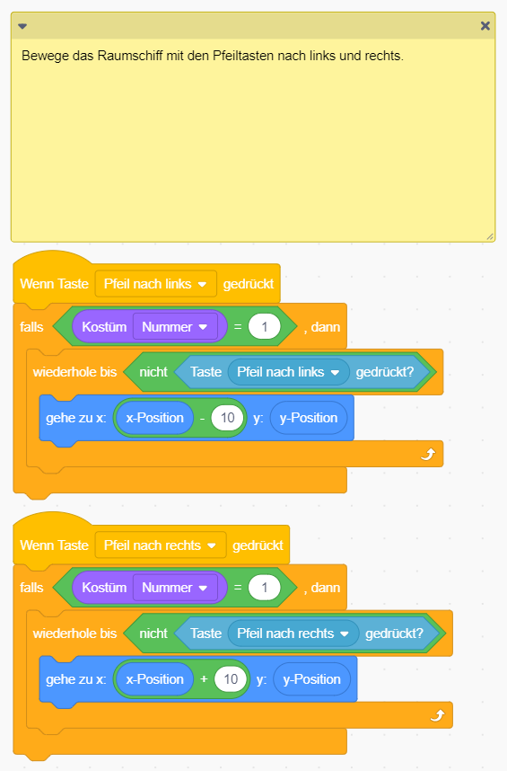
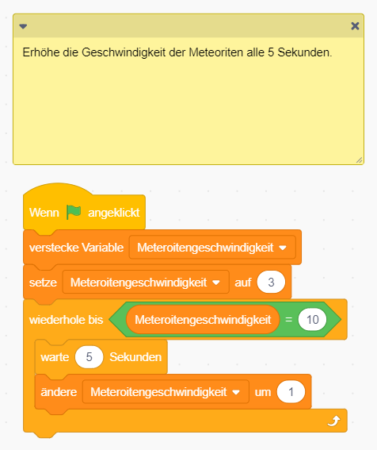

# Scratch Space Shooter

In dieser Übung schießt du mit deinem Raumschiff herabfallende Meteoriten ab bevor sie dein Raumschiff zerstören.

## Bühne und Figuren anlegen

1. {: .right}
Als erstes legst du fest, wie deine Bühne aussehen soll. Für dieses Spiel brauchst du das Weltall als Hintergrund. 
Wähle ein passendes Bild aus oder male selbst eines.

2. {: .right}
Als erste Figur brauchst du das Raumschiff. Es besteht aus zwei Kostümen: dem Raumschiff selbst und einem weiteren Kostüm das angezeigt wird, 
wenn das Spiel vorbei ist. Zeige den Text "Game Over" an oder male ein passendes Bild

3. {: .right}
Die nächste Figur ist der Laserstrahl, der von der Rakete abgefeuert werden kann.

4. {: .right}
Und als letzte Figur brauchst du noch einen Meteoriten.

## Daten

1. {: .right}
Wir brauchen für den Space Shooter einige Daten: die Anzahl der Treffer, die Enstehungszeit von Meteoriten, deren Geschwindigkeit und 
einen Indikator, ob ein Meteroit getroffen wurde. ACHTUNG: die Variable getroffen gilt nur für die Figur "Meteroit", 
alle anderen Variablen gelten für alle Figuren.

## Skripte für das Raumschiff

Das Raumschiff hat drei Aufgaben:

    <ol>
        <li>Es muss erkennen, wann es von einem Meteoriten getroffen wurde und dann das Spiel beenden.</li>
        <li>Mit den Pfeiltasten kann es nach links und rechts bewegt werden.</li>
        <li>Mit den Tasten a und d kann es nach links und rechts gedreht werden.</li>
    </ol>

## Skripte für den Laser

Jedesmal wenn die Leertaste gedrückt wird, muss ein neuer Laserstrahl erzeugt und abgefeuert werden.

## Skripte für den Meteoriten

## Weitere Ideen

* Füge Klänge für das Abfeuern eines Laserstrahls, für das Treffen eines Metoriten und das Zerstören des Raumschiffes hinzu.
* Verwende Variablen um die Geschwindigkeit der Meteoriten und die Anzahl der erzeugten Meteoriten mit der Zeit zu erhöhen