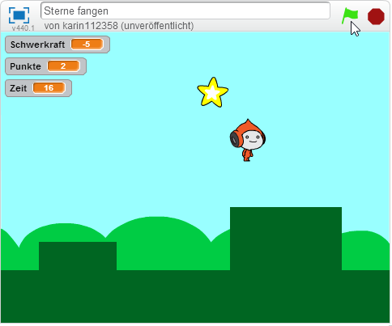
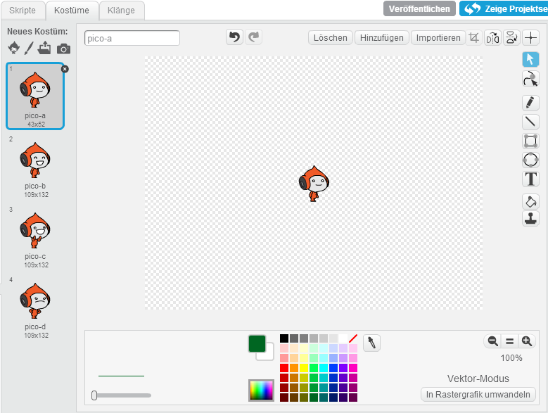
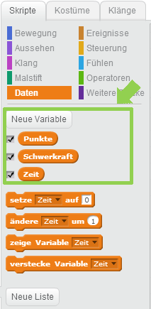
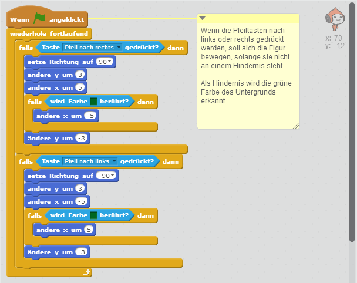
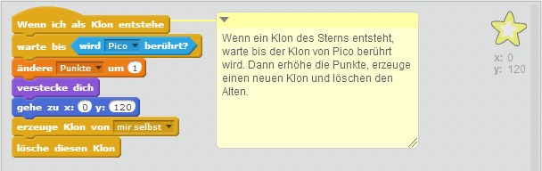
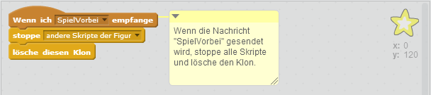
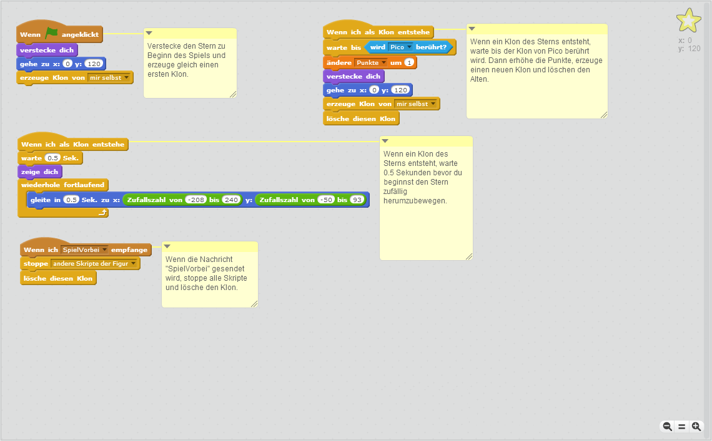

# Scratch Sterne fangen

Verwende die Pfeiltasten nach links und rechts um am Boden zu laufen und die Pfeiltaste nach oben um hochzuspringen. 
Fange so viele Sterne wie möglich.

Das Spiel besteht aus 3 Figuren und 7 Skripten. Es basiert auf dem Spiel [Gravity!! von gilnz21](https://scratch.mit.edu/projects/63121636/){:target="_blank"}.

## Figuren anlegen

1. {: .right}
Lösche als erstes die Figur Scratchy mit dem Namen *Sprite1* indem du mit der rechten Maustaste darauf klickst. 
Im angezeigten Menü kannst du Scratchy löschen.

1. {: .right}
Suche dir ein Bühnenbild für dein Spiel aus.

1. {: .right}
Füge eine Figur hinzu, die die Sterne fangen soll. In diesem Beispiel haben wir Pico ausgewählt. 
Passe die Größe der Figur an, so dass sie gut in dein Bühnenbild passt.

1. {: .right}
Füge eine Figur für die zu fangenden Sterne hinzu.

1. {: .right}
Male eine Figur für den Untergrund, auf dem Pico herumlaufen und springen kann.

1. {: .right}
Vergiss nicht, dass du mit Hilfe des Fadenkreuzes rechts oben für alle Figuren den Mittelpunkt markieren musst.

## Daten

1. {: .right}
Wir brauchen für das Spiel drei Informationen: die Punkte des Spielers, die Schwerkraft beim Springen und die Zeit. 
Lege dafür drei Variablen mit den Namen "Punkte", "Schwerkraft" und "Zeit" an. Alle Variablen gelten für alle Figuren.

## Skripte für Pico

1. {: .right}
Wenn das Spiel gestartet wird, setze die Anzahl der Punkt auf 0 und die Zeit auf 20.  
Jede Sekunde muss der Wert für die Zeit um 1 reduziert werden.  
Wenn die Zeit abgelaufen ist, sende eine Nachricht "SpielVorbei" an alle, stoppe die anderen Skripte und sage dem Spieler, wie viele Punkte er erreicht hat.

1. {: .right}
Mit den Pfeiltasten nach links und rechts, soll Pico nach links und rechts laufen, solange er kein Hindernis berührt. 
Ein Hindernis wird durch die grüne Farbe erkannt.

1. {: .right}
Mit der Pfeiltaste nach oben kann Pico springen, um mehr Sterne zu erwischen.
  
## Skripte für den Stern

1. {: .right}
Beim Starten des Spiels verstecke gleich den Stern und erzeuge einen ersten Klon. Wenn ein neuer Klon entsteht, warte kurz, dann zeige den Stern und bewege ihn dann zufällig herum.

1. {: .right}
Wenn ein neuer Klon entsteht, warte bis dieser von Pico berührt wird. Dann erhöhe die Punkte um eins, erzeuge einen neuen Klon und lösche den Alten.

1. {: .right}
Wenn die Nachricht "SpielVorbei" gesendet wird, stoppe alle Skripte und lösche den Klon.
	
## Weitere Ideen

* Füge eine Highscore Liste ein.
* Baue mehrere Levels.
* Baue einen Hintergrund, der zufällig generiert wird.

## Ausprobieren

Du kannst das fertige Projekt unter [https://scratch.mit.edu/projects/80926486/](https://scratch.mit.edu/projects/80926486/){:target="_blank"} ausprobieren.

## Gesamte Skripte je Figur

### Pico

### Stern

