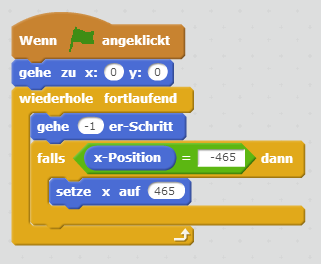
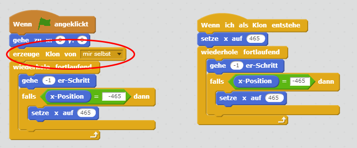
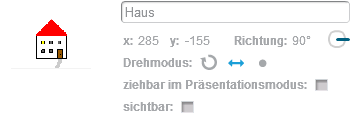
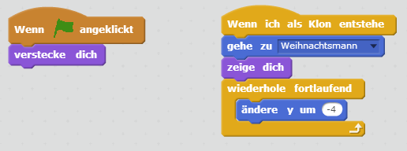
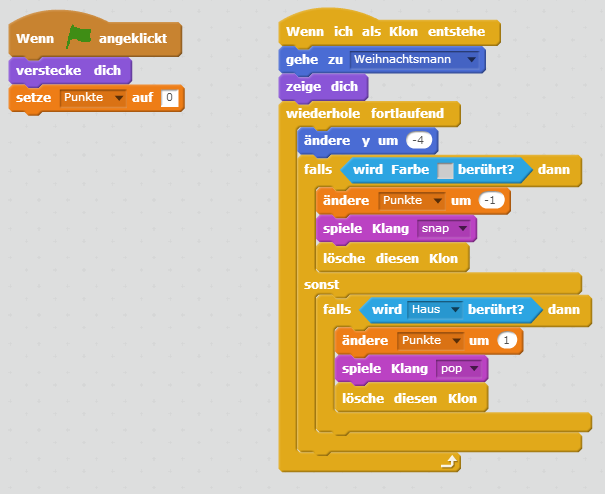

# Scratch Weihnachtsspiel
Bald ist Weihnachten - und der Weihnachtsmann hat alle Hände voll zu tun, um die Geschenke rechtzeitig in die Häuser zu bringen. Wie viel schaffst du in einer Minute?

Das Spiel besteht aus 4 Figuren und 9 Skripten!

## Bilder downloaden

Wir haben einige Bilder vorbereitet, die du für dieses Spiel benötigst. Lade dir die folgende Datei herunter:
[weihnachtsspiel.zip](scratch-weihnachten/Weihnachtsspiel.zip)

## Winterlandschaft

Es soll so aussehen, dass der Weihnachtsmann sich von links nach rechts bewegt. Dabei darf er aber natürlich nicht aus dem Bild rausfliegen. Deshalb verwenden wir einen Trick: Wir bewegen nicht den Weihnachtsmann nach rechts, sondern den Hintergrund nach links. Der Weihnachtsmann bleibt immer an der gleichen Position – wie wenn du ihn mit einer Kamera filmen würdest.
Erstelle eine neue Figur mit dem Bild aus der heruntergeladenen Vorlage und erstelle ein Script, dass sie nach links schiebt:

{: .right}

Wenn du jetzt auf die grüne Fahne klickst, siehst du, dass der Hintergrund nach links aus dem Bildschirm geschoben wird. Daher müssen wir die Figur zweimal nebeneinander darstellen. Sobald wir die erste so weit nach links geschoben haben, dass sie gar nicht mehr sichtbar ist, setzen wir sie wieder rechts neben die zweite... Hier siehst du eine Skizze, wie das ganze funktionieren soll (rot ist der Ausschnitt, den man im Spiel gerade sieht).

{: .right}

Wir erstellen also im bestehenden Skript zusätzlich das zweite Bild ("erzeuge einen Klon von mir selbst") und lassen diesen Klong genauso durchs Bild ziehen - allerdings mit einer anderen Startposition.

{: .right}

Zeit für einen ersten Versuch: starte das Spiel - die Winterlandschaft sollte schon vorüberziehen?!

## Häuser

Als nächstes kümmern wir uns um die Häuser. Erstelle eine neue Figur mit mehreren Kostümen, die Bilder dafür kannst du aus der Vorlage nehmen. Diese Figur werden wir nicht anzeigen, aber wir werden regelmäßig Klone erstellen, die dann so wie der Hintergrund von links nach rechts durchs Bild wandern:

{: .right}

Damit für etwas Abwechslung gesorgt ist, wählen wir für jeden Klon ein anderes Kostüm und vertauschen manchmal die Richtung. So sieht jedes Haus ein bisschen anders aus. Achte darauf, dass der Drehmodus richtig eingestellt ist:

{: .right}

Setze den Drehpunkt bei jedem Kostüm in der Mitte am unteren Rand des Hauses:

{: .right}

## Weihnachtsmann

Jetzt kommt der Weihnachtsmann (oder das Christkind - je nach Wunsch): Erstelle eine neue Figur und zeichne einen Weihnachtsmann - gerne auch mit einem Rentierschlitten. Achte darauf, dass die Figur nicht zu groß wird - es sollen ja auch noch Häuser auf der Bühne Platz haben.

Platziere den Weihnachtsmann oben links auf der Bühne. Sorge dafür, dass beim Starten des Spiels die Position korrekt gesetzt wird. 

{: .right}

### Sound
Wenn du willst, kannst du auch einen Sound abspielen. Gehe dafür auf den Reiter "Klänge" und klicke unterhalb von "Neuer Klang" auf das Lautsprechersymbol ("Klang aus der Bibliothek wählen"). Das "horse gallop" würde ganz gut zu den Rentieren passen, oder?

{: .right}

Anschließend kannst du den gewählten Sound zum Skript hinzufügen.

{: .right}

### Zeitmessung

Jetzt beginnt der Stress: der Weihnachtsmann hat nur 60 Sekunden Zeit, um die Packerl zu liefern.

Lege unter "Daten" eine neue Variable namens "Zeit" an. Wenn du den Haken neben der Variable ankreuzt, dann wird der aktuelle Wert auch auf der Bühne angezeigt.

{: .right}

Im Weihnachtsmann-Skript kannst du nun einen neuen Block hinzufügen, der die Zeit am Beginn auf 60 setzt - und anschließend nach unten zählt.

{: .right}

## Geschenke

Es wird ernst: die Geschenke kommen!

Füge eine neue Figur aus der Bibliothek hinzu: in der Rubrik "Weihnachten" gibt es ein Geschenkpackerl zur Auswahl.

Erstelle zwei Skript-Blöcke:

Beim Start des Spiels soll die Figur versteckt werden.

Wenn ein neues Geschenk erzeugt wird ("Wenn ich als Klon entstehe"), dann soll das Geschenk an die Position des Weihnachtsmanns verschoben werden. Anschließend wird es angezeigt und nach unten fallen gelassen: also die y-Position in einer Schleife verändert.

{: .right}

### Punkte zählen

Damit wir am Ende wissen, wie viele Pakete zugestellt werden konnten, benötigen wir wieder eine neue Variable. Erstelle unter "Daten" die Variable "Punkte".

Anschließend ergänzen wir die beiden Skripts im Geschenk um die Punktevergabe:

setze die Variable am Beginn auf 0

wenn die graue Farbe am unteren Rand des Hintergrundbilds berührt wird: ziehe einen Punkt ab

wenn ein Haus berührt wird: zähle einen Punkt dazu.

{: .right}

Wenn du möchtest, könntest du das Spiel auch etwas verändern: zum Beispiel doppelte Punkte abziehen, wenn man daneben wirft - oder das Kostüm des Geschenks per Zufall wechseln (dann fallen blaue und rote Packerl vom Himmel).

### Geschenke abwerfen

Bringen wir den Weihnachtsmann und die Geschenke noch zusammen. Erstelle in der Weihnachtsmann-Figur einen Block, der nach Drücken der Leertaste ein neues Geschenk erzeugt.

Nach Ablauf der Zeit soll das natürlich nicht mehr möglich sein - daher fragen wir das vorher ab.

{: .right}

## Fertig!

Und los gehts: wie viele Geschenke schaffst du in einer Minute?
