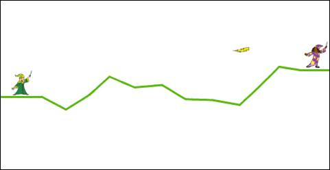
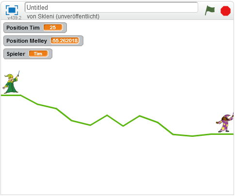

# Die Zauberlehrlinge

Die Zauberlehrlinge Tim und Melley haben wieder mal gestritten und versuchen sich jetzt gegenseitig in Frösche zu verwandeln. Dieses Spiel kannst du später gemeinsam mit einem Freund oder einer Freundin spielen. Ihr seid dabei immer abwechselnd an der Reihe einen Zauberspruch zu verschießen. Doch es ist gar nicht so leicht, den anderen zu treffen - man muss genau in die richtige Richtung zielen!

{: .right}

Damit es nicht langweilig wird, wollen wir die Landschaft im Hintergrund jedes mal ein bisschen anders zeichnen. Damit fangen wir an.

## Landschaft zeichnen

Beginne damit, die Landschaft zu zeichnen. Lasse dazu eine unsichtbare Figur mit aktiviertem Malstift von links nach rechts über den Bildschirm laufen. Am Ende jedes Kapitels findest du eine Abbildung des Skripts, aber versuche zuerst die Aufgabe selbst zu lösen.

Hier noch ein paar Hinweise:

* Erstelle eine unsichtbare Figur und lass sie von links (x-Position -240) nach rechts (x-Position 240) laufen.
* Ändere alle paar Schritte zufällig die Richtung. Auch die Höhe (y-Position) zu Beginn kannst du zufällig auswählen.
* Versuche am linken und rechten Rand des Bildes eine gerade (waagrechte) Linie zu zeichnen, damit die Figuren dort Platz haben und stehen können.

So in etwa sollte die Landschaft aussehen, wenn du fertig bist.
{: .right}

Damit wir die Figuren an den richtigen Positionen zeichnen können, müssen wir uns merken, auf welche Höhe (y-Position) die Landschaft am linken und rechten Bildrand hat.

* Erstelle zwei Variablen (z.B. "Position Tim" und "Position Melley") und setze sie auf die y-Position der Landschaft, einmal bevor du anfängst zu zeichnen und einmal nachdem du fertig bist.

Zwei Dinge brauchen wir noch, wenn die Landschaft fertig gezeichnet ist: Wir müssen wissen, welcher Spieler gerade dran ist, und wir müssen den Figuren mitteilen, dass es losgeht.

* Erstelle noch eine Variable (z.B. "Spieler"), in der wir uns merken, wer gerade dran ist. Setze den Wert auf "Tim" oder auf "Melley", je nachdem wer anfangen soll. Wenn du willst, kannst du das auch zufällig entscheiden.
* Schicke ganz am Ende des Skripts eine Nachricht (z.B. "start") an alle, damit die Figuren wissen, dass es losgeht.

Hier siehst du eine Möglichkeit, wie man das Skript bauen kann. Hast du es anders gelöst? Super! Beim Programmieren gibt es immer viele verschiedene Wege, um zum Ziel zu kommen.

{: .right}
  
## Der Zauberlehrling Tim
  
Als nächstes erstellen wir die zwei Zauberlehrlinge. Beginne zunächst mit einer Figur:

* Die Figur braucht zwei Kostüme, einmal das normale und ein zweites als Frosch (wenn die Figur getroffen wird).
* Die Bilder sind etwas zu groß, verkleinere sie (oder zeichne gleich deine eigenen).
* Achte auf die richtige Position der Bilder. Sie sollten genau über dem kleinen Kreuz in der Mitte sein, damit sie sich später richtig drehen. Das Kreuz ist nicht leicht zu sehen, aber du kannst auch zuerst das Kostüm zeichnen und dann mit dem Knopf rechts oben ("Drehpunkt des Kostüms") das Kreuz an die richtige Position setzen.

{: .right}

Jetzt brauchen wir noch ein paar Skripte für die Figur:

* Zu Beginn, wenn die Landschaft gezeichnet wird, soll die Figur sich verstecken.
* Sobald es losgeht (wenn die Nachricht empfangen wird), sollen mehrere Dinge passieren:
	* Platziere die Figur an der richtigen Position. Die y-Position haben wir vorhin in der Variable gespeichert, die x-Position muss ein Stück vom Rand entfernt sein (in der Mitte des geraden Strichs, den du am Rand gezeichnet hast).
	* Lass die Figur nach rechts sehen (Richtung: 90);
	* Wechsle zum ersten, normalen Kostüm.
	* Die Figur soll sich zeigen.
* Wenn die Taste "Pfeil nach oben" gedrückt wird und die Figur gerade dran ist, soll sie sich um 1 Grad gegen den Uhrzeigersinn (nach links) drehen.
* Wenn die Taste "Pfeil nach unten" gedrückt wird und die Figur gerade dran ist, soll sie sich um 1 Grad mit dem Uhrzeigersinn (nach rechts) drehen.
* Wer gerade dran ist, kannst du über die Variable "Spieler" rausfinden, die wir oben erstellt haben.

Wenn du Hilfe brauchst, findest du am Ende der Anleitung alle Skripte, aber versuche es zuerst selbst zu lösen. Die Mentoren helfen dir auch gerne, wenn du Fragen hast.

## Der Zauberlehrling Melley

Für Melley brauchen wir eigentlich genau das gleiche wie für Tim. Erstelle eine neue Figur mit zwei Kostümen. Einen kleinen Unterschied gibt es aber! Melley soll in die andere Richtung sehen. Damit das nachher richtig funktioniert, müssen wir ihr Kostüm auf dem Kopf stehen lassen!
Klicke dazu einmal auf den Knopf "Oben und Unten vertauschen" (rechts oben) und platziere das Bild diesmal *unter* dem Kreuz:

{: .right}

Vergiss auch nicht, den Frosch ebenfalls auf dem Kopf stehen zu lassen.

Erstelle dann die gleichen Skripte wie für Tim auch für Melley. Ein paar Dinge musst du dabei aber anpassen:

* Verwende die richtigen Variablen (immer "Melley" statt "Tim").
* Die x-Position ist am rechten Rand des Bildschirms.
* Die Richtung ist -90 (links).
* Die Drehungen sind genau umgekehrt, also im Uhrzeigersinn bei "Pfeil nach oben" und gegen den Uhrzeigersinn bei Pfeil nach unten.

Auch die Skripte von Melley findest du am Ende der Anleitung nochmal, falls du Hilfe brauchst.

So sollte dein Spiel jetzt aussehen, wenn du auf die grüne Fahne klickst. Mit den Pfeiltasten solltest sich die Figur, die gerade dran ist, drehen lassen.

{: .right}

## Das Zaubern

Ein wichtiger Teil fehlt uns jetzt noch für das Spiel: Das Zaubern!

Dafür brauchen wir noch eine weitere Figur: den Blitz, der den Zauberspruch darstellt. Drehe das Kostüm so, dass der Blitz nach rechts zeigt und passe die Größe an.

{: .right}

Erstelle zwei Skripte für den Blitz. Das erste ist ganz einfach: Wenn die grüne Fahne angeklickt wird, soll der Blitz sich verstecken.
Das zweite Skript soll dafür sorgen, dass der Spieler, der gerade dran ist, einen Blitz abschießt, wenn die Leertaste gedrückt wird.

Folgendes muss dabei passieren:

* Setzt die Position und Richtung des Blitzes auf Position und Richtung des Spielers, der gerade dran ist.
* Zeige den Blitz.
* Wiederhole:
  * Bewege den Blitz ein Stück vorwärts (z.B. 10er Schritt, je nachdem wie schnell der Blitz fliegen soll).
  * Drehe den Blitz um 1 Grad (wenn Tim gerade dran ist, gegen den Uhrzeiger, wenn Melley dran ist im Uhrzeigersinn). Dadurch macht der Blitz eine Kurve und man kann über Berge schießen.
  * Überprüfe, ob der Blitz von Tim kommt (Spieler = "Tim") und Melley berührt wird *oder umgekehrt*.
  * Falls ja:
    * Sende eine Nachricht (z.B. "getroffen") an alle.
	* Verstecke den Blitz.
	* Stoppe das Script.
  * Falls nein:
	* Überprüfe, ob der Blitz den Rand oder die Landschaft (Farbe) berührt.
	* Falls ja:
		* Sorge dafür, dass der andere Spieler dran kommt, indem du den Wert der Variable "Spieler" änderst.
		* Verstecke den Blitz.
		* Stoppe das Skript.

Puh, das war ein ganz schön langes Skript. Jetzt solltest du mit der Leertaste schon abwechselnd Zaubersprüche verschießen und mit den Pfeiltasten zielen können. Wenn du willst kannst du auch wieder das Skript hinten mit deiner Lösung vergleichen.

## Die Verwandlung

Was fehlt jetzt noch? Genau, die Verwandlung in den Frosch, wenn ein Spieler getroffen wird!

In der Mitte des langen Skripts haben wir eine Nachricht geschickt, wenn wir festgestellt haben, dass ein Spieler getroffen wurde. Jetzt müssen wir bei beiden Spieler noch ein Skript einbauen:

Wenn die Nachricht "getroffen" empfangen wird, überprüfe ob der Blitz vom anderen Spieler kommt (ob der andere gerade dran ist). Wenn ja, ändere das Kostüm auf den Frosch und setze die Variable "Spieler" dann auf einen leeren Wert, damit das Spiel nicht mehr weitergeht. Füge dieses Skript auch bei der anderen Figur ein.

{: .right}

## Skripte für Tim

{: .right}

## Skripte für Melley

{: .right}

## Skripte für den Blitz

{: .right}

## Weitere Ideen

* Füge Klänge für verschiedene Ereignisse hinzu, z.B. das Abfeuern eines Zauberspruchs, die Verwandlung in den Frosch oder das Lachen des Siegers.
* Füge ein paar Grafiken (Bäume, Berge, Wolken, ...) im Hintergrund ein.
* Manchmal wird die Landschaft zu hoch, so dass man nicht darüber schießen kann. Versuche das zu verhindern.
* Denk dir andere Zaubersprüche aus! Wie wäre es z.B. mit einem Spruch, der den getroffenen Spieler zittern lässt und so das Zielen schwieriger macht?
* Lass den Computer einen der beiden Spieler steuern, damit du auch alleine spielen kannst. Falls du dafür Hilfe brauchst, wende dich an die Mentoren.

## Ausprobieren

Du kannst das fertige Projekt unter [https://scratch.mit.edu/projects/77684448/](https://scratch.mit.edu/projects/77684448/){:target="_blank"} ausprobieren.