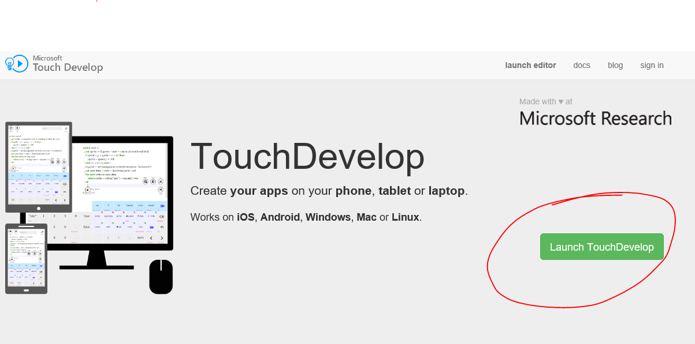
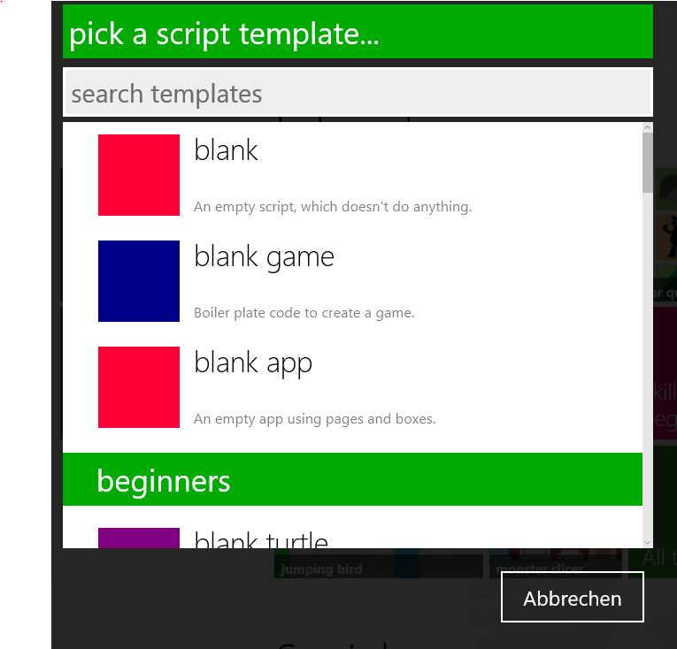
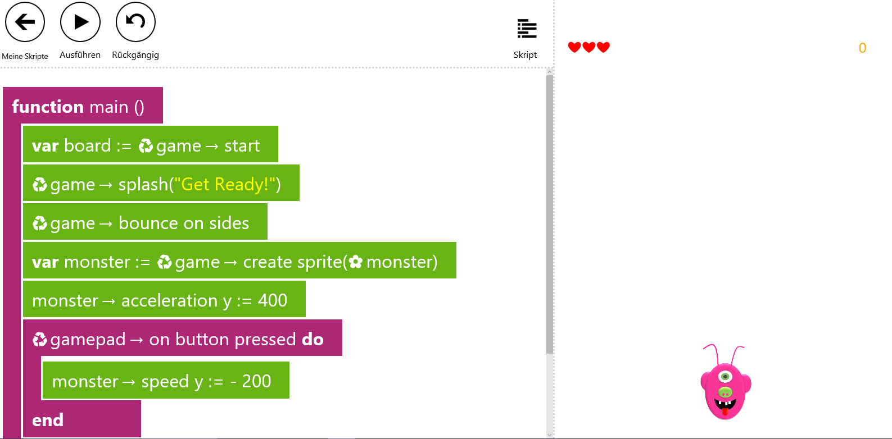
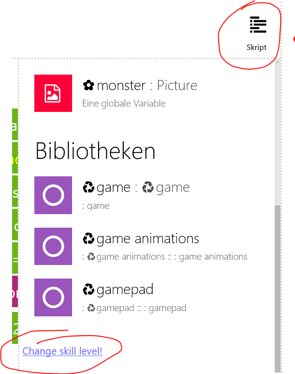

#Erste Schritte mit TouchDevelop

##Was ist TouchDevelop?

TouchDevelop ist eine Webseite, auf der man Spiele entwickeln kann. Du kannst auf die Webseite von jedem Web Browser auf deinem PC, Laptop, Tablet oder Handy aus zugreifen. Die Webseite findest du auf [www.touchdevelop.com](http://www.touchdevelop.com).

Diese TouchDevelop Spiele kannst du dann in einem Web Browser, wie zb Internet Explorer, Edge, Chrome oder Firefox aufrufen und spielen. Du kannst die Spiele auch in einem Browser auf deinem Handy öffnen und somit die Spiele auf einem iPhone, Android oder Windows Phone spielen. Bei Windows Phone hast du zusätzlich noch die Möglichkeit, dein Spiel aus TouchDevelop zu exportieren und über eine andere Webseite namens *AppStudio* zu einer Windows App zu machen und in den Windows 10 Store zu stellen.

Die Spiele in TouchDevelop werden in einer eigenen Sprache geschrieben. Diese Sprache besteht aus englischen Worten und Symbolen, mit denen du dem Computer sagen kannst, wie das Spiel aussehen soll, welche Spielfiguren, Hindernisse und Gegner verwendet werden und was passieren soll, wenn der Spieler bestimmte Aktivitäten am PC unternimmt. 

##Anmelden auf TouchDevelop

Jeder kann auf TouchDevelop auch ohne Anmeldung sofort loslegen, Spiele zu entwickeln. Wenn du dich aber in TouchDevelop anmeldest, dann kannst du deine Spiele auch speichern und später wieder bearbeiten. Wenn du mehrere Spiele schreibst, hast du so alle deine Spiele an einer Stelle gesammelt und gespeichert. Wir wollen uns daher anmelden. 

### 1. Die Webseite öffnen

Wir öffnen einen Browser und navigieren zur Seite [www.touchdevelop.com](http://www.touchdevelop.com). 

### 2. *Launch TouchDevelop* Button klicken

Jetzt öffnet sich die Seite, wo wir unsere Spiele schreiben können. Ihr seht einige Abschnitte auf dieser Seite. Die interessantesten sind **Meine Skripte** und **tutorials**. Im ersten Abschnitt seht ihr alle eure gespeicherten Spiele, wenn ihr angemeldet seid. Im Abschnitt **tutorials** seht ihr verschiedene Kurse, wo ihr beispielhafte Spiele nachbauen kömmt. 

### 3. *Sign In* Button klicken

Hier könnt ihr euch mit einer Microsoft (dh hotmail, msn, outlook, live), Facebook, Google oder Yahoo Email Adresse anmelden.

##Die Arbeitsumgebung in TouchDevelop

Wir wollen nun die Arbeitsumgebung kennenlernen, in der wir das Spiel schreiben.

### 1. *Neues Skript erstellen* klicken

Jetzt öffnet sich ein Dialogfenster, das verschiedene Vorlagen für Spiele enthält. 

Wir wählen die Option **blank game**. Diese Vorlage enthält schon einige Funktionen, die für Spiele nützlich sind, wie zb einen Spielstand und eine Lebensanzahl. 

Es erscheint ein Feld, wo ihr einen Namen für das Spiel eingeben könnt. Ihr könnt hier einen beliebigen Namen eingeben.

### 2. Den Skill Level ändern

Wir sehen jetzt folgende Ansicht, die auf das *Beginner* Level angepasst ist:

Das erste, was wir machen, ist unseren Skill Level von **Beginner** auf **Coder** umzuändern. Das ist wichtig, weil einige Funktionen, die wir in unserem Spiel einbauen wollen, in der Beginner Ansicht nicht zur Verfügung stehen.

Dazu klicken wir auf den Punkt **Skript**. In dem Dialogfenster gehen wir zu dem untersten Ende der Liste. Dort gibt es einen Punkt **Change skill level!**. Diesen klicken wir an und wählen den mittleren Punkt **coder**.

### Die Coder Ansicht

Wir wollen uns jetzt anschauen, in welche Teile unser Bildschirm in der Coder Ansicht geteilt ist.

#### Befehlsleiste

Links oben habt ihr die Befehlsleiste. Hier findet ihr folgende Optionen:

* Meine Skripte: Hier könnt ihr zu der Auflistung von allen euren Spielskripten kommen.
* Ausführen: Mit diesem Befehl könnt ihr den Code, den ihr für das Spiel geschrieben habt, ausführen, testen und spielen. Dies geschieht in der rechten Hälfte des Bildschirms.
* Rückgängig: Hier könnt ihr eure letzte Eingabe im Code rückgängig machen.
* Trennen: Hier habt ihr die Möglichkeit, die Spiele-Ansicht auf der rechten Seite zu trennen und nur den Spiele Code auf der linken Seite anzuzeigen. Wenn ihr bei getrenntem Bildschirm *Ausführen* klickt, seht ihr euer Spiel in der Vollbildansicht.

#### Code

Der linke Teil des Bildschirms ist euer Skript, der Code, den ihr für das Spiel geschrieben habt. Wenn ihr in diesen Teil an einer beliebigen Stelle klickt, erscheinen Bausteine, die ihr zum Bauen eures Spieles verwenden könnt.

#### Spiel

Der rechte Teil des Bildschirms ist euer Spiel, das immer durch den *Ausführen* Button in der Befehlsleiste gestartet wird. Bei getrenntem Bildschirm erscheint das Spiel in einer eigenen Vollbilddarstellung.

