#Seifenblasen Spiel

## Vorbereiten des Skripts

### 1. Neues Skript erstellen

Wir erstellen ein neues Skript auf der Basis der **blank game** Vorlage und ändern 
unseren Skill Level auf **coder**. Im vorigen Abschnitt 
[Erste Schritte mit TouchDevelop](ErsteSchritte.md) haben wir Schritt für Schritt gesehen, 
wie das geht.

### 2. Beispielcode entfernen

Wir markieren die erste Zeile unter **``function main()``**, indem wir auf die Zeile klicken. 
Dann klicken wir auf den Button **Auswählen** auf der rechten Seite.

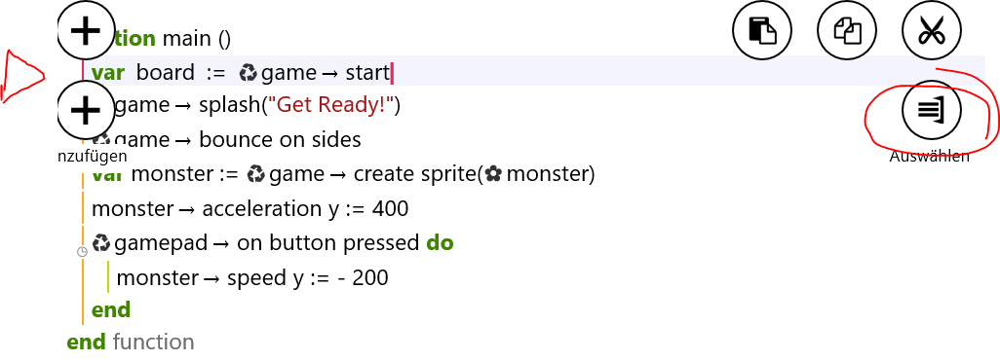
 
Jetzt können wir den unteren Markierungszeiger nach unten ziehen, um alle weiteren Zeilen bis zum 
vorletzem **``end``** zu markieren.

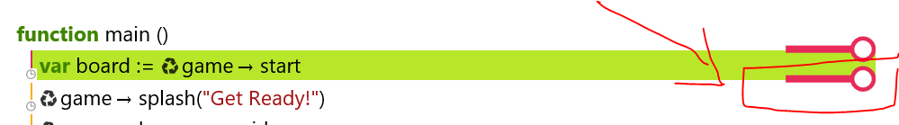

Wenn alle Zeilen markiert sind, drücken wir entweder die Entfernen Taste auf unserem Keyboard 
oder wir klicken auf dem **delete selection** button in linken Spalte.

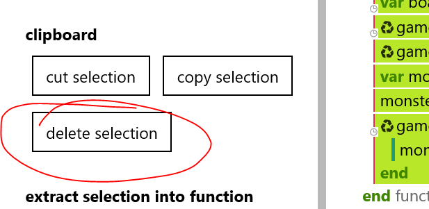

Ihr solltet nun nur mehr folgende Zeilen stehen haben:

Jetzt löschen wir noch das Bild des Monsters aus dem Beispiel Code. Dazu gehen wir in die linke Spalte 
zu dem Abschnitt *Kunst* und löschen das Bild namens **monster**, indem wir draufklicken und im rechten Teil auf 
**Löschen** klicken.

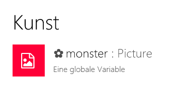

##Das Spielfeld

Bevor wir anfangen können ein Spiel zu bauen, brauchen 
wir zuerst unser Spielfeld. Das ist das Feld, wo alle unsere 
Spielfiguren, Hindernisse, usw für den Spieler dargestellt werden. 

Da wir die Vorlage **blank game** verwenden, haben wir in unserem Spielprojekt 
bereits einige *Bibliotheken* dabei. *Bibliotheken* beinhalten Teile, die jemand 
anderer für Spiele geschrieben hat, und wir es in unserem Spiel einfach durch 
Aufruf wiederverwenden können. Um unser Spielfeld zu bekommen, verwenden wir daher 
einfach die Start Funktion aus der Bibliothek **game**. Das Spielfeld wird 
in der TouchDevelop Sprache **Board** genannt. Wir müssen natürlich das 
Spielfeld, das wir durch diese Funktion bekommen, auch mit einem Namen abspeichern, 
damit wir während unseres gesamten Spieles immer wieder auf unserem Spielfeld 
Dinge tun können.

###1. Spielfeld abspeichern

Wir klicken in die Zeile zwischen ``function main()`` und ``end``. 
Es erscheint unten das Bausteinemenü. Wir wählen die Bibliothek **game** aus. 

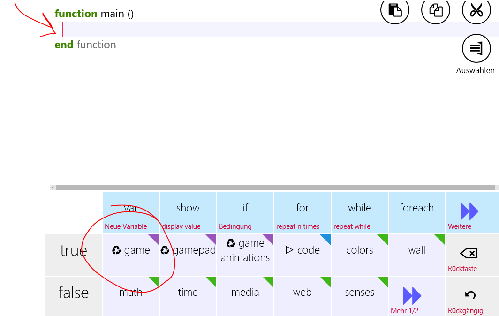

Als nächstes erscheinen im Bausteinemenü Dinge, die ich aus der **game** Bibliothek 
aufrufen kann. Wir wählen hier die Funktion **start** aus.

Nachdem wir das getan haben, bekommen wir in unserem Bausteinemenü die Option 
**In Var speichern** zu sehen. Das bedeutet, dass wir ein Objekt, in unserem Fall 
ein Board, mit einem Namen abspeichern können. Wir klicken daher auf **In Var speichern** und 
bennen unser Board ganz einfach board (das wird uns schon so vorgeschlagen).

###2. Hintergrund setzen

Jetzt wollen wir den Hintergrund des Spieles setzen.

Dazu klicken wir unsere gerade geschriebene Zeile an. Es erscheinen zwei Plus-Zeichen 
ober- und unterhalb dieser Zeile. Wir klicken das untere Plus an, um eine neue, leere  
Zeile darunter zu erstellen.

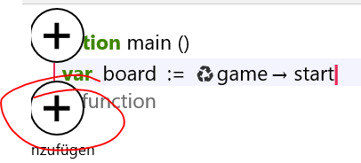

Jetzt klicken wir in die leere Zeile und klicken aus dem Bausteinemenü **wall** an.
**wall** besitzt eine Funktion, um den Hintergrund zu setzen. Das heißt, als nächstes klicken wir 
aus dem Menü **set background picture** an. 

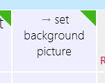

**Wichtig:** Wenn ihr einmal ein Element im Bausteinemenü nicht findet, könnt ihr 
mit **Mehr 1/2** im Menü weiterblättern. 

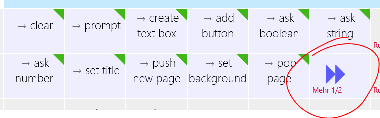

Jetzt können wir ein Bild für unseren Hintergrund auswählen. Dazu klicken wir in die 
Klammer und tippen oben im Suchfeld auf der linken Seite **Jungle Ruins**. 
Wir sehen eine Ergebnisliste und wählen ein Bild aus. Dieses wird automatisch in der 
Klammer eingefügt. 

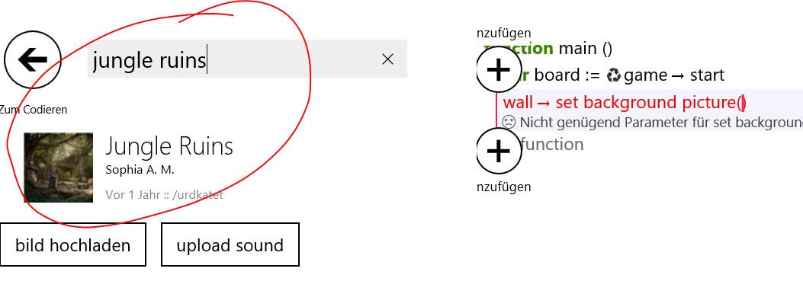

###3. Lebenslinie entfernen

Als letztes entfernen wir noch die Lebenslinie, da wir diese in unserem Spiel nicht 
brauchen.

Dazu schreibt ihr eine Zeile darunter **game** und wählt das Element **set life invisible**. Der 
Wert in der Klammer sollte **false** sein.

Jetzt könnt ihr auf Ausführen klicken und solltet den Hintergrund von eurem 
Spiel sehen.

##Seifenblasen darstellen

Wenn wir Grafiken in unser Spiel anzeigen wollen, dann werden diese in TouchDevelop 
**Sprite** genannt. Sprites können unsere Spielfiguren, unsere Gegner oder sonstige 
grafischen Elemente sein. Wenn wir von einer Grafik mehrmals in einem Spiel anzeigen 
wollen - beispielsweise sollen viele Gegner angreifen, die aber alle die gleiche 
Grafik haben - dann speichern wir dieses Sprite in einer Sammlung oder Liste, die 
**Sprite Set** genannt wird.

Wir wollen nun 10 Seifenblasen in unser Feld holen, die der Spieler zerplatzen 
soll. Dazu brauchen wir ein Sprite Set, wo wir die Seifenblasen speichern können.

###1. Erstellen eines Sprite Sets	

Wir klicken nun die von uns zuletzt geschriebene Zeile und fügen darunter eine neue ein.

Wir fügen folgende Elemente aus dem Bausteinmenü in dieser Reihenfolge ein:
* **board** 
* **->create sprite set**
* **In Var speichern** 
* **Umbenennen**
* Jetzt tippen wir das Wort **bubbles** ein

### 2. *For*-Schleife für 10 Seifenblasen

Wenn man mehrere Male dasselbe tun möchte, kann man in der Programmierung Schleifen 
verwenden, die dem Computer sagt, dass alles was in einer Schleife drinnen ist, auf eine 
bestimmte Anzahl oder bestimmte Zeit beschränkt immer wieder durchgeführt werden soll.

Bei einer For-Schleife können wir angeben, wieviele Male die Aktionen innerhalt 
durchgeführt werden soll. Wir wollen 10 mal eine Seifenblase erstellen und in unserer 
Sammlung namens **bubbles** speichern. 

Wir fügen in der nächsten Zeile folgendes ein: **for**.
Als nächstes wird *number* markiert, hier geben wir die Anzahl der Schleifen ein. 
In unserem Fall geben wir **10** ein.

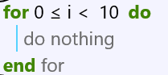

### 3. Seifenblase erstellen

Jetzt klicken wir in der Zeile zwischen **for** und **end**. Alles, was wir 
hier hineinschreiben, wird 10 Mal ausgeführt.

Wir fügen aus dem Bausteinmenü folgendes ein:
* **board**
* **-> create picture**
* In der Suche links tippen wir bubble und suchen uns ein Bild 
einer Seifenblase aus
* **In Var speichern**
* **Umbenennen**
* Den Namen **bubble** tippen

So sieht es dann aus: 

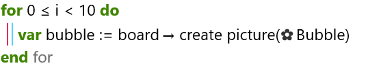

### 4. Größe der Seifenblase definieren

Die 10 Seifenblasen sollen unterschiedlich groß sein. Daher wollen wir die 
Größe zufällig bestimmen. Dazu gibt es die Funktion namens **random range**, die 
eine Zufallszahl aus einem bestimmten Bereich gibt. Diese Funktion finden wir 
in der **math** Bibliothek.

Wir erstellen eine neue Zeile unter unserer Seifenblase und fügen ein:
* **bubble**
* ** -> set width**
* Wir entfernen die Zahl *0* und stattdessen fügen wir ein **math**
* Jetzt fügen wir ein **random range**. Wenn ihr dieses Element im Menü nicht findet, 
dann tippt links in der Suche random range und klickt es aus der Ergebnisliste an.
* In der Klammer von **random range** tippen wir die Zahlen **100, 150** ein.

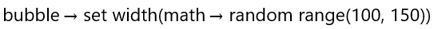

### 5. Position der Seifenblase auf dem Spielfeld

Die Größe des **boards* wird duch width (Höhe) und height (Höhe) bestimmt. Wir 
wollen die Seifenblase zufällig am Spielfeld positionieren. Das heißt, wir 
müssen für die Seifenblase die X Position und die Y Position setzen. 

Das machen wir folgendermaßen:

* Neue Zeile unter unser zuletzt geschriebenen Zeile
* **bubble**
* **set x**
* Entfernen der *0* und einfügen von **math**
* **random range**
* Die erste Zahl in **random range** ist 0, die zweite ist **board**, 
** -> width**.

* Neue Zeile
* **bubble**
* **set y**
* Entfernen der *0* und einfügen von **math**
* **random range**
* Die erste Zahl in **random range** ist 0, die zweite ist **board**, 
** -> height**.

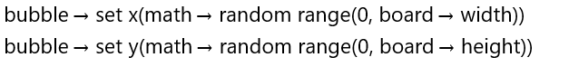

### 6. Geschwindigkeit der Seifenblase

Wir wollen der Seifenblase eine Geschwindigkeit geben.

* Neue Zeile
* **bubble**
* Im Suchfeld links nach **set speed y()** suchen und einfügen
* 150 in der Klammer für **set speed y** eingeben

Dann habt ihr die Zeile: **``bubble->set speed y(150)``**

### 7. Seifenblase in Sammlung *bubbles* hinzufügen

* Neue Zeile
* **bubbles**
* **add**
* In der Klammer **bubble**

Dann habt ihr: **``bubbles.add(bubble)``**

Jetzt könnt ihr auf **Ausführen** klicken. Ihr solltet 10 Seifenblasen sehen, die 
die herunterfallen. 

Das gesamte Skript bis hier sieht so aus:

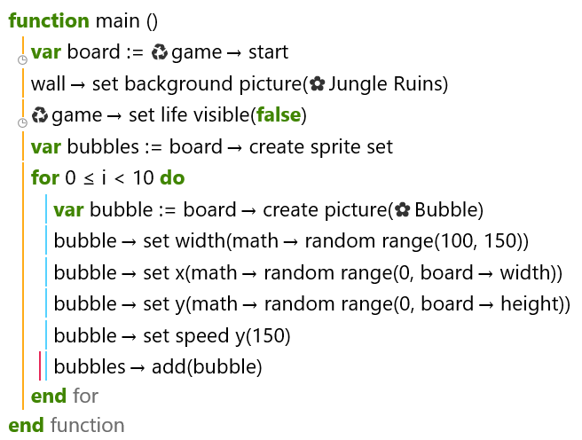

##Seifenblasen Zerplatzen

### 1. Auf Touch oder Mouseklick reagieren

Wenn die Seifenblase vom Benutzer gelickt oder berührt wird, soll die 
Seifenblase zerplatzen. Das können wir tun, indem wir auf jede Seifenblasse 
eine Funktion aktivieren, die nur darauf wartet, dass ein Spieler die Blase 
berührt. Wenn er das tut, wird das ausgeführt, was in dieser Funktion 
hineingeschrieben wurde.

Wir können auf folgende Weise die Seifenblase auf Berührung/Klick warten lassen:

* Neue Zeile unter **``bubbles->add(bubble)``**
* **bubble**
* **on tap** (ihr findet es über das Suchfeld)

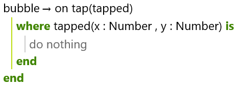

Alles was wir zwischen **``where``** und **``end``** schreiben, wird ausgeführt, 
jedes Mal wenn der Spiele die Seifenblase berührt.

### 2. Position ändern

Wir wollen eine Seifenblase, die berührt wurde, wieder nach oben setzen 
und erneut herunterfallen lassen. 

Die obere Kante des Bildschirms is auf der Y-Achse die Null. Das heißt, wenn wir die Seifenblase über der oberen Kante 
setzen wollen, brauchen wir einen negativen Wert. 

Auf der X-Achse möchten wir die Seifenblase wieder zufällig setzen.

Wir fügen folgendes ein nach der **where** Zeile ein:

* **bubble**
* **set y()**
* In der Klammer: **- 300**

* Neue Zeile
* **bubble**
* **set x()**
* In der Klammer: **math**
* **random range**
* In der Klammer: **0, board->width**

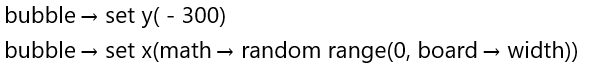

### 3. Spielstand erhöhen

* Neue Zeile
* **game**
* **add score**
* In der Klammer: **100**

Wir haben somit: **``game->add score(100)``**

### 4. Sound abspielen

Um einen Sound abzuspielen, brauchen wir zuerst eine Datei mit einem Geräusch.

Wir fügen folgendes ein:

* Neue Zeile
* In dem Suchfeld links geben wir ein: **bubble pop**
* Wir klicken den Klang **bubble pop

Wir haben nun: **``Bubble Pop->play``**

Ihr könnt das Spiel nun mit **Ausführen** testen. Wenn ihr mit der Maus oder 
dem Finger die Seifenblase zerplatzt, sollte ein Geräusch ertönen und die 
Seifenblase erscheint von oben wieder. 

## Spiel fertigstellen

Um ein abgeschlossenes Spiel zu haben, fehlen uns noch zwei Dinge. Wir 
wollen, dass Spiel auf eine bestimmte Zeit begrenzen, in der der Spieler 
versuchen muss, soviele Seifenblasen wie möglich zu zerplaten.

Dazu müssen wir zwei Dinge tun:
	* Für unsere Spielzeit sollen Seifenblasen laufen herunterfallen.
	* Nach der Spielzeit soll das Spiel zu Ende sein.
	
### 1. Unendlich viele Seifenblasen fallen lassen

Wir haben ursprünglich 10 Seifenblasen erstellt. Wenn diese Seifenblase 
den Boden erreicht, dann ist sie weg. Wenn wir eine Seifenblase zerplatzen,
dann erscheint sie von oben wieder. Wir wollen, dass jede Seifenblase 
von oben wieder erscheint. 

Dazu fügen wir nach dem **``end``** des **on tap**-Blocks eine neue Zeile 
hinzu.

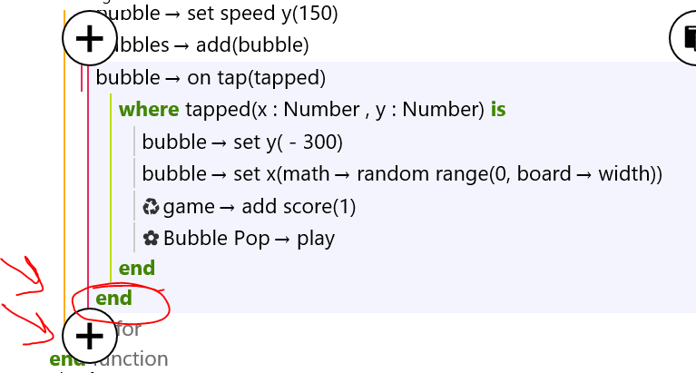

Wir wollen, dass an der Seifenblase die ganze Zeit überprüft wird, ob sie 
am Boden angelangt ist. Dazu müssen wir in jedem "Bild" diese Prüfung machen.
In TouchDevelop wird so ein Bild **Frame** genannt.

Wir fügen also folgende Elemente ein:

* **bubble**
* Im Suchfeld eingeben und klicken: **on every frame**

Zwischen **do** und **end** können wir jetzt eingeben, was getan werden soll.
In unserem Fall wollen wir eine Überprüfen machen, ob die Seifenblasen am 
Boden angelangt ist. Wenn wir eine Überprüfung machen, die mit *wahr* oder *falsch* 
beantwortert werden kann, dann verwenden wir einen ***if***-Block.

Wir fügen in der Zeile nach dem **do** folgendes ein:

* **if**
* In dem *Condition* Teil: **bubble**
* **y**
* **>**
* **board**
* **height**

Jetzt klicken wir in die Zeile nach dem **then** und schreiben folgende Zeilen:

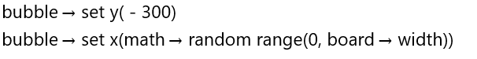

### 2. Begrenzte Spielzeit definieren

Wir markieren das vorletzte **end** vom ganzen Skript. Es sollte dort ein *for* 
daneben stehen. Wir fügen jetzt danach eine neue Zeile hinzu.

Hier fügen wir nun ein:

* **game**
* Im Suchfeld: **start countdown timer** 
* In der Klammer geben wir 30 für 30 Sekunden Spielzeit ein.

Wenn ihr jetzt auf **Ausführen** geht, könnt ihr in 30 Sekunden Punkte für 
das Spiel sammeln.

Hier seht ihr noch einmal das gesamte Spielskript:

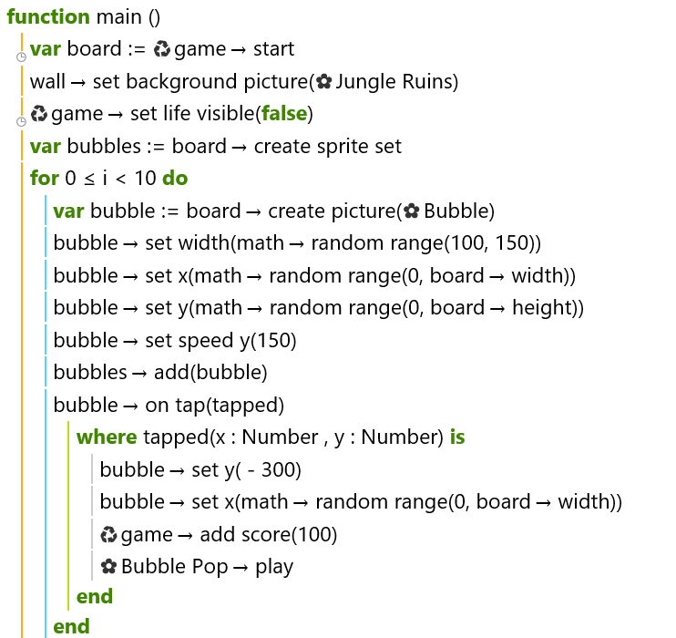
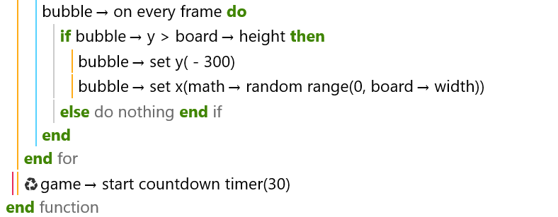