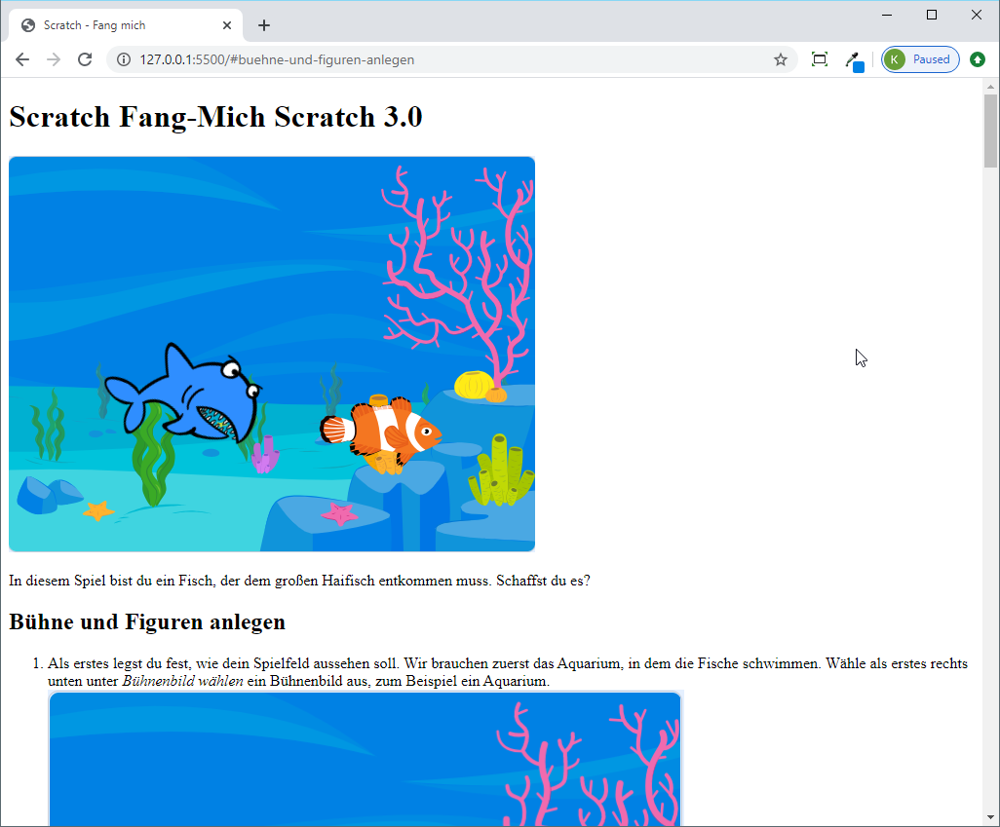
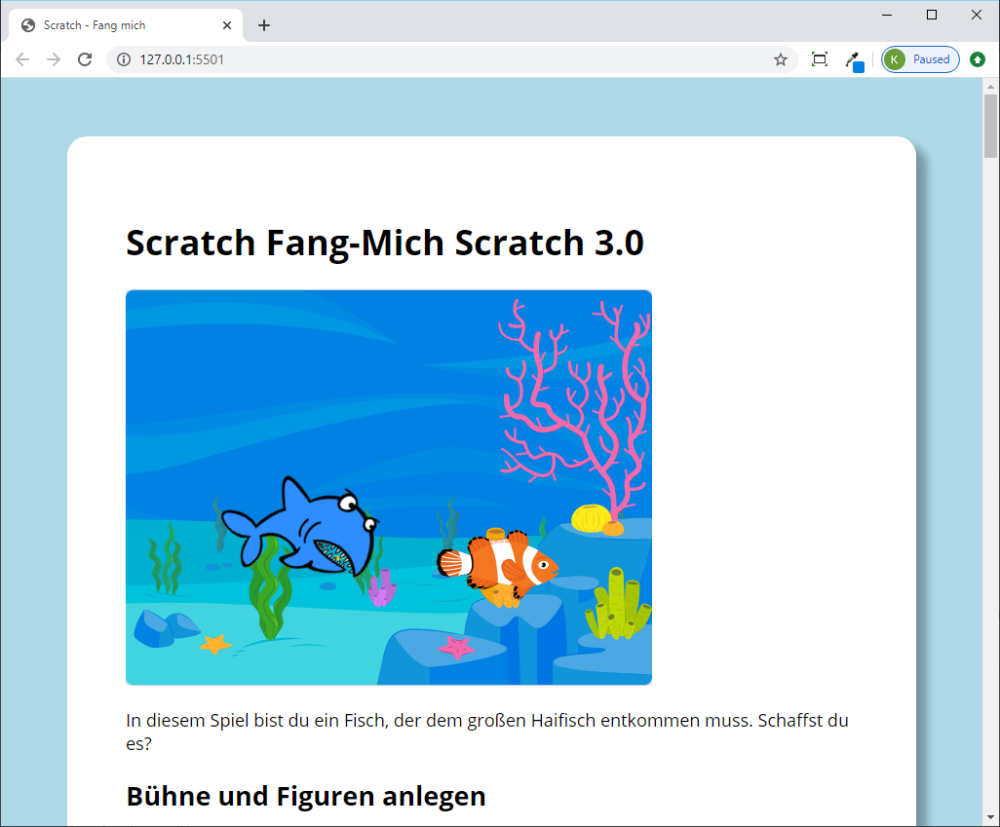

# Advanced CSS Styles

Für diese Übung starten wir mit einer existierenden Webseite, die nur HTML enthält, aber noch gar keine Styles.

```
<!DOCTYPE html>
<html lang="en">

<head>
    <meta charset="UTF-8">
    <meta name="viewport" content="width=device-width, initial-scale=1.0">
    <title>Scratch - Fang mich</title>
</head>

<body>
    <div class="content">
        <h1>Scratch Fang-Mich <span class="version">Scratch 3.0</span></h1>

        <div class="intro">
            
            <p>In diesem Spiel bist du ein Fisch, der dem großen Haifisch entkommen muss. Schaffst du es?</p>
        </div>
        ...
```

Ihr könnt das initiale Projekt mit allen Bildern aber ohne Styles hier herunterladen: [Startprojekt](css-advanced-styles/initial-project.zip)

Wenn ihr die Webseite index.html darin öffnet, sieht das dann so aus:



## CSS File hinzufügen

Damit wir die Styles für die Webseite in einem eigenen File verwalten können, legen wir zuerst einen Ordner *styles* in unserem Projekt an, und in diesem Ordner brauchen wir ein neues File *style.css*.

Im `head` unsere Webseite müssen wir einen Verweis auf das File einfügen.


Im File *style.css* könnt ihr dann erste Styles zu eurem Projekt hinzufügen:

```
body {
    background-color: lightblue;
}
```

## Google Font verwenden

Als erstes fügen wir eine hübschere Schriftart dazu. Ihr findet z.B. unter [https://fonts.google.com/](https://fonts.google.com/) eine Menge an kostenloser Schriftarten.


Klickt auf eine Schriftart, die euch gefällt, und klickt dann bei den folgenden drei Styles auf "+ Select this style":

- Light 300
- Regular 400
- Bold 700

Ihr findet dann auf der rechten Seite unter *Embed* den Code zum Einbetten in eure Webseite.


Den Link müsst ihr im `head` der HTML Seite einfügen:

```
<head>
    <meta charset="UTF-8">
    <meta name="viewport" content="width=device-width, initial-scale=1.0">
    <title>Scratch - Fang mich</title>
    <link href="https://fonts.googleapis.com/css2?family=Open+Sans:wght@300;400;700&display=swap" rel="stylesheet">
    <link rel="stylesheet" href="styles/1-style.css">
</head>
```

Damit die neue Schriftart verwendet wird, müsst ihr im CSS unter `body` den Style für die `font-family` einfügen. Wir geben hier außerdem auch gleich noch die Größe der Schrift mit `font-size` an:

```
body {
    font-family: 'Open Sans', sans-serif;
    font-size: 18px;
    background-color: lightblue;
}
```


## Content in der Mitte platzieren

Als nächstes möchten wir den Bereich mit Texten und Bildern in der Mitte platzieren und mit weißen Hintergrund hinterlegen, damit er besser lesbar wird. Dazu ergänzen wir zuerst den `body` um `padding-left` und `padding-right`. Das bewirkt, dass der Text links und rechts etwas Abstand zum Rand bekommt:

```
body {
    ...
    padding-left: 60px;
    padding-right: 60px;
}
```

Dann fügen wir einen eigenen Style für das `<div ...>` mit der Klasse `content` ein:

```
.content {
    background-color: white;
    padding: 60px;
    max-width: 900px;
    margin-left: auto;
    margin-right: auto;
    margin-top: 60px;
    margin-bottom: 60px;
    border-radius: 20px;
    /* offset-x | offset-y | blur-radius | spread-radius | color */
    box-shadow: 10px 10px 8px 1px rgba(0, 0, 0, 0.3);
}
```



## Headers

Als nächstes fügen wir Styles für die Überschriften hinzu. Die erste große Überschrift `<h1>` soll in blauen Großbuchstaben dargestellt werden. Füge dazu einen neuen Style für `h1` im Stylesheet hinzu:

```
h1 {
    text-transform: uppercase;
    color: #0081e4;
}
```

In der HTML Seite siehst du, dass in der Überschrift `<h1>` ein weiteres Tag `<span>` enthalten ist, das den Bereich mit der Versionsnummer markiert:

```
<h1>Scratch Fang-Mich <span class="version">Scratch 3.0</span></h1>
```

Wir können dafür einen eigenen Style im Stylesheet hinzufügen. Wenn Styles im CSS mit Leerzeichen getrennt werden, dann bedeutet das, dass die Elemente ineinander vorkommen müssen. Hier suchen wir also alle Elemente mit der Klasse *version*, die innerhalb von `<h1>` Elemente vorkommen:

```
h1 .version {
    font-size: 16px;
    margin-left: 10px;
    background-color: #2b992b;
    color: #fff;
    border-radius: 5px;
    padding: 2px 10px;
    /* necessary for vertical alignment within h1 */
    vertical-align: 0.5em;
}
```

Die kleineren Überschriften wollen wir in einem Kästchen mit grünem Hintergrund und einem Schatteneffekt darstellen:

```
h2 {
    background-color: #2b992b;
    color: #fff;
    display: inline-block;
    margin-block-start: 2em;
    padding: 2px 10px;
    box-shadow: 8px 8px 0 2px rgba(0, 0, 0, 0.3);
}
```


## Bilder

Die Bilder sollen einen Rahmen erhalten, und wenn man mit der Maus drüber fährt, sollte es sich leicht vergrößern und einen Schatten anzeigen. Dazu fügen wir die folgenden Styles ein:

```
img {
    display: block;
    margin-block-start: 1em;
    margin-block-end: 1em;
    max-width: 100%;
    background-color: white;
    padding: 20px;
    border: 1px solid rgba(0, 0, 0, 0.3);
    /* center images */
    margin-left: auto;
    margin-right: auto;
    /* animation */
    transition: all 0.5s;
}

img:hover {
    /* changes when mouse moves over image */
    transform: scale(1.01);
    /* offset-x | offset-y | blur-radius | spread-radius | color */
    box-shadow: 10px 10px 8px 2px rgba(0, 0, 0, 0.3);
}
```


## Intro Bereich

Im Einleitungsbereich der Webseite wollen wir den Text etwas größer und zentriert darstellen. Das Bild soll rotieren, wenn die Maus darüber bewegt wird:

```
.intro p {
    font-size: 24px;
    font-weight: 300;
    text-align: center;
}

.intro>img {
    transition: transform 1s;
}

.intro>img:hover {
    transform: rotateY(180deg);
    box-shadow: none;
}
```


## Hintergrundbild

Um für die ganze Seite ein Hintergrundbild hinzuzufügen, füge folgende Styles zum `body` hinzu:

```
body {
    ...
    background-image: url('/images/underwater-treasures.jpg');
    background-attachment: fixed;
    background-size: cover;
    background-position: center;
}
```

Außerdem kannst du beim Style für den Contentbereich noch die Hintergrundfarbe leicht transparent machen, ändere dafür im Style für `.content` die `background-color`:

```
.content {
    background-color: rgba(255, 255, 255, 0.9);
    ...
}
```


## Aufzählungen

Aufzählungen, die mit dem Element ´<ol>´ gemacht werden, sehen in HTML standardmäßig so aus:


Wir können aber ändern, wie die Nummern dargestellt werden. Dazu schalten wir im `ol` mit `list-style: none` die Standarddarstellung aus. Stattdessen bauen wir im Style `ol>li:before` unsere ganz eigene Version:

```
ol {
    list-style: none;
    counter-reset: my-counter;
    padding-inline-start: 0;
}

ol>li {
    counter-increment: my-counter;
    padding-left: 50px;
    padding-top: 5px;
    margin-block-start: 1em;
    margin-block-end: 1em;
}

ol>li:before {
    width: 32px;
    height: 32px;
    line-height: 32px;
    text-align: center;
    content: counter(my-counter) ".";
    background-color: #2b992b;
    color: #fff;
    font-weight: bold;
    font-size: 16px;
    border-radius: 50%;
    position: absolute;
    margin-left: -50px;
    margin-top: -5px;
}
```


## Flip Box

Zu guter letzt wollen wir das Bild im Einleitungsbereich noch etwas erweitern. Wenn man mit der Maus drüber fährt, soll es nicht nur rotieren, es soll auf der Hinterseite des Bildes ein Text angezeigt werden, der dadurch dann sichtbar wird.

Dazu müssen wir zuerst im HTML eine Änderung machen. Ersetze im Bereich `<div class="intro">` folgendes Bild:

```

```

durch folgendes HTML:

```
<div class="flip-box">
    <div class="flip-box-inner">
        <div class="flip-box-front">
            
        </div>
        <div class="flip-box-back">
            <h3>Scratch Fang-Mich</h3>
            <p>Figuren: 2<br />Scripte: 8</p>
        </div>
    </div>
</div>
```

Das HTML bildet die Flip Box mit einem Bereich für die Vorderseite und einem Bereich für die Hinterseite des Bildes ab.

Im Stylesheet müssen wir jetzt folgende Styles hinzufügen:

```
.flip-box {
    width: 540px;
    height: 407px;
    max-width: 100%;
    /* center flip box */
    margin-left: auto;
    margin-right: auto;
    /* Remove this if you don't want the 3D effect */
    perspective: 1000px;
}

/* Remove general img styles */
.flip-box img {
    border: none;
    padding: 0;
    margin: 0;
    box-shadow: none;
    border-radius: 20px;
}

/* This container is needed to position the front and back side */
.flip-box-inner {
    position: relative;
    width: 100%;
    height: 100%;
    transition: transform 0.5s;
    transform-style: preserve-3d;
}

/* Do an horizontal flip when you move the mouse over the flip box container */
.flip-box:hover .flip-box-inner {
    transform: rotateY(180deg);
}

/* Position the front and back side */
.flip-box-front,
.flip-box-back {
    position: absolute;
    width: 100%;
    height: 100%;
    border-radius: 20px;
}

/* Style the front side (fallback if image is missing) */
.flip-box-front {
    background-color: #bbb;
    color: black;
}

/* Style the back side */
.flip-box-back {
    background-color: #0081e4;
    color: #fff;
    border-radius: 20px;
    text-align: center;
    transform: rotateY(180deg);
}

.flip-box-back h3 {
    margin-block-start: 4em;
    font-size: 2rem;
}
```
Wenn man jetzt mit der Maus über das Bild fährt, wird es umgedreht und der Text auf der Hinterseite angezeigt:

