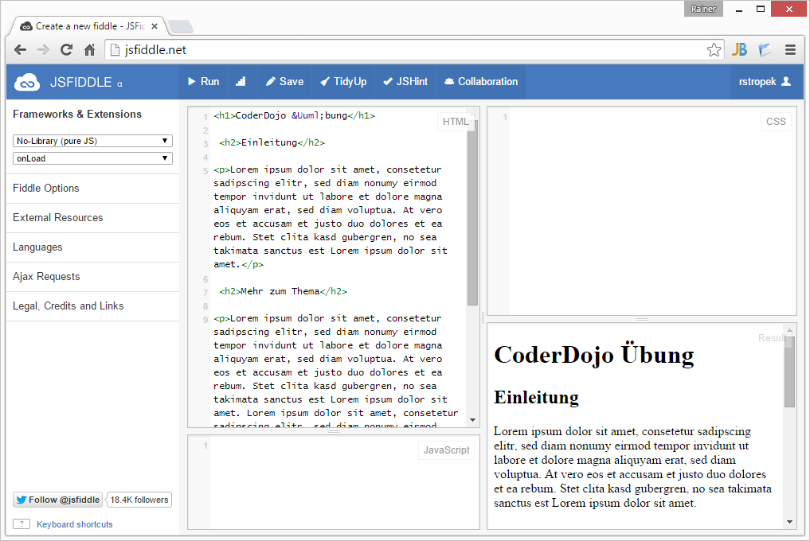

# Erste Schritte mit CSS

## Ziel der Übung

In dieser Übung lernst du *Cascading Style Sheets* (kurz CSS) kennen. Unser Ziel ist es, eine HTML-Seite mit CSS zu formatieren und hübsch zu gestalten. Wenn du nach dieser Übung mehr über CSS lernen willst oder während der Übung Detailfragen hast, kannst du einen Blick auf [die CSS Einführung auf w3schools.com](http://www.w3schools.com/css/css_intro.asp){:target="_blank"} werfen.

Falls du noch überhaupt keine Erfahrung mit HTML hast, wende dich an eine CoderDojo Mentorin oder einen Mentor. Sie werden dir die HTML-Basics erklären oder dir eine Übung für HTML-Grundlagen zeigen.

## Entwicklungsumgebung öffnen

Besonders einfach ist es mit HTML und CSS zu experimentieren, indem man die Webseite [https://jsfiddle.net/](https://jsfiddle.net/){:target="_blank"} verwendet.

1. Öffne einen Webbrowser deiner Wahl und navigiere zu [https://jsfiddle.net/](https://jsfiddle.net/){:target="_blank"}.

2. Klicke rechts oben auf Login/Sign up, und lege dir einen Benutzer an. Die Anmeldung ist wichtig, damit du deine Arbeitsergebnisse speichern kannst.

3. Nach dem Anlegen des Benutzers kehre zurück zum JSFIDDLE Editor, damit wir mit der Übung beginnen können.

## HTML Grundgerüst

Zum Experimentiere mit Styles brauchen wir Inhalt, den wir gestalten können. Der Inhalt kommt in JSFIDDLE in das Eingabefeld links oben, das mit *HTML* beschriftet ist.

1. Erstelle eine Überschrift erster Ordnung: `<h1>CoderDojo &Uuml;bung</h1>`.

3. Als nächstes möchten wir etwas Fließtext. Dazu müssen wir etwas Text generieren. Dafür verwendet man sogenannte *Lorem Ipsum Generatoren*. Sie erzeugen sinnlosen Text, der für Entwürfe als Platzhalter dient. Einen solchen Generator findest du unter [http://www.loremipsum.de/](http://www.loremipsum.de/){:target="_blank"}. Öffne diese Seite, generiere 50 Wörter und kopiere sie in die Zwischenablage. Anschließend füge den kopierten Text in einen HTML-Absatz ein: `
Lorem ipsum dolor sit amet ...
`.

2. Erstelle darunter eine Überschrift zweiter Ordnung: `<h2>Einleitung</h2>`.

3. Für analog zu Schritt 2 wieder Fließtext ein.

4. Wiederhole die Schritte 3 und 4 ein paar Mal mit verändertem Text, damit wir ein wenig Inhalt zum Experimentieren haben.

5. Klicke auf *Run* und kontrolliere, ob dein HTML richtig angezeigt wird. 

## Erste Formatierungen

1. Als erstes ändern wir die Schriftart für den gesamten Text der Seite. Dazu formatieren wir den gesamten *body* der HTML-Seite mit folgendem CSS Element. Füge es in JSFIDDLE rechts oben im Bereich *CSS* ein und probiere die Auswirkung aus, indem du auf *Run* drückst.

        body {
            font-family:'Arial';
        }

2. Formatiere die Überschrift erster Ordnung mit folgendem CSS Element. 

        h1 {
            font-family:'Arial Black';
            color: #1a1a1a;
            font-size: 3em;
            margin: 0;
        }

3. Formatiere die Überschriften zweiter Ordnung mit folgendem CSS:

        h2 {
            color: #313131;
            font-size: 2em;
            margin-top: 50px;
            border-bottom: 2px red dotted;
        }

3. Formatiere den Fließtext mit folgendem CSS:

        p {
            color: #464646;
            line-height: 150%;
            padding-top: 10px;
            padding-left: 60px;
        }

4. Spiele mit verschiedenen Farben (siehe auch [HTML Color Picker](http://www.w3schools.com/tags/ref_colorpicker.asp){:target="_blank"}, Schriftgrößen und Abständen, indem du die CSS Elemente veränderst. Lies dazu auf [w3schools](http://www.w3schools.com/css/css_text.asp){:target="_blank"} nach, um mehr über Textformatierung, Schriftarten, Ränder etc. zu erfahren.

## Klassen und IDs selektieren

1. Markiere den ersten Fließtext direkt unter der `h1` Überschrift mit einer CSS Klasse: `
...
`

2. Formatiere den Fließtext mit der Klasse *intro* mit folgendem CSS:

        .intro {
            font-size: larger;
            padding-bottom: 10px;
            background: #c8c8c8;
        }

3. Wir möchten in der ersten Überschrift das Wort *CoderDojo* in dunklem Rot hervorheben. Umschließe dafür das Wort *CoderDojo* mit einem `span` Element und ordne die CSS Klasse `highlight` zu: `<h1>CoderDojo &Uuml;bung</h1>`.

5. Formatiere `highlight` mit folgendem CSS:

        .highlight {
            color: #4c0000;
        }

6. Ändere den `intro`-Fließtext von `class` auf `id`: `
...
`. Aktualisiere das Ergebnis und du wirst sehen, dass der `.intro`-Selektor nicht mehr funktioniert.

7. Ändere den CSS-Selektor von `.intro` auf `#intro` und aktualisiere das Ergebnis. Wie du siehst klappt jetzt wieder alles. Mit `.` selektierst du alle auf Grundlage einer CSS Klasse, mit `#` auf Grundlage einer `id`.

## Verschachtelte Elemente selektieren

1. Mache im ersten Fließtext-Absatz ein paar Wörter zu einem Hyperlink:

        
Lorem ipsum <a href="http://www.somewhere.at">dolor sit amet</a>, consetetur ...

2. Aktualisiere das Ergebnis und beachte, wie der Hyperlink standardmäßig formatiert wird.

3. Definiere einen Stil, der nur auf Hyperlinks (`a` Tag) innnerhalb von Fließtexten (`p` Tag) angewendet wird. Probiere den Stil aus und experimentiere mit den Einstellungen.

        p a {
            color: #330000;
            text-decoration: none;
            border-bottom: 1px red dotted;
        }

4. Wenn der Hyperlink schon einmal angeklickt wurde (`visited`), soll er eine leicht andere Farbe haben. Verwende dazu folgenden Stil und probiere ihn aus. `visited` ist eine sogenannte *pseudo-Klasse*. Mehr dazu findest du auf [w3school](http://www.w3schools.com/css/css_pseudo_classes.asp){:target="_blank"}.

        p a:visited {
            color: #b20000;
        }

## Liste formatieren

1. Füge in die *Einleitung* eine Aufzählung ein und aktualisiere das Ergebnis.

        <ul>
            <li>Erstens</li>
            <li>Zweitens</li>
            <li>Drittens</li>
            <li>Viertens</li>
        </ul>

2. Verschönere die Aufzählung ein wenig, indem du die Einrückung und Textfarbe korrigierst:

        ul {
            margin-left: 35px;    
            color: #464646;
        }
        li {
            padding-left: 10px;
        }

3. Zur besseren Übersichtlichkeit möchten wir jede zweite Zeile schattieren. Dazu verwenden wir wieder eine pseudo-Klasse, diesmal `nth-child`:

        li:nth-child(odd) {
            background: #e0e0e0;
        }

