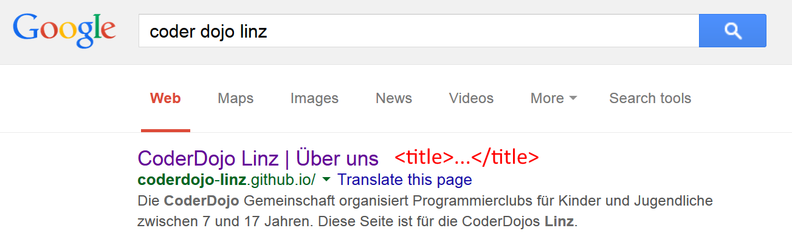

# Meine erste Webseite

In dieser Übung lernst du die [Hypertext Markup Language](https://de.wikipedia.org/wiki/Hypertext_Markup_Language){:target="_blank"} (kurz HTML) kennen. Unser Ziel ist es, Schritt für Schritt eine HTML-Seite zu erstellen und dabei die wichtigsten Grundbegriffe von HTML zu entdecken. Wenn du nach dieser Übung mehr über HTML lernen willst oder während der Übung Detailfragen hast, kannst du einen Blick auf [die HTML Einführung auf w3schools.com](http://www.w3schools.com/html/default.asp){:target="_blank"} werfen.

## Das Grundgerüst einer HTML-Seite

1. Öffne einen beliebigen Texteditor. Empfehlenswert ist ein Editor, der speziell für Softwareentwicklung gedacht ist. Hier einige Links zu kostenlosen Editoren, mit denen du HTML gut schreiben kannst. Falls du nicht sicher bist, welchen du nehmen sollst, nimm gleich den ersten. Im Lauf der Zeit kannst du mit verschiedenen experimentieren und dich für den entscheiden, der dir am besten gefällt.

	* [Visual Studio Code](https://code.visualstudio.com/){:target="_blank"} (Windows, MacOS, Linux)
	* [Notepad++](https://notepad-plus-plus.org/download/v6.8.2.html){:target="_blank"} (Windows)
	* [Sublime Text](http://www.sublimetext.com/2){:target="_blank"} (Windows, MacOS, Linux)
	* [Brackets](http://brackets.io/){:target="_blank"} (Windows, MacOS, Linux)
	* [Atom](https://atom.io/){:target="_blank"} (Windows, MacOS, Linux)

2. Erstelle eine neue Textdatei. In *Visual Studio Code* geht das so:  

3. Gib folgenden Code in die neue Datei ein:

        <!DOCTYPE html>
        <html>

          <head>
           <title>Beschreibung der Seite (erscheint in der Titelzeile des Browsers)</title>
          </head>

          <body>
            
Dieser Text wird im Browserfenster angezeigt.

          </body>

        </html>

3. Speichere die Datei in einem Ordner unter dem Namen `default.html` ab. Merke dir den Ordner, in dem du sie speicherst. Du wirst ihn gleich brauchen.

4. Suche die gespeicherte Datei im Dateiexplorer (Windows) bzw. Finder (MacOS). Öffne sie durch Doppelklick. Ein Webbrowser sollte sich öffnen und deine erste Webseite anzeigen. 

3. Mache dich mit dem HTML-Code vertraut. Es folgen einige Erklärungen. Falls du Fragen hast, wende dich an einen CoderDojo Mentor. 

	* Mit der ersten Zeile `<!DOCTYPE html>` sagst Du dem Browser: *Das ist eine HTML-Datei*. Auch wenn diese Zeile nicht immer notwendig ist, gewöhne dir an, sie immer am Beginn einer HTML-Datei hinzuschreiben.

	* Bestimmt sind Dir schon diese spitzen Klammern (`<` und `>`) aufgefallen. Sie sind typisch für HTML. Welche Angabe Du auch immer machst: Wenn Du möchtest, dass der Browser Dich versteht, must du diese Klammern drumherum setzen. So heißt die Angabe `<html>` *Hier fängt der HTML-Bereich an*.

	* Die zweite Angabe mit dem Schrägstrich darin (z.B. `</html>`) sagt dem Browser, dass der HTML-Bereich hier zu Ende ist. Wir merken uns: Spitze Klammern mit einer Bezeichnung drin - Anfang. Spitze Klammern mit einem Schrägstrich und derselben Bezeichnung drin - Ende. Das englische *to tag something* bedeutet *etwas markieren* oder *etwas kennzeichnen*, und so spricht man bei HTML von *Tags*. `<html>` ist also ein öffnendes Tag, und `</html>` ist ein schließendes Tag - beide zusammen *kennzeichnen* das HTML-Element.

	* HTML-Elemente können auch ineinander verschachtelt sein, d.h. ein Element befindet sich innerhalb eines anderen Elements. Das ist bei HTML ganz normal - auch bei unserer kleinen Beispielseite oben. Das `html`-Element beispielsweise enthält noch zwei weitere Elemente, nämlich `head` und `body` (*Kopf* und *Körper*). Das `head`-Element (der *Kopf*) enthält Angaben über das folgende Dokument; der eigentliche Inhalt, also das, was der Browser letztlich anzeigen soll, folgt später im `body`-Element (im *Körper*).

## Der Titel der Seite

Jede HTML-Datei muss einen Titel erhalten. Dieser Titel dient in der Praxis mehreren Zwecken, aber solange du die Seiten nur zum Lernen und Ausprobieren auf deinem eigenen Computer entwickelst und testest, wird für dich erstmal wichtig sein, dass der Titel im Browser in der Titelzeile des Anzeigefensters bzw. Karteireiters (*Tab*) angezeigt wird. So könnte dies beispielsweise beim Dojo so aussehen.

Später, wenn Deine HTML-Datei aus dem Internet erreichbar sein wird, bekommt der Titel einer HTML-Seite sogar noch größere Bedeutung:

* Der Titel der Datei wird vom Web-Browser beim Setzen von Lesezeichen (*Bookmarks*, *Favoriten*) verwendet.
* Der Titel der Datei wird im Web-Browser in der Liste der bereits besuchten Seiten (Verlauf) angezeigt.
* Der Titel der Datei dient im Web vielen automatischen Suchprogrammen als wichtige Informationsquelle, sodass deine HTML-Seiten leichter von Interessenten mit einer Suchmaschine wie z.B. Google gefunden werden können, wenn du sinnvolle Titel für deine HTML-Seiten vergeben hast.
* Wenn die Datei zu den Suchtreffern einer Suche gehört, bieten viele Suchmaschinen den Titel der Datei als anklickbaren Verweis an. 

1. Für unser CoderDojo wäre folgender Titel passend. Ersetze den Titel in deiner HTML-Datei durch diesen Code. Vergiss nicht, die HTML-Datei abzuspeichern! 

        <title>CoderDojo Linz | Meine erste Webseite</title>

2. Aktualisiere deine HTML-Datei im Webbrowser und achte darauf, wie sich der Titel ändert. 

## Nach dem Kopf folgt der Körper
               
Wie schon erwähnt, kommt der eigentliche Inhalt der Webseite in das `body`-Element.

1. Nehmen wir als erstes Beispiel eine schöne große Überschrift. Überschrift heißt auf Englisch *heading*. Es gibt verschiedene Überschriftenebenen, die einfach mit eins beginnend nummeriert werden (*h1, h2, h3, ...*). Man fängt mit `h1` an; das ist die größte. Wenn man dann das, was auf diese Überschrift folgt, nochmals unterteilen will, nimmt man die nächste: `h2`. Und so weiter, und so fort. Füge vor dem `
` Absatz eine Überschrift mit `<h1>` ein. Vergiss nicht, die HTML-Datei danach abzuspeichern! 

        ...
        <body>
          <h1>Meine erste Webseite</h1>
          
Dieser Text wird im Browserfenster angezeigt.

        </body>
        ...

2. Aktualisiere deine HTML-Datei im Webbrowser und achte darauf, wie sich der Inhalt ändert. 

3. Du willst sicher ein paar Worte über dich oder ein Thema, das dir wichtig ist, schreiben. Ein normalen Text wird in Absätze gegliedert. Das englische Wort für *Absatz* ist *paragraph*, und daraus ergeben sich dann die Tags `
` (Absatzanfang) und `
` (Absatzende). Füge ein paar Absätze in deine HTML-Datei ein wie unten gezeigt. Vergiss nicht, die HTML-Datei danach abzuspeichern!

        ...        
        <body>
          <h1>Meine erste Webseite</h1>
          
Diese Webseite soll zeigen, wie HTML funktioniert. Hier lernen wir gerade, 
             wie man mit dem p-Element umgeht.

          
Das ist ein zweiter Absatz. Um zu sehen, was die Auswirkung ist, geben 
             wir hier etwas sinnlosen Beispieltext ein. Bla bla bla ...

        </body>
        ...        

2. Aktualisiere deine HTML-Datei im Webbrowser und achte darauf, wie sich der Inhalt ändert. 

## Ungeordnete Listen, Aufzählungen

Liste heißt auf Englisch *list*. Es gibt sie in zwei Arten: Entweder nummeriert (geordnet) oder eben nicht nummeriert (ungeordnet). Ungeordnete Listen (*unordered list*) haben meistens irgendein Symbol vor den einzelnen Listenpunkten; das kennst Du vermutlich aus einem Textverarbeitungsprogramm.

Eine geordnete Liste (*ordered list*) wird bei HTML zwischen `<ol></ol>` notiert. Eine ungeordnete Liste (*unordered list*) wird zwischen `<ul></ul>` notiert. Jedes einzelne *Element* der Liste (egal, ob geordnet oder ungeordnet) wird wiederum zwischen die Tags `<li></li>`gesetzt.

1. Erweitere den Code deiner HTML-Datei wie unten gezeigt. Vergiss nicht, die HTML-Datei danach abzuspeichern!

        ...        
        <body>
          <h1>Meine erste Webseite</h1>
        
          <h2>Einleitung</h2>
          
Diese Webseite soll zeigen, wie HTML funktioniert. Hier lernen wir gerade, 
             wie man mit dem p-Element umgeht.

          
Das ist ein zweiter Absatz. Um zu sehen, was die Auswirkung ist, geben 
             wir hier etwas sinnlosen Beispieltext ein. Bla bla bla ...

        
          <h2>Meine Hobbies</h2>
          <ul>
            <li>radfahren</li>
            <li>Musik hören</li>
            <li>mit Freunden spielen</li>
            <li>vor dem Rechner sitzen</li>
          </ul>
        
        </body>
        ...        

2. Aktualisiere deine HTML-Datei im Webbrowser und achte darauf, wie sich der Inhalt ändert. Fällt dir auf, dass die HTML-Seite das Zeichen *ö* falsch darstellt? Das kommt daher, dass HTML mit deutschen Sonderzeichen nicht richtig umgehen kann. Sie brauchen eine besondere Schreibweise, auf die wir unten noch eingehen werden. 

3. Ändere die ungeordnete Liste auf eine geordnete List, indem du `ul` auf `ol` änderst. Schau dir den Unterschied im Webbrowser an.

4. Man kann Listen auch verschachteln. Ändere den HTML-Code deiner Liste wie folgt. Vergiss nicht, die HTML-Datei danach abzuspeichern!

        ...
        <h2>Meine Hobbies</h2>
        <ul>
          <li>radfahren</li>
          <li>Musik hören
            <ul>
              <li>Jazz</li>
              <li>Rock</li>
              <li>Pop</li>
            </ul>
          </li>
          <li>mit Freunden spielen</li>
          <li>vor dem Rechner sitzen</li>
        </ul>
        ...

2. Aktualisiere deine HTML-Datei im Webbrowser und achte darauf, wie sich der Inhalt ändert. 

## Wichtige Sonderzeichen

Kannst du dich an das Problem mit dem *ö* erinnern? Hier die wichtigsten Sonderzeichen der deutschen Sprache mit ihren HTML-Codes: 

Zeichen&nbsp; | in Worten              | Html Code
--------------|------------------------|-----------
ß             | schafes S (sz-Ligatur) | &amp;szlig;
ä             | a Umlaut               | &amp;auml;
ü             | u Umlaut               | &amp;uuml;
ö             | o Umlaut               | &amp;ouml;
Ä             | a Umlaut               | &amp;Auml;
Ü             | u Umlaut               | &amp;Uuml;
Ö             | o Umlaut               | &amp;Ouml;
&             | *und* Zeichen          | &amp;amp;

Eine gute Auflistung ist [hier](http://wiki.selfhtml.org/wiki/Referenz:HTML/Zeichenreferenz){:target="_blank"} zu finden

1. Ändere im HTML-Code `<li>Musik hören</li>` auf `<li>Musik h&ouml;ren</li>`. Vergiss nicht, die HTML-Datei danach abzuspeichern!

2. Aktualisiere deine HTML-Datei im Webbrowser und kontrolliere, ob das *ö* jetzt richtig angezeigt wird.

## Bilder einfügen

Das Bild-Element kommt wie alle anderen Elemente auch aus dem Englischen. Bild heißt auf Englisch *Image*. Da Entwickler gerne Zeichen sparen, wurde es einfach auf `img` verkürzt. Jedes Bild braucht auch einen Verweis wo die Bild-Datei zu finden ist. Dies wird als Quelle bezeichnet und lautet im englishen Source also für Entwickler kurz `src`.

1. Mach ein Foto oder suche eine Bilddatei aus dem Internet, die dir gefällt. **Wenn du Bilder aus dem Internet kopierst, achte immer darauf, ob du das lizenzrechtlich darfst. Verwende keine Bilder, bei denen du nicht sicher bist!** Die Google-Bildersuche ermöglicht es, nach Bildern zu suchen, die man wiederverwenden darf: 

2. Speichere die Bilddatei aus dem Internet in den Ordner, in dem auch deine HTML-Datei liegt. In unserem Beispiel haben wir uns das Bild eines Apfels ausgesucht und speichern es unter dem Namen `apfel.jpg`. 

3. Füge ein `img` Tag zu deinem HTML-Code hinzu, um das Bild in deiner Webseite anzuzeigen. Vergiss nicht, die HTML-Datei danach abzuspeichern!

        ...
        <body>
          <h1>Meine erste Webseite</h1>
        
          <h2>Einleitung</h2>
          ...
        
          <h2>Meine Hobbies</h2>
          ...
        
          <h2>Ein sch&ouml;nes Bild</h2>
          
        </body>
        ...

2. Aktualisiere deine HTML-Datei im Webbrowser und achte darauf, wie sich der Inhalt ändert. 

## Verlinkungen, Verweise

Der `a` Tag kommt vom englischen *to anchor* dies kann übersetzt werden mit *verankern* oder *befestigen*. Das zugehörige Attribut heißt `href` (englisch: *hyper reference* = Hyper[text]-Referenz). Darauf folgt das Gleichheitszeichen (=) und darauf, eingeschlossen in doppelte Anführungszeichen, die *Adresse* (HTML-Datei) zu der man beim Anklicken gelangen soll.

1. Füge am Beginn der HTML-Seite einen Absatz mit einem Link zur CoderDojo Linz Seite ein. Vergiss nicht, die HTML-Datei danach abzuspeichern!

        ...
        <body>
          <h1>Meine erste Webseite</h1>
        
          
Zur <a href="http://coderdojo-linz.github.io">CoderDojo Linz Webseite</a> gehen ...

        
          <h2>Einleitung</h2>
          ...

2. Aktualisiere deine HTML-Datei im Webbrowser und achte darauf, wie sich der Inhalt ändert. 

## Musterlösung

Wir haben Dir die fertige HTML-Datei zusammengestellt. Du kannst sie [hier](html-meine-erste-webseite/meine-erste-webseite.html){:target="_blank"} ansehen.

## Weitere Übungen

1. Wenn du schon etwas Erfahrung mit HTML gesammelt hast, kannst du das [HTML Quiz auf w3schools](http://www.w3schools.com/html/html_quiz.asp){:target="_blank"} probieren. Wie viele Fragen kannst du richtig beantworten? Lies nach, um dein HTML-Wissen noch zu erweitern.

2. Möchtest du deine Webseite etwas schöner gestalten? Ein Übungsbeispiel dafür findest du [hier](/trainingsanleitungen/web/erste-schritte-mit-css.html).

3. Möchtest du lernen, wie man Programme in JavaScript in eine Webseite einbettet? Ein Übungsbeispiel dafür findest du [hier](/trainingsanleitungen/web/javascript-zahlen-raten.html).
