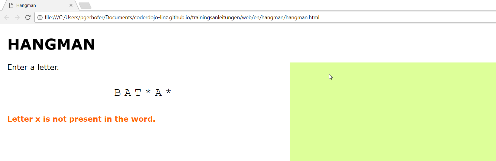

---

title: Hangman
description: In this exercise you will program the hangman game
---

# Hangman

## Goal 

One player enters a word that another player has to guess. 

At first the player, who has to guess the word, only sees a star for every letter. Every correctly guessed letter will be shown.
For every suggested letter that is not in the word the gibbet is extended with one line. The goal is to guess the word before the man hangs!

## Skeletal structure of the page

Create a new file with the name `hangman.html`.

	<!DOCTYPE html>
	<html>

	<head>
		<title>Hangman</title>
		<link rel="stylesheet" type="text/css" href="styles.css">
	</head>

	<body>
		<h1>Hangman</h1>

		

			

				
Enter a letter.

				

				

			

			

				<svg id="hangman" width="400" height="500"></svg>
			

		

		

		
	</body>

	</html>

## Styles

The styles are not included in the HTML but extracted to a seperate file. 
This file is loaded with the line `<link rel="stylesheet" type="text/css" href="styles.css">`. 
Create a new file `styles.css` in the same folder as the `hangman.html` with the following content:

	body {
		font-family: Verdana, Geneva, Tahoma, sans-serif;
		font-size: 20px;
		margin: 20px;
	}

	h1 {
		text-transform: uppercase;
	}

	div {
		box-sizing: border-box;
	}

	.gameArea {
		height: 500px;
		display: flex;
		align-items: stretch;
	}

	.guessingArea {
		width: 50%;
		padding-right: 20px;
	}   

	#word {
		text-transform: uppercase;
		font-family: Courier New, Courier, monospace;
		margin-top: 40px;
		font-size: 30px;
		text-align: center;
		letter-spacing: 0.3em;
	}

	#info {
		margin-top: 40px;
		color: #ff6600;
		font-weight: bold;
	}

	.hangmanArea {
		width: 50%;
		background-color: #ddff99;
	}

	line, circle, ellipse, rect, text, path {
		stroke: black;
		fill: none;
	}

## Scripts

In order to bring some action to the game we have to define the behavior in the `<javascript>` area of our web page. 
At first we will build the skeletal structure of our program. We need some *variables* for the count of wrong guesses, 
an indicator whether the game already ended or not and a list of already mentioned letters. Moreover we need a SVG drawing area with the name "hangman".

	var countWrongGuesses = 0;
	var gameFinished = false;
	var guessedLetters = [];
	var svg = Snap("#hangman");
	
Afterwards we prompt one user with `prompt` to enter a word.

	// choose a word and show it masked with *
	var word = window.prompt("Which word should be guessed?").toLowerCase();
	showWord();
	
Whenever a key is pressed in the document we have to check whether the pressed key is present in the word. 
To do so we can use the `onkeyup` event which is triggered when a key is released again. 

	// window.focus() is required in some browsers to make sure the onkeyup event is triggered afterwards
    window.focus();
	// react when a key is pressed
	document.onkeyup = function(event) {
		// TODO
	};
	
Now we'll add three functions: showWord, checkLetter and drawHangman. We will implement those later and just add them empty now. 

	// show the word with masked with stars (*) for every letter that was not yet guessed correctly
	function showWord() {
		// TODO
	}

	// check if the given letter was already guessed or is present in the current word 
	function checkLetter(key) {
		// TODO
	}

	// draw the hangman
	function drawHangman() {
		// TODO
	}

When you save the page and open `hangman.html` in a browser you will be prompted for a word. 
Afterwards nothing happens yet as all of our functions are still empty. 
The next thing we will do is implement the function for showing the word. 

	// show the word with masked with stars (*) for every letter that was not yet guessed correctly
    function showWord() {
		var hiddenWord = word;

		// check for every letter, if the current letter is in the list of already guessed letters, if he is not in the list replace the letter with a star
		for (var i = 0; i < hiddenWord.length; i++) {
			if (guessedLetters.indexOf(hiddenWord[i]) < 0) {
				hiddenWord = hiddenWord.replace(hiddenWord[i], "*");
			}
		}

		// show the word masked with stars for letters that were not yet guessed
		document.getElementById("word").innerText = hiddenWord;

		// in case there is no * left in the hidden word, the whole word was guessed and the game was won
		if (hiddenWord.indexOf("*") < 0) {
			document.getElementById("info").innerText = "Congratulations, you guessed the word!";
			gameFinished = true;
		}
	}

When you save your changes and reload the page you will be prompted for a word and afterwards for each letter in the word you should see a star.
Wenn du die Seite nun aufrufst, wird du zuerst nach einem Wort gefragt, 

The next step is to let the other user suggest letters. 
To do so we react to the event `document.onkeyup`. As long as the game is not over we check the entered letter. 
In the function `checkLetter` we have to differentiate between the following three cases: 

- the letter was already suggested
- the letter was not yet suggested, but is not present in the current word
- the letter was not yet suggested and is present in the current word

The man hangs when the amount of wrong suggestions/guesses is 10 which means that the game is over.

	// react when a key is pressed
	document.onkeyup = function(event) {
		if (!gameFinished) {
			checkLetter(event.key);
		}
	};

    // check if the given letter was already guessed or is present in the current word 
	function checkLetter(key) {
		if (guessedLetters.indexOf(key) >= 0) {
			// the key was already pressed, this counts as a wrong guess
			// we increment the count of wrong guesses and update the hangman
			document.getElementById("info").innerText = "You already guessed letter " + key + ".";
			countWrongGuesses++;
			drawHangman();
		} else if (word.indexOf(key) < 0) {
			// the letter is not present in the word, we add the letter to the list of already guessed letters
			// increment the count of wrong guesses and update the hangman
			document.getElementById("info").innerText = "Letter " + key + " is not present in the word.";
			guessedLetters.push(key);
			countWrongGuesses++;
			drawHangman();
		} else {
			// the letter is present in the word, we add the letter to the list of already guessed letters
			// and update the shown word to show the letters
			document.getElementById("info").innerText = "Great, you guessed a letter.";
			guessedLetters.push(key);
			showWord();
		}

		// after 10 wrong guesses the game is lost
		if (countWrongGuesses >= 10) {
			document.getElementById("info").innerText = "Game over!";
			gameFinished = true;
		}
	}

Now you can already play the game - without the hangman animation. 
The correctly guessed letters are shown in the word instead of the stars. 
If you guess wrong 10 times the game is over. 

## draw hangman

Now only the hangman is missing in order to keep track of your number of wrong guesses. 

For drawing we will use a library [snap.svg](http://snapsvg.io/docs/). 
With this library it is easy to draw lines, circles, ellipses, rectangulars and similar things.
This library is loaded in our file with the line ``.

	// examples
	svg.circle(x, y, r);
	svg.ellipse(x, y, rx, ry);
	svg.rect(x, y, width, height);
	svg.line(x1, y1, x2, y2);
	svg.text(x, y, "I draw with snap.svg!");
	svg.path("M200,250L300,300L400,250");

For the hangman we only need the `line` and `circle` functions in the `drawHangman` function.

For every wrong guess we add a line or a circle t our hangman. 
The first line is the block of the gibbet, this line starts at the position x=50, y=450 and ends at 
position x=150, y=450. The `// TODO`s should be replaced with lines/circles according to the picture of the hangman. 

	// draw the hangman
	function drawHangman() {
		switch (countWrongGuesses) {
			case 1:
				svg.line(50, 450, 150, 450);
				break;
			case 2:
				// TODO
				break;
			case 3:
				// TODO
				break;
			case 4:
				// TODO
				break;
			case 5:
				// TODO
				break;
			case 6:
				// TODO
				break;
			case 7:
				// TODO
				break;
			case 8:
				// TODO
				break;
			case 9:
				// TODO
				break;
			case 10:
				// TODO
				break;
		}
	}

When you need help with the drawing, feel free to ask any mentor for help or take 
a look at the finished game at <a href="hangman-en/hangman.html" target="_blank">hangman.html</a>. 
You can try the game there directly or take a look at the source code using the developer tools of your browser (F12).